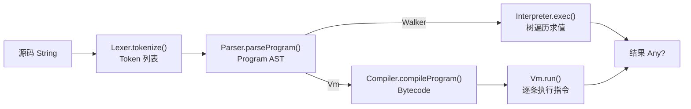

# D0 · KJS 引擎总览与执行管线

> 本篇是整套文档的入口，定位 KJS 是什么、由哪些模块组成、一段 `eval("1+2*3")` 在内部走过
> 怎样一条管线。各模块的深入剖析见 D1–D10。

## 1. KJS 是什么

KJS 是一个用 Kotlin 实现的小型 JavaScript 引擎，走**编译器 + 栈式虚拟机**路线（与 QuickJS、
V8 Ignition 同源思路），同时保留一个**树遍历解释器**作为对照后端。它支持 ES5.1 实用子集 +
若干 ES2015 特性（箭头函数、`let/const`、模板字符串、解构、class、for-of 等），足以跑通
常见脚本与算法题。

工程结构：

```
engine/
  lex/      Lexer.kt           词法分析：源码 → Token 流
  parse/    Ast.kt              AST 节点定义
            Parser.kt          递归下降：Token → Program AST
  ir/       Opcode.kt          字节码指令集（枚举）
            Bytecode.kt        编译产物：三条并行 IntArray + 常量池
            Compiler.kt        AST → Bytecode
  vm/       Vm.kt              栈式虚拟机（解释器后端）
            Jit.kt/Compiled.kt/JitBridge.kt  模板 JIT（D8）
            PropIc.kt/GlobalIc.kt             内联缓存（D7）
  runtime/  JsValue/JsObject/Realm/JsFunction  运行时值模型（D6）
            Interpreter.kt     树遍历后端（D9）
            Intrinsics*.kt     内置函数（D10）
  Engine.kt                    对外门面
cli/        Main.kt            CLI / REPL（D10）
tests/      unit/              VM 与 Walker 对拍测试（D9）
```

## 2. 执行管线：源码如何变成结果

门面 `Engine`（`Engine.kt:27`）把五段串起来。`eval`（`Engine.kt:44`）只做四件事：

```kotlin
44:60:engine/src/main/kotlin/io/kjs/Engine.kt
fun eval(source: String): Any? {
    val tokens = Lexer(source).tokenize()        // ① 词法
    tracer?.onTokens(tokens)
    val program = Parser(source).parseProgram()  // ② 语法
    tracer?.onAst(program)
    return when (mode) {
        Backend.Walker -> walker.exec(program).also { tracer?.onResult(it) }   // ③a 树遍历
        Backend.Vm -> {                                                     // ③b 编译 + 解释
            val bc = Compiler.compileProgram(program, source)
            tracer?.onBytecode(bc)
            tracer?.onVmEnter(bc)
            vm.run(bc).also { tracer?.onResult(it) }
        }
    }
}
```



管线五段：

1. **词法（Lexer）**：字符流 → `Token` 列表。难点是 `/` 是"除号"还是"正则起始"的歧义，靠
   "上一个有效 token 类型"判断（D1）。
2. **语法（Parser）**：`Token` → `Program` AST。递归下降 + 优先级爬升，把 `for-of`、解构、模板
   等语法糖在 AST 阶段就部分展开（D2）。
3. **编译（Compiler）**：`Program` → `Bytecode`。按函数切分编译单元，做作用域/槽位分配、变量
   提升、Upvalue 闭包解析、跳转修补，并把 `class` 解语法糖为构造函数（D4）。
4. **字节码（Bytecode）**：三条并行 `IntArray`（opcode / 操作数 A / 操作数 B）+ 常量池，VM 直接
   按索引连续读取，零装箱（D3）。
5. **执行（Vm / Interpreter）**：`Bytecode` → 结果。默认走 VM（D5）；`Walker` 后端直接遍历 AST
   求值，作为"预言机"与 VM 对拍验证正确性（D9）。

## 3. 双后端：同一个 API，两种实现

`Engine.Backend`（`Engine.kt:31`）枚举 `Vm` 与 `Walker`。二者共享 AST 与运行时值模型，仅"执行"
这一步不同：

- **Vm（默认）**：编译成字节码后用栈式 VM 执行，可被 JIT 进一步加速（D8），性能更好，是正式路径。
- **Walker**：`Interpreter.exec(program)` 直接递归遍历 AST 求值，实现简单、正确性强，留作
  对照/兜底，也用于 `evalToString` 之外的兼容性校验。

后端可运行时切换（`setBackend`，`Engine.kt:42`），也可用环境变量 `KJS_BACKEND=walker`（或 `ast`）
在启动时默认选 Walker（`Engine.kt:70`）。D9 详述二者如何通过共享 `JsValue` 模型做差分测试。

## 4. 门面还做了什么

- **`Realm`**（`Engine.kt:33`）：一次执行会话的全局状态（全局对象、原型、`Object/Array/...`
  内置构造器），VM 与 Walker 共用。详见 D6。
- **`Tracer`**：传入 `trace=true`（`Engine.kt:38`）即安装，逐阶段回调 `onTokens/onAst/onBytecode/
  onVmStep/onResult`，把词法→语法→编译→VM 步进完整旁白打印出来，是学习引擎内部运行的利器。
- **`evalToString`**（`Engine.kt:63`）：包一层 `JsValues.toStr`，并把 `JsThrown` 渲染成
  `"Uncaught ..."`，方便 REPL 与断言。
- **`VISUAL`/`eval` 返回值**：`eval` 直接返回 `Any?`（底层是 `JsValue` 体系里的盒装值，D6），
  顶层程序的最后一个表达式值通过 `STASH_RESULT`/`HALT` 落到 `frame.lastResult`（见 D5 §6）。

## 5. 这套文档的阅读顺序

```
D0 总览 → D1 Lexer → D2 Parser/AST → D3 字节码 → D4 编译器 → D5 虚拟机
       → D6 运行时值模型 → D7 内联缓存 → D8 模板 JIT → D9 双后端对拍 → D10 内置库与 CLI
```

建议按此顺序读：前半段是"源码如何变成可执行字节码"（D1–D4），D5 是执行核心，后半段是支撑
机制（值模型、IC、JIT）与正确性保障（双后端）。每篇都带可点击的源文件行号与 Mermaid 图。
