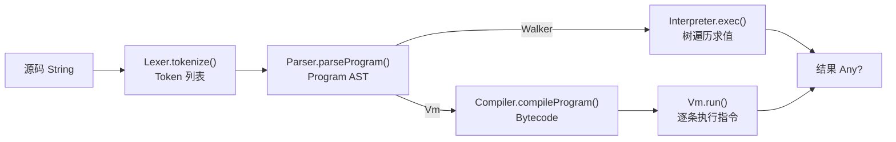

# D0 · KJS 引擎总览与执行管线

> **白话导读（给第一次读的人）**：这份文档讲 KJS 引擎从你写下的 JS 代码，到跑出结果，中间经过哪几道工序。一句话版：你的代码先被"切词"(词法) → 整理成"结构树"(语法) → 翻译成"字节码清单"(编译) → 由"虚拟机"照着清单一步步算(执行)。后面每节会把这些工序展开讲细，先看"§3 执行管线"用 `1+2*3` 走一遍最直观。

> 本篇是整套文档的入口，定位 KJS 是什么、由哪些模块组成、一段 `eval("1+2*3")` 在内部走过
> 怎样一条管线。各模块的深入剖析见 D1–D10。
>
> 阅读目标：读完应能回答——KJS 为什么采用"栈式 VM + 树遍历解释器"双后端？一段源码从
> `String` 到运行结果，中间经过哪些数据结构（Token 流 / AST / Bytecode）？每个模块的输入输出
> 与职责边界在哪？

## 1. KJS 是什么：定位与设计哲学

KJS 是一个用 Kotlin 实现的小型 JavaScript 引擎，走**编译器 + 栈式虚拟机**路线（与 V8 的
Ignition 字节码解释器、QuickJS 同源思路），同时保留一个**树遍历解释器**作为对照后端。它支持
ES5.1 实用子集 + 若干 ES2015 特性（箭头函数、`let/const`、模板字符串、解构、`class`、for-of 等），
足以跑通常见脚本、算法题与教学示例。

设计上做了几个有意识的取舍，理解它们有助于读懂后续每一篇：

- **栈式字节码而非寄存器式**：每条指令只操作操作数栈，指令定宽为"1 字节 opcode + A/B 两个
  操作数"（见 D3），VM 主循环是 `while(true){ op = code[pc]; pc++; dispatch }`，实现简单、可被 JIT
  直接复用（D8），也便于用 `pc` 精确定位异常（D5 §18）。代价是运行时栈操作较多，但 JVM 上这点
  开销远小于"把每个 JS 值拆成 JVM 原生类型"的复杂度。
- **双后端而非单一实现**：一个正式的栈式 VM（性能路径），加一个树遍历解释器作为"预言机"
  （oracle）。二者共享同一套 AST 与运行时值模型 `JsValue`，因此可对同一段源码分别执行并逐值
  差分，作为正确性保障（D9）。这是 KJS 敢于快速演进编译器的底气。
- **编译期把"难事"做绝**：作用域/槽位分配、变量提升、Upvalue 闭包解析、跳转修补、`class` 解语法糖，
  全部在编译期一次性定死（D4）；运行期 VM 只做"按索引读槽、按 pc 派发"，闭包捕获、继承拓扑等都是
  编译产物里写好的，运行期零查表。
- **可观测性内建**：`Tracer` 逐阶段回调（词法→语法→编译→VM 步进→结果），学习引擎内部运行或
  调试某段脚本的行为时，打开 `trace=true` 即可拿到完整旁白（D10）。

## 2. 工程结构与模块职责

```
engine/
  lex/      Lexer.kt           词法分析：源码 → Token 流
  parse/    Ast.kt             AST 节点定义（ sealed class 树）
            Parser.kt          递归下降：Token → Program AST
  ir/       Opcode.kt          字节码指令集（枚举，~70 条）
            Bytecode.kt        编译产物：三条并行 IntArray + 常量池
            Compiler.kt        AST → Bytecode（每函数一 Compiler）
  vm/       Vm.kt              栈式虚拟机（解释器后端，核心执行循环）
            Jit.kt/Compiled.kt/JitBridge.kt  模板 JIT（D8）
            PropIc.kt/GlobalIc.kt             内联缓存（D7）
  runtime/  JsValue/JsObject/Realm/JsFunction  运行时值模型（D6）
            Interpreter.kt     树遍历后端（D9）
            Intrinsics*.kt     内置函数（D10）
  Engine.kt                    对外门面（编排五段管线）
cli/        Main.kt            CLI / REPL（D10）
tests/      unit/              VM 与 Walker 对拍测试（D9）
```

各模块的职责边界（关于"输入/输出"的严格契约）：

| 模块 | 输入 | 输出 | 关键不变量 |
|---|---|---|---|
| `Lexer` | `String` | `List<Token>` | 每个 token 带 `line/col`；数字预求值为 `Double/BigInteger`；`/` 歧义靠 `prevType` 消解 |
| `Parser` | `String`（内部重新 `Lexer`） | `Program`（AST） | 递归下降 + 优先级爬升；语法糖部分在 AST 阶段展开 |
| `Compiler` | `Program` | `Bytecode` | 按函数切分编译单元；`localCount` 编译期定死；跳转/upvalue 全部修补完 |
| `Bytecode` | — | 三条 `IntArray` + 常量池 | 数据本地化、连续可读，VM 零装箱逐条派发 |
| `Vm` | `Bytecode` | `Any?`（`JsValue` 体系） | `Frame` 递归建栈；IC 挂在 `Bytecode` 上；异常走 handler 栈 |
| `Interpreter` | `Program` | `Any?` | 直接递归遍历 AST，不生成字节码 |

> 注意 `Engine.eval` 中 **Lexer 被调用了两次语义上只一次**：`Lexer(source).tokenize()` 仅用于
> `Tracer.onTokens` 展示；真正的解析由 `Parser(source)` 内部自行重新词法（源码注释："Parser
> re-lexes internally for now; fine for demo purposes"）。这是一处已知的"展示用 token 流"与
> "解析用 token 流"的轻微重复，属于 M1 简化，不影响正确性。

## 3. 执行管线：用 `1+2*3` 走完五阶段

门面 `Engine`（`Engine.kt:27`）把五段串起来。`eval`（`Engine.kt:44`）只做四件事：词法、语法、
（依后端）编译+执行或树遍历执行。

```kotlin
44:60:engine/src/main/kotlin/io/kjs/Engine.kt
fun eval(source: String): Any? {
    val tokens = Lexer(source).tokenize()        // ① 词法
    tracer?.onTokens(tokens)
    val program = Parser(source).parseProgram()  // ② 语法
    tracer?.onAst(program)
    return when (mode) {
        Backend.Walker -> walker.exec(program).also { tracer?.onResult(it) }   // ③a 树遍历
        Backend.Vm -> {                                                     // ③b 编译 + 解释
            val bc = Compiler.compileProgram(program, source)
            tracer?.onBytecode(bc)
            tracer?.onVmEnter(bc)
            vm.run(bc).also { tracer?.onResult(it) }
        }
    }
}
```

以 `eval("1 + 2 * 3")` 为例，看数据如何形态转换：

### 3.1 ① 词法 → Token 流

```
NUMBER(1.0)  PLUS(+)  NUMBER(2.0)  STAR(*)  NUMBER(3.0)  EOF
```

数字已在词法阶段直接算成 `numberValue`（见 D1 §2），Parser 无需再解析。

### 3.2 ② 语法 → AST

`Parser` 用语义优先级把 `*` 绑得比 `+` 更紧，得到：

```
Program
 └─ ExprStmt
     └─ Binary(op=+, left=NumberLit(1.0),
                  right=Binary(op=*, left=NumberLit(2.0), right=NumberLit(3.0)))
```

即 AST 已体现"先乘后加"的结合顺序，编译期不再需要重新算优先级。

### 3.3 ③ 编译 → Bytecode

`Compiler` 把表达式编译成栈式指令（顶层程序包在 `STASH_RESULT`/`HALT` 里）：

```
0  LOAD_INT   1
1  LOAD_INT   2
2  LOAD_INT   3
3  MUL           // 弹 3、2 → 6 压栈
4  ADD           // 弹 6、1 → 7 压栈
5  STASH_RESULT  // frame.lastResult = 7
6  HALT          // 返回 lastResult
```

注意操作数栈天然的"后缀求值"顺序：先 `LOAD_INT 1`，再 `LOAD_INT 2/3` 后立刻 `MUL`，`ADD` 时栈上
恰好是 `[1, 6]`，一次弹两个得到 `7`。这正是栈式 VM 用"求值顺序"编码"树结构"的方式（D5 §2）。

### 3.4 ④ 执行 → 结果

`Vm.run`（`D5 §8`）逐条派发：

```
pc=0 LOAD_INT 1   stack=[1.0]
pc=1 LOAD_INT 2   stack=[1.0, 2.0]
pc=2 LOAD_INT 3   stack=[1.0, 2.0, 3.0]
pc=3 MUL          stack=[1.0, 6.0]
pc=4 ADD          stack=[7.0]
pc=5 STASH_RESULT lastResult=7.0
pc=6 HALT         返回 7.0
```

若走 `Walker` 后端，结果同样是 `7.0`，但从 AST 递归求值得到——两端结果一致正是 D9 对拍测试的核心。



五段职责小结：

1. **词法（Lexer）**：字符流 → `Token` 列表。难点是 `/` 是"除号"还是"正则起始"的歧义，靠
   "上一个有效 token 类型"判断（D1）。
2. **语法（Parser）**：`Token` → `Program` AST。递归下降 + 优先级爬升，把 `for-of`、解构、模板
   等语法糖在 AST 阶段就部分展开（D2）。
3. **编译（Compiler）**：`Program` → `Bytecode`。按函数切分编译单元，做作用域/槽位分配、变量
   提升、Upvalue 闭包解析、跳转修补，并把 `class` 解语法糖为构造函数（D4）。
4. **字节码（Bytecode）**：三条并行 `IntArray`（opcode / 操作数 A / 操作数 B）+ 常量池，VM 直接
   按索引连续读取，零装箱（D3）。
5. **执行（Vm / Interpreter）**：`Bytecode` → 结果。默认走 VM（D5）；`Walker` 后端直接遍历 AST
   求值，作为"预言机"与 VM 对拍验证正确性（D9）。

## 4. 双后端：同一个 API，两种实现

`Engine.Backend`（`Engine.kt:31`）枚举 `Vm` 与 `Walker`。二者共享 AST 与运行时值模型，仅"执行"
这一步不同：

- **Vm（默认）**：编译成字节码后用栈式 VM 执行，可被 JIT 进一步加速（D8），性能更好，是正式路径。
- **Walker**：`Interpreter.exec(program)` 直接递归遍历 AST 求值，实现简单、正确性强，留作
  对照/兜底，也用于 `evalToString` 之外的兼容性校验。

后端可运行时切换（`setBackend`，`Engine.kt:42`），也可用环境变量 `KJS_BACKEND=walker`（或 `ast`）
在启动时默认选 Walker（`Engine.kt:70`）。D9 详述二者如何通过共享 `JsValue` 模型做差分测试
（同一源码两种路径逐值比对，任何不一致都意味着编译期或 VM 期 bug）。

## 5. 门面还做了什么（全局状态与可观测性）

- **`Realm`**（`Engine.kt:33`）：一次执行会话的全局状态（全局对象、原型、`Object/Array/...`
  内置构造器），VM 与 Walker 共用。它是"全局环境"的宿主，`LOAD_GLOBAL`/`DECL_GLOBAL` 的查找链
  根就在这里（D6 §5）。
- **`Tracer`**：传入 `trace=true`（`Engine.kt:38`）即安装，逐阶段回调 `onTokens/onAst/onBytecode/
  onVmStep/onResult`，把词法→语法→编译→VM 步进完整旁白打印出来，是学习引擎内部运行的利器。
- **`evalToString`**（`Engine.kt:63`）：包一层 `JsValues.toStr`，并把 `JsThrown` 渲染成
  `"Uncaught ..."`，方便 REPL 与断言。
- **`VISUAL`/`eval` 返回值**：`eval` 直接返回 `Any?`（底层是 `JsValue` 体系里的盒装值，D6），
  顶层程序的最后一个表达式值通过 `STASH_RESULT`/`HALT` 落到 `frame.lastResult`（见 D5 §6）。
- **错误传播**：词法/语法/运行期错误各自有异常类型（`LexError`/`ParseError`/`JsThrown`），
  门面只在 `evalToString` 处把 `JsThrown` 转成可读字符串，原始 `eval` 会直接向上抛，由调用方决定
  如何处理（REPL 捕获展示、测试断言匹配）。

## 6. 设计取舍

- **栈式 VM 而非寄存器式**：指令定宽、派发简单、与 JIT 后端天然对接；代价是运行期栈操作偏多，
  但在 JVM 上这一开销可忽略，且大幅降低了实现与调试成本。
- **双后端是"正确性投资"**：树遍历解释器看似冗余，却让编译器/VM 的每一次改动都有即时差分验证，
  长期看比单后端更少出隐蔽 bug。
- **编译期做重、运行期做轻**：作用域、闭包、继承拓扑全在编译期定稿，运行期只派发已写好的索引，
  是性能与正确性的双重选择。
- **可观测性默认关闭、按需开启**：`Tracer` 通过空对象（无 trace 时 `tracer` 为 `null`）零成本
  缺席，不影响生产路径性能。

## 7. 常见坑

- **词法重复执行**：`Engine.eval` 为展示调用了一次 `Lexer`，`Parser` 内部又自行词法一次，二者
  必须产出一致 Token 流；若改动 `Lexer` 只更新了一处，会出现"Tracer 显示"与"实际解析"不符。
- **顶层结果来源**：忘记 `STASH_RESULT`/`HALT` 最后一步，或 `lastResult` 未被赋值，顶层程序会返回
  `undefined` 而非最后一个表达式值。
- **后端切换的隐式差异**：VM 与 Walker 对极少数边缘语义可能有细微差异（如 `this` 绑定、严格模式），
  对拍测试能暴露，但手动切后端跑单测容易漏掉。
- **`Realm` 共享状态**：`Realm` 在同一 `Engine` 实例内跨多次 `eval` 累积（全局变量持久化），若期望
  每次 `eval` 干净隔离，需要重建 `Engine`/`Realm`。

## 8. 这套文档的阅读顺序

```
D0 总览 → D1 Lexer → D2 Parser/AST → D3 字节码 → D4 编译器 → D5 虚拟机
       → D6 运行时值模型 → D7 内联缓存 → D8 模板 JIT → D9 双后端对拍 → D10 内置库与 CLI
```

建议按此顺序读：前半段是"源码如何变成可执行字节码"（D1–D4），D5 是执行核心，后半段是支撑
机制（值模型、IC、JIT）与正确性保障（双后端）。每篇都带可点击的源文件行号与 Mermaid 图。
