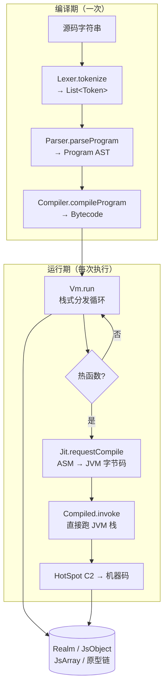
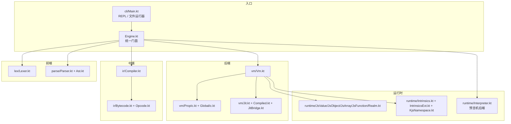

# D0 · 总览：KJS 是什么 / 架构图 / 怎么跑

> 定位：这是文档第一篇，给想**快速看懂全貌**的人。读完后你应当知道 KJS 解决什么问题、
> 由哪些模块拼成、怎么运行和调试。

## 1. 它是什么

KJS 是一个**手写的、运行在 JVM 上的 JavaScript 引擎**（对标 QuickJS 的架构思路，但实现语言是 Kotlin）。
它不依赖任何 JS 库（无 GraalJS、无 Rhino），从词法分析一路写到虚拟机，自己把 JS 跑起来。

特性概览：

- **前端**：手写 Lexer + 递归下降 Parser，支持 ES5 语法 + 一批 ES2015+ 语法（箭头函数、
  解构、`let/const`、`class`、模板字符串、`for-of/for-in`、可选链等）。
- **中端**：AST → 紧凑的、三条并行 `IntArray` 车道的栈式字节码。
- **后端（默认）**：一个 `while(true) when(op)` 的分发表虚拟机，带**属性内联缓存**和**帧池化**。
- **性能内核**：热函数（默认被调用 ≥3 次）由 ASM 在运行时编译成 JVM 字节码，再由 HotSpot 编译成
  机器码——相当于**免费拿到两级 JIT**。
- **双后端**：保留一个 AST 树遍历解释器作为「正确性预言机」，可与 VM 对拍。
- **教学模式**：`--trace` 能把 token → AST → 字节码 → 每一步栈的变化都打印出来。

## 2. 五段执行管线



三段"车道"的设计是性能关键（见 D3）：
字节码用 `codeA / aOpsA / bOpsA` 三个并行的 `IntArray` 存 opcode 和两个操作数，
而不是每个指令一个对象，从而让 CPU 缓存友好、避免 GC 压力。

## 3. 模块地图



- `engine/`：引擎核心（上述所有模块）。
- `cli/`：命令行入口与 REPL。
- `tests/`：单测 + VM/Walker 对拍 corpus。
- 根目录的 `kjs` 脚本 / `bench-*.js`：运行与基准测试脚本。

## 4. `Engine` 门面

所有入口都收敛到 `Engine`（见 `Engine.kt:27`）：

```kotlin
12:26:engine/src/main/kotlin/io/kjs/Engine.kt
class Engine(
    backend: Backend = defaultBackend(),
    trace: Boolean = false,
) {
    enum class Backend { Vm, Walker }   // 两个后端
    val realm: Realm = Realm()
    private val walker: Interpreter = Interpreter(realm)
    private val vm: Vm = Vm(realm)
    ...
    fun eval(source: String): Any? {
        val tokens = Lexer(source).tokenize()          // 1) 词法
        val program = Parser(source).parseProgram()     // 2) 语法
        return when (mode) {                            // 3) 执行
            Backend.Walker -> walker.exec(program)
            Backend.Vm -> {
                val bc = Compiler.compileProgram(program, source)
                vm.run(bc)
            }
        }
    }
}
```

注意 `eval` 里 Lexer 和 Parser 是**分别**对源码做的（`Parser` 内部自己重做词法，
注释里说"for demo purposes"）。两条管线输入同一字符串，互不直接耦合。

后端切换由环境变量 `KJS_BACKEND` 控制（`Engine.kt:69`）：

```kotlin
69:75:engine/src/main/kotlin/io/kjs/Engine.kt
private fun defaultBackend(): Backend =
    when (System.getenv("KJS_BACKEND")?.lowercase()) {
        "walker", "ast" -> Backend.Walker
        else -> Backend.Vm
    }
```

## 5. 怎么跑 / 怎么调试

```bash
# 交互式 REPL
./kjs
# 运行文件
./kjs script.js
# 运行内联代码
./kjs -e '1 + 2 * 3'
# 教学模式：把 token→AST→字节码→VM 每步都打印出来
./kjs --trace -e 'let a = [1,2,3]; a.map(x => x*2)'
```

`Tracer`（`Engine.kt:38` 注入到 `vm.tracer`）在四个节点输出：
`onTokens / onAst / onBytecode / onVmEnter / onResult`，是理解整个管线的"放大镜"。

## 6. 设计取舍速记

- **为什么是栈式字节码而不是 AST 直跑？** 栈式字节码分发表编译成 JVM `tableswitch` 后很紧凑，
  且比递归解释 AST 快得多（见 D5 实测数字）。
- **为什么保留 Walker？** 它慢但对"语义对不对"提供了一个独立实现，作为 VM 的 oracle（见 D9）。
- **为什么两层 JIT？** 第一层（KJS→JVM 字节码）由我们控制、可做类型特化；第二层（JVM→native）
  免费由 HotSpot 提供。我们几乎"白嫖"了 C2 的优化。

## 7. 接下来读什么

- 想看"输入怎么被切碎"→ **D1 Lexer**
- 想看"碎片怎么拼成树"→ **D2 Parser/AST**
- 想看"树怎么变字节码"→ **D4 Compiler**（先看 D3 字节码）
- 想看"字节码怎么跑"→ **D5 Vm**
- 想看"值长什么样"→ **D6 运行时值模型**
- 想看"快在哪"→ **D7 IC → D8 JIT**
- 想看"怎么保证没写错"→ **D9 对拍**
