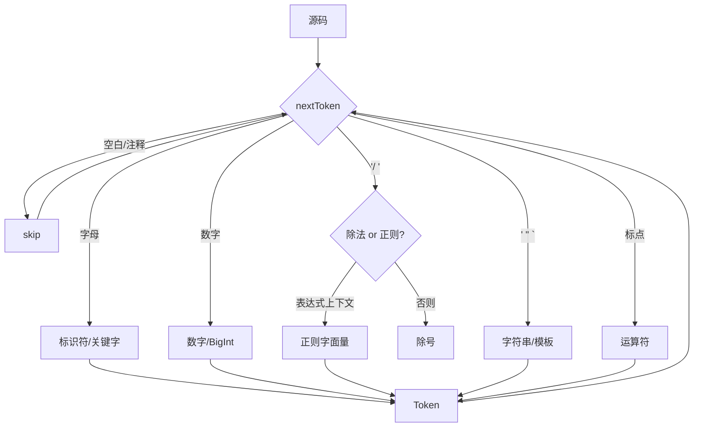

# D1 · 词法分析 Lexer

> 前置知识：D0。本篇讲"源码字符串如何被切成 token 流"。

## 1. Token 模型

`Token`（`lex/Lexer.kt:5`）是一个紧凑的数据类：`type`、`value`、`line`、`col`。
`type` 是一个 `enum class TokenType`，覆盖了 JS 的全部词法范畴：`NUMBER`、`STRING`、
`IDENT`、`KEYWORD`、`PUNCT`（标点/运算符）、`EOF` 等。

```kotlin
5:13:engine/src/main/kotlin/io/kjs/lex/Lexer.kt
data class Token(
    val type: TokenType,
    val value: String,
    val line: Int,
    val col: Int,
)
```

值得注意：关键字不是单独的 token 类型，而是用 `KEYWORD` 承载，`value` 存具体词
（`if`/`for`/`function`…）。`PUNCT` 同理，`value` 存运算符原文。这让 Parser 用 `value` 判断语义，
Lexer 本身保持简单。

`Lexer.tokenize()`（`Lexer.kt:34`）是主入口：一个 `while` 循环，每次 `nextToken()`，
遇到空白/注释跳过，直到 `EOF`。



## 2. 正则 vs 除号歧义（核心难点）

JS 里 `/` 既可能是**除号**也可能是**正则字面量开头**，取决于上下文——这是任何 JS 词法器
最棘手的点。KJS 用 `prevType` 状态判定：

```kotlin
115:140:engine/src/main/kotlin/io/kjs/lex/Lexer.kt
private fun canStartRegex(prev: TokenType?): Boolean {
    if (prev == null) return true
    return when (prev) {
        TokenType.IDENT, TokenType.NUMBER, TokenType.RPAREN,
        TokenType.RBRACKET, TokenType.STRING, TokenType.TEMPLATE_END,
        TokenType.REGEX -> false   // 这些后面跟的 '/' 一定是除号
        else -> true               // 运算符、左括号等后面 → 正则
    }
}
```

逻辑：`/` 紧跟在标识符、数字、右括号、`)`、`]`、字符串、正则后面时，一定是**除号**；
否则（如 `=`、`,`、`(`、一元运算符之后）当作**正则字面量**。这是"词法状态机"的简化版，
够用且正确。在 `nextToken` 里：

```kotlin
141:160:engine/src/main/kotlin/io/kjs/lex/Lexer.kt
if (ch == '/') {
    val n = peek(1)
    if (n == '*') { skipBlockComment(); continue }
    if (n == '/') { skipLineComment(); continue }
    if (canStartRegex(lastTokenType)) {
        tokenizeRegex()      // 正则字面量
    } else {
        // 除号运算符
        emit(PUNCT, "/"); advance()
    }
    continue
}
```

## 3. 标识符 / 关键字

标识符按 `isIdentStart`/`isIdentPart` 规则（Unicode 字母、下划线、`$`、数字后续）吸收。
吸收后查 `KEYWORDS` 集合（`Lexer.kt:18`），命中则发 `KEYWORD`，否则 `IDENT`。

## 4. 数字字面量

支持十进制、十六进制 `0x`、八进制 `0o`、二进制 `0b`，以及科学计数法 `1e3`。
末尾 `n` 识别为 **BigInt**（`NUMBER` token，`value` 带 `n` 后缀），交给 Parser/运行时处理。

```kotlin
200:230:engine/src/main/kotlin/io/kjs/lex/Lexer.kt
private fun tokenizeNumber(): Token {
    val start = pos
    if (peek(0) == '0') {
        when (peek(1)) {
            'x','X' -> readHex()
            'o','O' -> readOct()
            'b','B' -> readBin()
        }
    }
    readDigitsAndFraction()
    // 科学计数法
    if (peek(0) in "eE") { advance(); if (peek(0) in "+-") advance(); readDigits() }
    // BigInt 后缀
    if (peek(0) == 'n') advance()
    return make(TokenType.NUMBER)
}
```

> 数字在 Lexer 阶段**不求值**，只切出原文；真正 `toDouble()`/`BigInteger()` 发生在 Parser 或运行时，
> 这样错误（如 `1e` 残缺）能摊到合适的语义层报出。

## 5. 字符串与模板字面量

- **普通字符串** `' " `：处理转义（`\n \t \\ \uXXXX` 等），识别未闭合 → `raise` 词法错误。
- **模板字面量** `` ` ``：KJS 在词法层就把模板切成 `TEMPLATE_HEAD` / `TEMPLATE_MID` / `TEMPLATE_END` /
  `TEMPLATE_TAIL` 等多段 token，并保留其中的 `${ }` 表达式边界信息，交给 Parser 组装成
  `TemplateExpr` AST 节点（见 D2）。这样 `a${b}c${d}e` 被切成 5 个片段，Parser 再插回表达式。

## 6. 注释

`//` 行注释与 `/* */` 块注释在 `nextToken` 开头被 `skipLineComment` / `skipBlockComment` 吃掉，
不产 token（除非开启保留注释的 trace 模式）。

## 7. 位置信息 `line/col`

每个 token 记录起始行列，错误报告能定位到源码坐标。`pos`、`line`、`col` 三个光标在
`advance()` 时同步维护（遇到 `\n` 行号 +1、列归零）。

## 8. 常见坑

- **`/` 误判**：在 `a / b` 中若 `a` 被错误切成非 `IDENT`（如宏展开残留），会出现 `/` 被当成正则。
  KJS 的 `canStartRegex` 用 `lastTokenType` 而非"是否期待值"，对绝大多数合法代码正确。
- **`<=` vs `<`**：多字符运算符（`<=`、`===`、`**`、`>>>` 等）必须**贪婪匹配**最长者，否则 `===`
  会被切成两个 `=`。`tokenizePunct` 按长度降序尝试。
- **BigInt 与 Number 混用**：`1 + 2n` 在 JS 里抛类型错误，KJS 在运行期 `looseAdd` 处才报错（见 D6），
  词法层只负责切出 `2n`。
