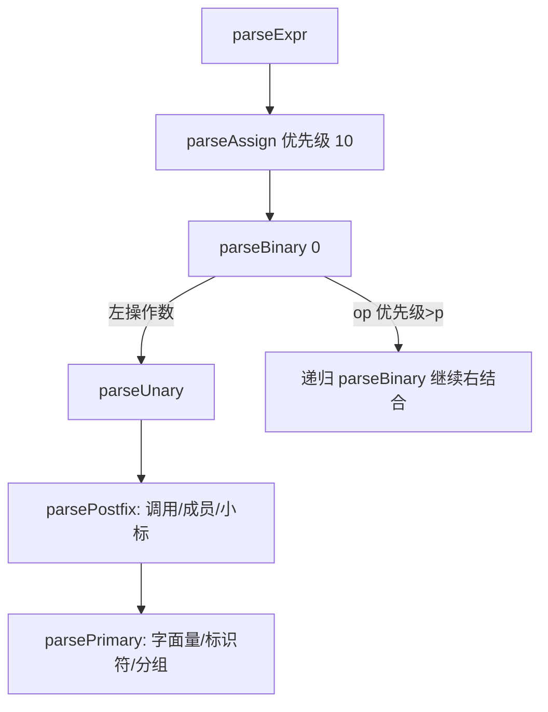

# D2 · AST 与语法分析 Parser

> 前置知识：D1。本篇讲"token 流如何拼成树"，重点是节点模型和递归下降 / 运算符优先级。

## 1. 节点模型（Ast.kt）

AST 以 `Node` 为根接口，按"是否是表达式（有值）"分两条子接口：`Expr : Node`（如 `BinaryExpr`
、`CallExpr`、`ArrowFnExpr`）与 `Stmt : Node`（如 `IfStmt`、`ForStmt`、`VarDecl`）。还有 `Decl`
和 `Pattern`（用于解构）。

顶层 `Program`（`parse/Ast.kt:14`）持有 `body: MutableList<Stmt>`。

关键表达式节点（节选）：

```kotlin
20:60:engine/src/main/kotlin/io/kjs/parse/Ast.kt
sealed interface Node { val loc: Loc? }
sealed interface Expr : Node
sealed interface Stmt : Node
sealed interface Decl : Stmt
sealed interface Pattern : Node

data class BinaryExpr(val op: String, val left: Expr, val right: Expr) : Expr
data class CallExpr(val callee: Expr, val args: List<Expr>) : Expr
data class MemberExpr(val obj: Expr, val prop: Expr, val computed: Boolean) : Expr
data class ArrowFnExpr(val params: List<Param>, val body: BlockStmt, val isExprBody: Boolean) : Expr
data class ClassExpr(val name: String?, val superClass: Expr?, val body: List<ClassMember>) : Expr
data class AssignExpr(val target: Expr, val value: Expr) : Expr   // 含解构目标
```

注意 `AssignExpr.target` 是 `Expr` 而非 `Pattern`——解构赋值（如 `[a,b] = c`）在 AST 层被
desugar 成多个单赋值（见 D4），这里只存"看起来像赋值目标"的节点。

语句节点（节选）：`IfStmt`、`WhileStmt`、`ForStmt`、`ForInStmt`、`ForOfStmt`、`TryStmt`
（含 `catch`/`finally`）、`ReturnStmt`、`BlockStmt`、`VarDecl`（`kind: var/let/const`，
`decls: List<VarDeclarator>`）、`FunctionDecl`、`ClassDecl`、`ThrowStmt`、`BreakStmt`/`ContinueStmt`。

## 2. 递归下降骨架

`Parser`（`parse/Parser.kt:30`）持有 `tokens` 与 `pos`，提供：
- `peek()` / `peek(k)` / `advance()` / `expect(type,value)` / `match(type,value)`。
- `parseProgram()`：循环 `parseStmt()` 直到 `EOF`。

`parseStmt` 是典型的"看第一张牌决定做什么"：

```kotlin
120:150:engine/src/main/kotlin/io/kjs/parse/Parser.kt
private fun parseStmt(): Stmt = when (val t = peek()) {
    isTok KEYWORD "if"      -> parseIf()
    isTok KEYWORD "while"   -> parseWhile()
    isTok KEYWORD "for"     -> parseFor()
    isTok KEYWORD "function"-> parseFunctionDecl()
    isTok KEYWORD "class"   -> parseClassDecl()
    isTok KEYWORD "return"  -> parseReturn()
    isTok KEYWORD "var",
    isTok KEYWORD "let",
    isTok KEYWORD "const"   -> parseVarDecl()
    isTok PUNCT "{"         -> parseBlock()
    else -> {                              // 表达式语句
        val e = parseExpr()
        expect(PUNCT, ";")        // 允许 ASI 自动补分号
        ExprStmt(e)
    }
}
```

> 伪代码 `isTok KEYWORD "if"` 表示调用 `match(TokenType.KEYWORD, "if")`。

## 3. 运算符优先级与结合性（核心）

表达式用**优先级爬升（precedence climbing）**解析，避免为每个优先级写一层函数：



`parseBinary(minPrec)` 的核心循环：

```kotlin
300:330:engine/src/main/kotlin/io/kjs/parse/Parser.kt
private fun parseBinary(minPrec: Int): Expr {
    var left = parseUnary()
    while (true) {
        val op = peek()
        if (op !is PUNCT) break
        val prec = BIN_PREC[op.value] ?: break
        if (prec < minPrec) break
        advance()
        // 三元 ?: 与赋值右结合 → 递归时 minPrec 调整
        val right = if (op.value == "?") parseTernary()
                     else parseBinary(prec + 1)   // 左结合：(a-b)-c
        left = BinaryExpr(op.value, left, right)
    }
    return left
}
```

`BIN_PREC` 表（节选，`Parser.kt:280`）：`,`=1，`=` 系列=2，`?:`=3，`||`=4，`&&`=5，
`|`=6，`^`=7，`&`=8，`==/!=`=9，`</<=/>/>=`=10，`<</>>`=11，`+/-`=12，`*/%`=13，`**`=14。

- **左结合**：`prec + 1` 让同优先级运算符在右侧重新进入时要求**更高**优先级 → `(a-b)-c`；
  但 **`**`（幂）是右结合**，用 `parseBinary(prec)`（不加 1）→ `a**(b**c)`。
- **赋值右结合**：`a = b = c` 解析为 `a = (b = c)`，用 `parseBinary(2)` 且只在 `minPrec=2` 进入。

## 4. 一元与后缀

`parseUnary` 处理 `! - + typeof void delete ~`，是**前缀**递归；`parsePostfix` 处理链式
`a.b`、`a[b]`、`a()`、`a` 模板标签，是**后缀**循环（左结合、不回退）。

`new` 运算符特殊：优先级高于调用但会"吃掉"后续参数列表，`Parser` 用一个专门分支处理
`new X(args)` 且不把 `new X` 后面无括号的情况误判。

## 5. 声明 vs 表达式

- **函数声明** `function f(){}` 可 hoist（见 D4）；**函数表达式** `(function(){})` 在 `parsePrimary` 中。
- **箭头函数** `x => ...` 在 `parsePostfix/parsePrimary` 里识别 `=>`。
- **对象 / 数组字面量** 在 `parsePrimary` 中，且**支持解构模式**（赋值时见 D4）。

## 6. 解构在 AST 层的表示

解构**不**引入新节点类型——`@` 数组/对象字面量同时可作"模式"。`Pattern` 接口由
`ArrayLit`（带 `isPattern` 标记）与 `ObjectLit`（带 `isPattern` 标记）实现，Parser 在赋值
左值上下文把它们当成模式解析，`VarDeclarator.name` 可为 `Pattern`。 后续 `Compiler`
把模式 desugar 成逐元素绑定（见 D4 §解构绑定）。

## 7. class 在 AST 层

`ClassExpr` / `ClassDecl` 直接持有 `body: List<ClassMember>`，成员区分
`MethodDef`（普通/构造/`get`/`set`）、`FieldDef`（实例字段）。`superClass` 存父类表达式。
`extends` 在 Parser 阶段只记录，**不**求值——求值推迟到类对象实例化时（D6）。

## 8. 常见坑

- **ASI（自动分号插入）**：KJS 在表达式语句后 `expect(PUNCT,";")` 但允许缺失（多数实现会
  看行尾换行补分号）。遇到 `return\n{...}` 这类经典 ASI 陷阱需注意：换行会把 `return` 截断。
- **`in` 关键字**：`for (x in obj)` 与 `x in y` 表达式都合法，Parser 在 `for` 头特殊处理 `in`。
- **`=>` 与 `>=`**：词法层 `>=` 是一个 PUNCT，会让 `a => b` 在 `a` 后读到 `=>` 必须优先于比较；
  KJS 在 `parsePostfix` 显式判断 `=>` 之后才进入箭头逻辑，避免与 `>=` 冲突。
- **逗号运算符 vs 参数列表**：`parseExpr` 顶层用 `BIN_PREC=1` 的逗号处理 `(a,b,c)` 三种上下文，
  需区分"表达式语句里的逗号"与"参数/数组元素分隔"。
