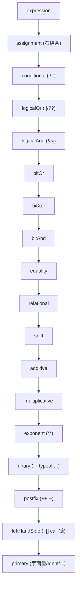

# D2 · 语法分析：Parser 与 AST

> **写给小白（本章导读）**：语法分析器（Parser）是流水线的第二道工序。Lexer 把字符切成词（Token）后，Parser 把这些词按 JS 的语法规则拼成一个"结构树"，叫 **AST（抽象语法树）**——就像把"主谓宾"组织成句子结构。
> - **基础信息**：AST 是"代码的树形结构表示"。`1 + 2 * 3` 在 AST 里是一棵"加法节点，左孩子是 1、右孩子是乘法节点（2 和 3）"的树，运算顺序就藏在树的结构里（先乘后加）。
> - **别的方案对比**：解析语法有两大流派——"递归下降"（KJS 用的，手写、直观、好调试）和"自动生成"（用 ANTLR/Bison 之类工具从文法自动生成解析器，省手写但难改）。KJS 选递归下降，因为它要边解析边"解语法糖"（见 §4）。
> - **进阶**：最精妙的是 §3 的"优先级爬升"——它决定了 `1+2*3` 为什么先算乘法；§4 讲箭头函数、`for-of`、模板这些"糖"怎么在解析阶段被展开。

> 前置知识：D0（管线）、D1（Lexer）。
>
> 本篇拆解 `parse/Parser.kt` 与 `parse/Ast.kt`：AST 节点模型、递归下降骨架、表达式的"优先级爬升"、
> 解构/箭头/`for-of` 等语法糖在 AST 阶段的展开。读完能理解"Token 流如何变成结构化的 Program"。

## 1. AST 节点模型（Ast.kt）

> **小白讲解**：**AST 节点**就是树上的"零件"。`sealed class` 是 Kotlin 写法，意为"节点种类都列在明处，编译器能检查你有没有漏处理某种节点"。下面把语句、表达式各种节点列出，当目录看即可。

AST 用一组 `sealed class` 表达（单继承层次，便于 `when` 穷尽匹配）：

- **`Node`**（`Ast.kt:7`）：所有节点基类，带 `line/col` 用于报错。
- **`Program`**（`Ast.kt:10`）：`body: List<Stmt>`，整棵语法树根。
- **语句 `Stmt`**（`Ast.kt:12`）：`Block / ExprStmt / VarDecl / If / While / DoWhile / ForC /
  ForIn / ForOf / Return / Break / Continue / Throw / Try / FunctionDecl / ClassDecl / Labeled /
  EmptyStmt`。
- **声明 `Declarator`**（`Ast.kt:20`）：`name`（标识符绑定）与 `pattern`（解构绑定）**恰有一个非空**。
- **`ClassDecl`**（`Ast.kt:49`）：`superClass / constructor / members`；VM 无原生 class，由 Compiler
  解语法糖为构造函数（D4 §6）。
- **`Param`**（`Ast.kt:74`）：`name` 与 `pattern` 恰有一个非空，外加 `default`、`rest` 标记。
- **解构 `Pattern`**（`Ast.kt:90`）：`IdentPattern / ArrayPattern / ObjectPattern / AssignTargetPattern`，
  可递归嵌套，是解构声明与解构赋值的统一表示。
- **表达式 `Expr`**（`Ast.kt:99`）：`NumberLit / StringLit / Ident / ArrayLit / ObjectLit /
  FunctionExpr / ArrowFn / ClassExpr / Unary / Update / Binary / Logical / Assign / Conditional /
  Member / Call / NewExpr / Sequence / TemplateLit / DestructuringAssign / SuperMember / SuperCall` 等。

> 设计要点：`AssignTargetPattern`（`Ast.kt:96`）把"可作为赋值目标的复杂表达式（成员访问、下标）"
> 统一成 Pattern，使解构赋值的 LHS 复用同一套绑定逻辑。

## 2. 递归下降骨架

`Parser`（`Parser.kt:13`）构造时即 `Lexer(source).tokenize()`（`Parser.kt:14`）得到 `tokens`，
`pos` 为当前下标。工具函数 `peek/eat/match`（`Parser.kt:25`）提供前瞻与消费，每个 `eat(t)` 在类型
不符时抛 `ParseError`（带行列）。

`statement()`（`Parser.kt:58`）是语句级分发，覆盖标签语句、块、`var/let/const`、`if/while/do/for`、
`return/break/continue/throw/try`、函数声明、class 声明、表达式语句等。`block()`（`Parser.kt:84`）
循环解析直到 `}`。

### 2.1 声明与解构

`varDecl()`（`Parser.kt:92`）支持 `var/let/const` 列表，每项可为普通标识符或**绑定模式**（数组/
对象解构，见 `bindingPattern` `Parser.kt:112`）。`objectBindingPattern`（`Parser.kt:139`）处理
`{a, b: c, d = 1, ...rest}`：简写 `{x}` 即 `IdentPattern("x")`，`...rest` 提升为 `rest` 字段。
`exprToPattern`（`Parser.kt:181`）把已按普通表达式解析的 `[a,b]`/`{x}` 反向转成 Pattern——因为解析
器事前不知道它是赋值目标，先当表达式解析，发现是解构赋值 LHS 时再"降级"成 Pattern。

## 3. 表达式：优先级爬升（核心算法）

> **小白讲解**：全篇最硬核也最精彩的一节。**优先级爬升**是不用写一大堆 if 嵌套就能正确处理运算符先后的算法：每层函数只管比自己低一级的运算符，遇到同级就一直往左收。比如 `1+2*3`，`+` 层发现右边是 `*`（更高优先级），先让 `*` 层算 `2*3`，再拿回来加。文末 mermaid 图把层级从低到高画出。 **进阶**：`**` 是右结合（`2**3**2`=`2**(3**2)`），而 `*` 是左结合，算法里专门处理了。

表达式解析是 Parser 最精妙处，采用**经典优先级爬升**（precedence climbing）：每个层级只比下一
层级高一级，用 `while (at(...))` 左结合地吸收同优先级的运算。层级从低到高（`Parser.kt:400`）：

```
expression  → assignment (, assignment)*      → Sequence
assignment  → conditional (= += ... ) assignment   (右结合)
conditional → logicalOr ? assignment : assignment
logicalOr   → logicalAnd (|| / ??)* logicalAnd
logicalAnd  → bitOr (&&)* bitOr
bitOr/bitXor/bitAnd → equality → relational → shift → additive → multiplicative
multiplicative → exponent  (** 右结合)
exponent    → unary (** exponent)            // 右结合，单独处理
unary       → (! ~ + - typeof void delete ++ --) unary | postfix
postfix     → leftHandSide (++ --)?          // 后缀 ++/--
leftHandSide→ (new) primary (. [] ( ) 链式)*  // 成员/下标/调用
primary     → 字面量 / Ident / 数组 / 对象 / 函数表达式 / ...
```

关键点：
- **`exponent` 的右结合**（`Parser.kt:495`）：`a ** b ** c` 解析为 `a ** (b ** c)`，因 `exponent`
  右侧递归回 `exponent` 而非 `unary`。
- **`unary` 的左递归终止**（`Parser.kt:501`）：前缀运算符后递归到 `unary`（允许 `!!x`），否则落
  到 `postfix`。
- **`leftHandSide` 的成员/调用链**（`Parser.kt:524`）：`a.b()[c].d` 用循环不断叠加 `Member/Call`，
  每次把当前表达式作为 `obj` 包新一层，保证 `a.b().c` 的 AST 是右结合的成员链。
- **`assignment` 的右结合**（`Parser.kt:409`）：`a = b = c` → `a = (b = c)`；若 LHS 是 `ArrayLit/
  ObjectLit` 则转 `DestructuringAssign`（`Parser.kt:430`）。



## 4. 三个语法糖在 AST 阶段的展开

> **小白讲解**：**语法糖** = 看着甜、写起来省事，但能被翻译成更基础写法的语法。箭头函数 `(x)=>x*2` 本质就是个函数；`for (x of arr)` 本质是反复调"取下一个"的迭代器。`for-of` 碰到解构时，Parser 偷偷塞个临时变量把解构展开，后面的编译器就省心了。

### 4.1 箭头函数（`Parser.kt:618` / `parenOrArrow` `636`）

`(x) => ...`、`x => ...`、`() => ...` 在 `primary` 与 `parenOrArrow` 里**前瞻 `=>` 判定**：
`parenOrArrow`（`Parser.kt:636`）先试解析逗号分隔的标识符列表，若 `)` 后是 `=>` 则按箭头函数处理，
否则 `pos` 回退（`Parser.kt:664`）当普通括号表达式。箭头函数体为表达式时包成 `Return` 块（D4 也
会处理 `isArrow`，见 D4 §4）。

### 4.2 `for-in` / `for-of` 的解构拆解（`Parser.kt:242`）

`forStmt` 先按普通 `for(;;)` 解析 init；若 init 是"单声明且无初值"且后跟 `in`/`of`，则识别为
`ForIn`/`ForOf`（`Parser.kt:251`）。当 LHS 是**解构模式**（非标识符）时，编译器不便直接迭代绑定，
Parser 在这里**合成一个隐藏临时变量 `__forOfTmpN__`**（`Parser.kt:264`），把循环体包成
`Block { 解构声明; 原body }`，从而把"模式 LHS"降为"标识符 LHS + 循环内解构"（`Parser.kt:266`）。
这是把语法糖在 AST 阶段提前消化的典型例子。

### 4.3 模板字符串（`expandTemplate` `Parser.kt:734`）

模板 `a${x}b${y}c` 被切分为字面段与 `${}` 插值段：字面段存为 `StringLit`，插值段**用新 `Parser`
递归解析**（注意支持嵌套 `{}`），最后拼成 `"a" + x + "b" + y + "c"` 的 `Binary(+)` 链。为保证整体
为字符串拼接，首段若非字面量会前置 `"" + ...`（`Parser.kt:768`）。

## 5. class 声明（`classDecl` / `classBody`，`Parser.kt:311`）

`classBody`（`Parser.kt:319`）解析成员：识别 `static` 前缀、`get/set` 访问器、`constructor` 单独
提升为 `constructor` 字段（`Parser.kt:353`），普通方法/字段分别记录。`#私有字段` 因词法器未发 `#`
暂不支持（代码留了 `isPrivate` 占位，`Parser.kt:345`）。`ClassDecl` 整体交给 Compiler 解糖（D4 §6）。

## 6. 设计取舍

> **小白讲解**：总结"为什么用递归下降 + 把糖提前在解析阶段展开"。好处是编译器那道工序更轻松；代价是 Parser 稍复杂。 **别的方案**：也有引擎把"解糖"放到编译器甚至专门的"解糖器"里做，没有绝对对错，只是职责划分不同。

- **纯递归下降 + 优先级爬升**：无生成器，逻辑直白；爬升法用一层函数对应一个优先级，可读且易扩展。
- **语法糖前移**：`for-of` 解构、箭头、模板都在 Parser/AST 层尽量展开，减轻 Compiler 负担。
- **错误定位**：所有 `ParseError` 带 `line/col`，由 Lexer 维护的行列保证可定位。
- **AST 用 `sealed class`**：编译器可 `when` 穷尽匹配，漏处理节点会编译报错。

## 7. 常见坑

- **优先级爬升的层级顺序**：层级写错（如把 `&&` 放在 `||` 之下）会改变结合性/优先级语义。
- **`**` 右结合**：漏掉 `exponent → exponent` 递归会变成左结合，算错 `2**3**2`。
- **箭头前瞻回退**：`parenOrArrow` 若不 `pos = snapshot` 回退，会吃掉普通括号表达式的 token。
- **`for-of` 解构合成**：忘记包裹"解构声明"到循环体，会导致模式 LHS 在 Compiler 阶段无法正确绑定。
- **模板插值递归**：`${}` 内 `{}` 嵌套深度（`depth`）必须配对，否则字符串越界或提前结束。
