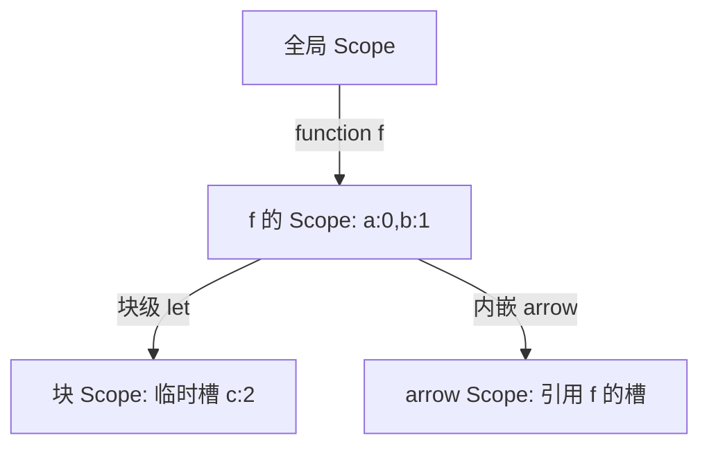
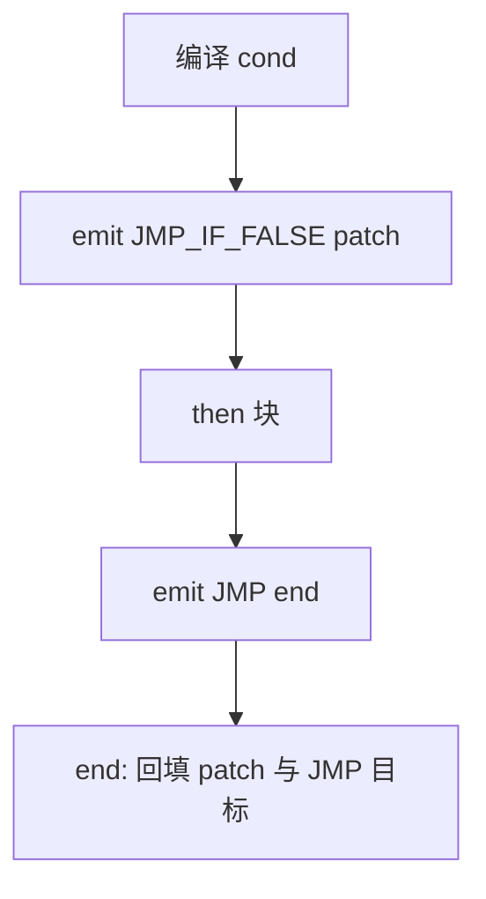

# D4 · AST → 字节码编译器

> 前置知识：D2、D3。本篇讲"树如何变成三条车道"，是引擎里最考验工程细节的模块。

## 1. 入口与结构

`Compiler`（`ir/Compiler.kt:20`）是递归编译 AST 的核心。入口 `compileProgram`：

```kotlin
20:45:engine/src/main/kotlin/io/kjs/ir/Compiler.kt
object Compiler {
    fun compileProgram(program: Program, sourceName: String): Bytecode {
        val bc = Bytecode(sourceName)
        val c = Compiler(bc, parent = null, isFunction = false)
        c.compileStmtList(program.body)   // 顶层语句
        bc.emit(Opcode.RETURN_UNDEF)
        bc.freeze()
        return bc
    }
}
```

编译器对象携带：当前 `Bytecode`、父编译器 `parent`、作用域 `scope`（槽位表）、`loopStack`
（break/continue 目标）、`upvalRequests`（需要向父作用域借的 upvalue）。

## 2. 作用域与槽分配

每个函数/块建立一个 `Scope`，变量名 → 局部槽位 `a`：



- **`var` / 函数声明**：提升到所在**函数作用域**顶部，槽位在函数开始处统一分配。
- **`let` / `const`**：块级作用域，进入块 `PUSH_SCOPE`，离开 `POP_SCOPE`；槽位在该块内分配。
- **参数**：按声明顺序占前 N 个槽（`arity`）。

`resolveLocal(name)`：从内层 Scope 向外找，返回槽位；找不到则可能是 **upvalue**（见下）
或全局变量（`LOAD_GLOBAL`）。

## 3. 闭包与 Upvalue（核心）

当内层函数引用了外层函数的局部变量，该变量被"捕获"。KJS 用 **`Upvalue` 盒子**实现真正的闭包：

```kotlin
60:90:engine/src/main/kotlin/io/kjs/ir/Compiler.kt
// 父帧持有真实槽，捕获变量被提升成共享 Upvalue 引用
private fun capture(name: String): Int {
    // 在本作用域找槽
    val slot = scope.find(name)
    // 请求父编译器把该槽"提升"为 Upvalue
    val up = parent!!.requestUpvalue(slot)
    // 本地记录：引用 Upvalue 而非直接槽
    return addUpval(up)
}
```

`requestUpvalue` 让**父帧**把局部变量搬到 `Upvalue` 对象（一个 `Ref` 盒子），父帧的所有读写
都改走这个盒子；内层闭包通过同一个 `Upvalue` 引用读写——于是闭包内外看到的是**同一份内存**
（这正是 JS 闭包语义，也是 D5 `CALL` 约定里 upvalue 数组的来源）。

`MAKE_CLOSURE b a`：`b`=functions 池里子字节码下标，`a`=需要绑定的 upvalue 个数，紧跟着
`LOAD_*` 把每个 upvalue 装载进栈，再由 VM 组装成 `JsClosure`。

## 4. Hoisting（变量提升）

JS 的 `var`/函数声明会被"提升"到作用域顶。KJS 在编译函数体**开头**先扫一遍声明：

```kotlin
100:120:engine/src/main/kotlin/io/kjs/ir/Compiler.kt
// 第一遍：分配 var/函数声明的槽位（hoist）
for (s in body) when (s) {
    is VarDecl -> { for (d in s.decls) scope.alloc(d.name) ; if (s.kind=="var") emit init }
    is FunctionDecl -> { scope.alloc(s.name); emit MAKE_CLOSURE; STORE_LOCAL }
}
// 第二遍：真正编译语句体（此时变量槽已就绪）
for (s in body) compileStmt(s)
```

> 函数声明提升优先级高于 `var`，且同名 `var` 不重复分配槽——KJS 用 `scope.alloc` 幂等处理。

## 5. 控制流跳转修补（核心难点）

`if/while/for/break/continue` 都靠"先 emit `JMP` 占位、回头回填目标"实现。

**if**：



```kotlin
150:175:engine/src/main/kotlin/io/kjs/ir/Compiler.kt
private fun compileIf(node: IfStmt) {
    compileExpr(node.cond)
    val elsePatch = emit(Opcode.JMP_IF_FALSE, b = 0)   // 占位
    compileStmt(node.then)
    if (node.els != null) {
        val endPatch = emit(Opcode.JMP, b = 0)         // 跳过 else
        patch(elsePatch, bc.countA)                    // else 起始
        compileStmt(node.els)
        patch(endPatch, bc.countA)                     // 结束
    } else {
        patch(elsePatch, bc.countA)
    }
}
```

`loopStack` 记录当前循环的 `continueTarget` / `breakTarget`，`break`/`continue` 编译成
`JMP breakTarget`/`JMP continueTarget`，循环体编译完后统一 `patch`。

**for**：`for(init; cond; update)` 展开成
`init; loop: cond?; JMP_IF_FALSE end; body; continue: update; JMP loop; end:`。
`for-in`/`for-of` 用 `ITER_INIT` / `ITER_NEXT b` / `ITER_JUMP b` 三件套（见 D5 迭代协议）。

## 6. 表达式编译（后序）

表达式编译成**后序**字节码——操作数先入栈，运算符最后消费：

```kotlin
200:220:engine/src/main/kotlin/io/kjs/ir/Compiler.kt
private fun compileExpr(e: Expr) = when (e) {
    is BinaryExpr -> {
        compileExpr(e.left); compileExpr(e.right)
        emit(opcodeForBin(e.op))     // ADD / SUB / EQ ...
    }
    is CallExpr -> {
        compileExpr(e.callee)
        for (a in e.args) compileExpr(a)   // 参数逆序/顺序入栈
        emit(Opcode.CALL, a = e.args.size, b = 0)
    }
    is ArrowFnExpr -> compileFunction(e.params, e.body, isArrow = true)
    is MemberExpr -> {
        compileExpr(e.obj)
        if (e.computed) compileExpr(e.prop) else emitStr(e.prop)  // 属性名
        emit(Opcode.LOAD_PROP, a = addPropCache())   // a = IC 槽
    }
}
```

> 关键点：`MemberExpr` 的 `LOAD_PROP a` 在编译期就分配好 **IC 槽**（`addPropCache()`），
> 运行时该槽缓存"对象的隐藏类 → 属性偏移"，命中即跳过原型链查找（D7）。

## 7. class desugar

`class A extends B { ... }` 不引入新 opcode，而是 desugar 成原生语义：

- `MAKE_CLOSURE` 编译构造函数；
- `extends`：先 `compileExpr(superClass)` 压栈，再用 `Env.setProto` /
  `Object.setPrototypeOf` 把子类 prototype 链接到父类 prototype；
- `super` 调用：编译成带特殊 `this` 绑定的 `CALL`（`SUPER_CALL` 思路，KJS 用 `LOAD_THIS` +
  `CALL_METHOD` 到父类方法）；
- 静态方法挂到类对象自身，实例方法挂到 `prototype`。

## 8. 解构绑定 desugar

`[a, b] = rhs` / `({x, y} = rhs)` 在编译期**拆成逐元素**绑定：先把 `rhs` 编译入栈（或一个临时
局部），再对每个模式元素生成 `LOAD_PROP`(取 `0`/`1`/`x`/`y`) → `STORE_LOCAL`。"剩余元素"
`[a, ...rest]` 用 `ITER_INIT/NEXT` 收集。

`const {a, b} = obj` 同理：每个键 `a`/`b` 生成 `LOAD_PROP a`（走 IC）→ `STORE_LOCAL`。

## 9. 设计取舍

- **两遍扫描（hoist + body）**：比"一遍 scan"简单且正确，代价是一次函数体遍历两次。
- **后序字节码**：与栈式 VM 天然契合，VM 无需 AST 即可求值。
- **Upvalue 延迟捕获**：只有真正被内层引用时才 `requestUpvalue`，无闭包的函数零开销。

## 10. 常见坑

- **跳转未回填**：`patch` 漏掉 → VM 跳到错误 `pc`。（最常发生于嵌套 try/finally，见下。）
- **break 跨越函数**：`break` 只能跳出循环，不能跳出函数；编译器在循环外压栈、循环内弹栈，
  若 lambda 里写 `break` 会被错误捕获到外层循环——KJS 用 `loopStack` 的"是否在同一函数帧"
  校验。
- **for-of 的迭代器协议**：`ITER_NEXT b` 的 `b` 是"取下一个"的回调入口，必须和 `ITER_INIT` 配对，
  否则栈上会残留未关闭的迭代器。
- **`PUSH_SCOPE/POP_SCOPE` 配对**：块级 `let` 在异常路径也必须 `POP_SCOPE`，否则后续 `STORE_LOCAL`
  槽位错乱——KJS 在 try/finally 的 normal/throw 两段都补 `POP_SCOPE`。
