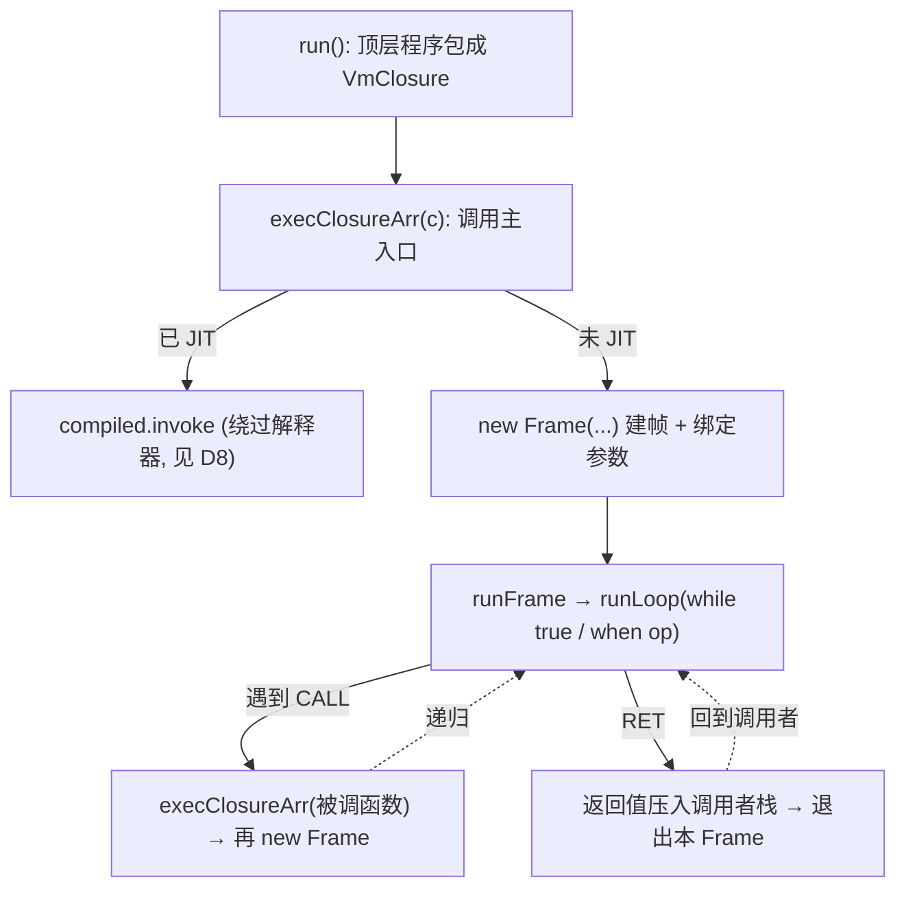
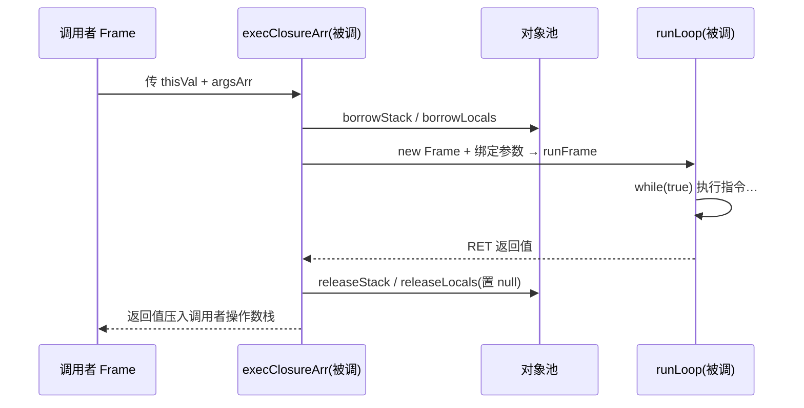
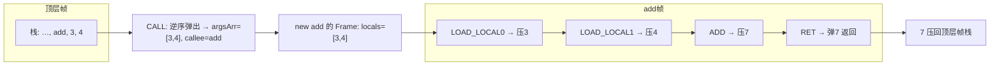
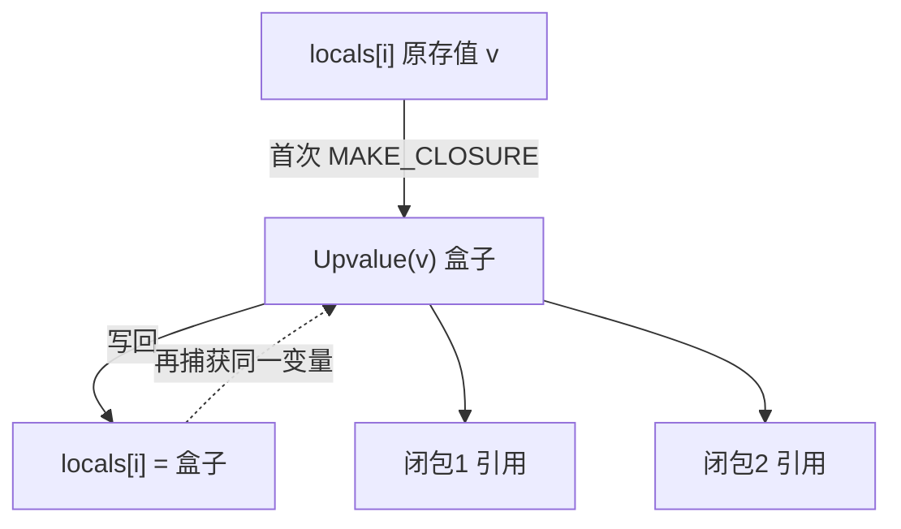
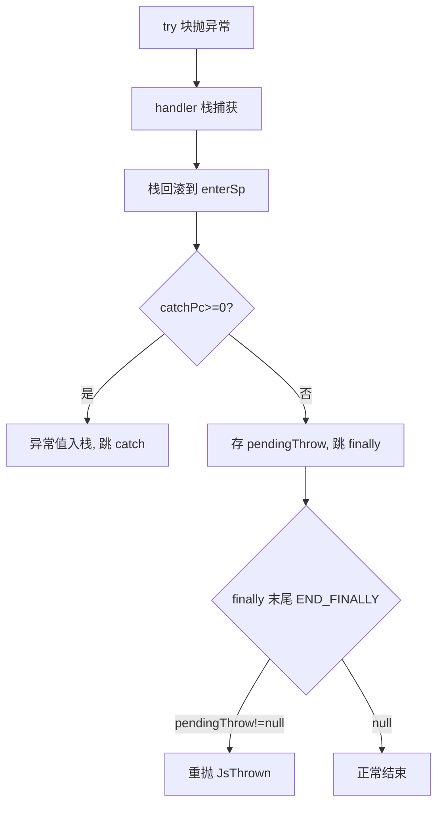

# D5 · 栈式虚拟机 Vm 完全指南

虚拟机本质上就是一个"读一条、做一条"的大循环，用一个 `pc` 指针记着当前读到第几行。每调用一个 JS 函数，就开一份"档案"（Frame），里面装着操作数栈（盘子）、局部变量表（格子）、参数、`this` 以及闭包盒子。本篇从主循环出发，一直讲到函数怎么调用、参数怎么传、闭包盒子怎么读写、异常怎么接、for-in / for-of 怎么遍历，全程带源码细节。如果只想先建立直觉，建议重点看 §1 的心智模型和 §7 对 `add(3,4)` 的完整走查。

> 前置知识：D3（字节码）、D4（编译器）、D6（运行时值模型）。
>
> 本篇以 **Frame** 为核心，自底向上拆解 `vm/Vm.kt` 的执行逻辑：先建立心智模型，再讲清
> 一次函数调用从建帧、传参、执行到返回的全过程，最后逐主题剖析闭包、内联缓存、异常、迭代与
> 算术特化。读完应能徒手单步执行任意一段字节码。

---

## 1. 心智模型：VM 如何执行代码

不妨把虚拟机想象成一个"读一条、做一条"的机器人：它有一个指针 `pc` 指向"当前读到第几行"，还有一个"盘子"（`stack`）用来临时放操作数——盘子是后进先出的，就像一摞盘子，只能从顶上拿、往顶上放。每读一行指令，它就按指令的意思拨弄一下盘子，再把 `pc` 往后挪一格。至于循环、判断这类"跳来跳去"的指令，办法就是直接修改 `pc`。下面这段伪代码，就是主循环的骨架。

KJS 的 VM 是一个**栈式解释器**。源码经编译器（D4）产出字节码 `Bytecode`，VM 再逐条执行它。

理解整个 VM 只需抓住一句话：

> **每调用一次函数，就新建一个 `Frame`，并在该 `Frame` 上跑分发循环；函数返回即退出该 `Frame`。
> "函数调用"在底层就是一次 Kotlin 递归。**

因此 JS 的调用栈与 Kotlin 的调用栈完全重合。例如执行 `add(3,4)` 时又调用 `mul()`，调用栈为：

```
runLoop(add)        ← add 的 Frame 上跑分发循环
  └─ runLoop(mul)   ← mul 的 Frame 上跑分发循环
       └─ RET 返回 12 给 add
  ← add 拿到 12，继续
```

VM 只有一类循环（`runLoop` 的 `while(true)`），所有 opcode 都在其中分发；"函数调用"只是从循环
内部再递归进入一个新的 `runLoop` + 新 `Frame`。



---

## 2. Frame：一次函数调用的全部状态

`Frame`（`Vm.kt:50`）封装了**一次函数调用所需的全部运行时状态**，让多函数嵌套调用各跑各的、互不干扰：

```kotlin
50:70:engine/src/main/kotlin/io/kjs/vm/Vm.kt
private class Frame(
    val bc: Bytecode,            // 本函数的字节码（指令、常量、字符串池、子函数表…）
    val stack: Array<Any?>,      // 操作数栈（运算临时值都在这）
    val locals: Array<Any?>,     // 局部变量表（参数 + 局部变量 + 编译器临时槽）
    val closureEnv: Environment?,// 闭包/词法环境（块级 let/const、全局名查找走这里）
    val upvalues: Array<Upvalue>,// 本函数捕获的外层变量（盒子数组）
    val thisVal: Any?,           // 本次调用的 this 绑定
    val args: Array<Any?>,       // 调用者传进来的实参数组（arguments 的来源）
) {
    var sp: Int = 0              // 操作数栈栈顶指针
    var pc: Int = 0              // 程序计数器：下一条要执行的指令下标
    var lastResult: Any? = JsValues.UNDEFINED  // 顶层程序的最终结果
    var pendingThrow: Any? = null              // finally 待重抛的异常
    // 异常处理器栈: 每项为 [catchPc, finallyPc, enterSp] 三元组（见 §13）
    val handlers = IntArray(64)
    var handlerTop = 0
    fun push(v: Any?) { stack[sp++] = v }
    fun pop(): Any? { sp--; val v = stack[sp]; stack[sp] = null; return v }
    fun peek(): Any? = stack[sp - 1]
}
```

各字段与 JS 概念的对应关系：

| Frame 字段 | 对应 JS 概念 |
|---|---|
| `bc` | 函数体编译后的字节码 |
| `stack` | 求值用的操作数栈 |
| `locals` | 局部变量表（参数在最前，见 §5 / §6） |
| `thisVal` | `this` |
| `args` | `arguments` 的底层数组 |
| `upvalues` | 闭包捕获的外部环境变量（见 §8） |
| `pc` | 当前执行到第几条指令 |
| `sp` | 操作数栈的使用高度 |
| `handlers` / `pendingThrow` | `try/catch/finally` 所需的控制流状态 |

> 补充：`Frame` 是 VM 的私有内部类，外部不可见。JS 层看到的"函数对象"是 `JsFunction`（D6），
> 内部挂载的 `VmClosure`（`Vm.kt:14`）才是"可被执行的函数载体"，携带 `Bytecode`、`closureEnv`、
> `Upvalue[]` 及 JIT 状态（`hotness`/`compiled` 等）。每次调用 `VmClosure` 时由它造出 `Frame` 去执行。

---

## 3. 调用的生命周期：建帧与退帧

每次调用都经过 `execClosureArr`（`Vm.kt:132`），它完成三件事：**建帧 → 进循环执行 → 退帧还池**。

```kotlin
132:196:engine/src/main/kotlin/io/kjs/vm/Vm.kt
private fun execClosureArr(c: VmClosure, thisVal: Any?, argsArr: Array<Any?>): Any? {
    // (1) JIT 快路径：已编译则直接调生成的类，绕过解释器（详见 D8）
    val already = c.compiled
    if (already != null) { c.jitCalls++; return already.invoke(this, realm, c, thisVal, argsArr) }
    // (2) 解释器路径：hotness++ 并可能在后台触发 JIT 编译
    if (!c.jitRejected && c.compiled == null) {
        c.hotness++
        if (Jit.shouldCompile(c.hotness)) Jit.requestCompile(c)   // 异步提交，本次仍走解释器
    }
    // (3) 建帧：从对象池借两个数组，组装 Frame
    val bc = c.bc
    val localsSize = maxOf(bc.localCount, bc.paramCount) + 4
    val stack = borrowStack()                       // 复用池里的 Array<Any?>
    val locals = borrowLocals(localsSize)
    val frame = Frame(bc, stack, locals, c.closureEnv, c.upvalues, thisVal, argsArr)
    //     把实参写进局部变量表槽 0..paramCount-1（不足补 undefined）
    val pc = bc.paramCount
    for (i in 0 until pc) frame.locals[i] = if (i < argsArr.size) argsArr[i] else JsValues.UNDEFINED
    try {
        return runFrame(frame)                      // 进入分发循环执行本函数体
    } finally {
        releaseStack(stack, frame.sp)              // 退出时把数组归还对象池
        releaseLocals(locals, localsSize)
    }
}
```

要点：

- **每次调用都新建 `Frame`**：`new Frame(...)` 每次调用都会发生，`Frame` 本身很轻（只是引用容器，
  不池化）；但 `stack`/`locals` 两个大数组从 `stackPool`/`localsPool`（`Vm.kt:107`）借出、用完归还，
  避免每次调用都 `new` 大数组。
- **`pop`/`release` 会置 null**（`Vm.kt:117`）：归还前清空数组元素，防止旧引用残留在池化内存里
  造成隐式内存泄漏。
- **`finally` 保证退帧**：无论函数正常 `RET` 还是抛异常，都会走 `releaseStack/releaseLocals` 还池。
  因此热递归（如 `fib(30)`）下"分配数组"的昂贵部分被池化抹平，GC 压力骤降——这是 VM 比"递归解释
  AST"快很多的主因之一。池上限各 64 个，超出则直接丢弃让 GC 收。



### 3.1 VmClosure：可执行的函数载体

§2 说过 JS 层看到的函数是 `JsFunction`，但解释器真正执行的载体是 `VmClosure`（`Vm.kt:14`）——一个"编译完成的用户函数"的数据包：

```kotlin
14:28:engine/src/main/kotlin/io/kjs/vm/Vm.kt
class VmClosure(
    val bc: Bytecode,
    val closureEnv: Environment?,   // nullable for top-level
    val upvalues: Array<Upvalue>,
) {
    @JvmField var hotness: Int = 0                 // 调用计数器，决定何时 JIT
    @JvmField @Volatile var compiled: Compiled? = null   // JIT 产物；非空则绕过解释器
    @JvmField @Volatile var jitRejected: Boolean = false // 编译被拒后不再尝试
    @JvmField @Volatile var compilePending: Boolean = false // "已提交编译、尚未发布"
}
```

前三个字段是"执行必需"（字节码、词法环境、捕获变量）；后四个字段全是 **JIT  bookkeeping**（D8 的主线）：

- **`hotness`**：每被调用一次就 `++`（`Vm.kt:149`）。当 `hotness == Jit.threshold`（`Jit.kt:57`）时，`requestCompile` 把编译任务丢给后台线程——**本次调用仍走解释器**，编译是异步的，不会卡住热路径。
- **`compiled`**：后台编译完成后发布的产物（一个 ASM 生成的类的实例）。一旦非空，`execClosureArr` 的第一步就直接 `compiled.invoke(...)` 返回，**完全绕过 §8 的分发循环**。`@Volatile` 是因为发布发生在编译线程、读取发生在执行线程。
- **`jitRejected` / `compilePending`**：前者防止"不可编译的函数"（`canCompile` 检查不过，比如含某些 opcode）反复提交编译；后者防止同一个函数被重复提交。

`VmClosure` 是怎么挂到 `JsFunction` 上的？靠 `makeJsFunction`（`Vm.kt:81`）——`MAKE_CLOSURE` 指令最后就是调它：

```kotlin
81:93:engine/src/main/kotlin/io/kjs/vm/Vm.kt
val fn = JsFunction.native(name, bc.paramCount) { _, _ -> JsValues.UNDEFINED }  // 占位 lambda, 永不执行
fn.set("name", name); fn.set("length", bc.paramCount.toDouble())
if (!bc.isArrow) { /* 挂 prototype + constructor */ } else fn.set("__arrow__", true)
fn.proto = realm.functionProto
val vc = VmClosure(bc, closureEnv, upvalues)
fn.vmClosure = vc                                    // 快路径槽：invokeFast 直接取它
fn.invoker = { _, thisVal, args -> execClosure(vc, thisVal, args) }  // 通用路径入口
```

注意那个占位的 native lambda 永远不会执行——因为 `fn.invoker` 被覆盖了，`JsFunction.call` 优先走 `invoker`（D6 §5）。同时设置 `vmClosure` 字段（快路径）与 `invoker`（通用路径）是双保险：`invokeFast` 查 `vmClosure`，`fn.call` 走 `invoker`，两条路最终都汇入 `execClosureArr`。

---

## 4. 参数传递：调用约定

参数传递分两端：**调用端**把栈上实参收进 `argsArr`；**被调端**把 `argsArr` 绑进局部变量表。

### 4.1 调用端：CALL 收拢参数

调用约定约定：调用前实参按 `arg0, arg1, … argN-1` 顺序压在操作数栈上，紧接着压被调函数。
`CALL`（`Vm.kt:447`）把它们收拢：

```kotlin
447:454:engine/src/main/kotlin/io/kjs/vm/Vm.kt
Op.CALL -> {
    val argc = a
    val argsArr = Array<Any?>(argc) { JsValues.UNDEFINED }
    for (i in argc - 1 downTo 0) argsArr[i] = f.pop()   // 逆序弹出：栈顶是最后一个参数
    val callee = f.pop()                                  // 再弹被调函数
    val fn = callee as? JsFunction ?: jsThrowTypeError(realm, "value is not a function")
    f.push(invokeFast(fn, realm.globalObject, argsArr))   // this = 全局对象
}
```

为何**逆序弹出**？栈是 LIFO，最后压进的是 `argN-1`（在栈顶），先弹出正好放进 `argsArr[N-1]`，
于是 `argsArr[0]` 始终是 `arg0`，与数组下标对齐。

### 4.2 被调端：实参写入局部变量表

回到 §3 的建帧代码：`frame.locals[i] = if (i < argsArr.size) argsArr[i] else UNDEFINED`。
`argsArr[0..paramCount-1]` 被复制到 `locals[0..paramCount-1]`，**少传的参数自动为 `undefined`**
（标准 JS 语义）。

### 4.3 this 的绑定

- `CALL`：非方法调用，`this = realm.globalObject`（非严格默认全局对象）。
- `CALL_METHOD`（`Vm.kt:455`）：从栈上再弹"方法所属对象"作 `this`；**若为箭头函数**
  （`fn.getOwn("__arrow__")==true`）则沿用外层 `f.thisVal`——箭头不重新绑定 `this`。
- `NEW_OP`（`Vm.kt:464`）：先按 `ctor.prototype` 造新对象作 `this`，构造函数返回对象则用返回值覆盖。

### 4.4 invokeFast：一切函数调用的统一入口

`CALL`/`CALL_METHOD`/`NEW_OP` 三条指令最后都收敛到 `invokeFast`（`Vm.kt:199`）——它是"用户函数与内置函数一视同仁"的分流点：

```kotlin
199:204:engine/src/main/kotlin/io/kjs/vm/Vm.kt
internal fun invokeFast(fn: JsFunction, thisVal: Any?, argsArr: Array<Any?>): Any? {
    val vc = fn.vmClosure as? VmClosure
    if (vc != null) return execClosureArr(vc, thisVal, argsArr)   // 快路径: VM 函数直接建帧
    // Fallback to generic path (native functions, bound functions, etc.).
    return fn.call(thisVal, argsArr.toList())                      // 通用路径: native/bind 等
}
```

两条路径的分界是 **`fn.vmClosure` 是否非空**：

- **VM 编译的用户函数**：`makeJsFunction` 建函数时就把 `VmClosure` 塞进了 `vmClosure` 槽（§3.1），这里取出来直接 `execClosureArr` 建帧——数组原样传递，零拷贝。
- **内置函数 / `bind` 产物 / Walker 函数**：`vmClosure` 为空，回退到 `JsFunction.call`，它走 `invoker` 或 `native` lambda（D6 §5）。代价是 `argsArr.toList()` 多一次数组→列表的拷贝。

为什么要有两条路径？因为 `fn.call` 的签名是 `List<Any?>`（面向所有调用方的通用接口），而 VM 内部手里已经是 `Array<Any?>`——如果每次调用内置函数也走 `toList()`，热路径上全是临时对象。所以 VM 给自己的函数开了 `vmClosure` 这个专用槽，把"调用 VM 函数"的代价压到最低。类似的优化在真实引擎里也常见：V8 对 JS 函数和 C++ 内置函数走完全不同的调用约定，内置函数连参数都不是数组而是直接从栈上读。

---

## 5. 局部变量表与变量的存储模型

很多人会把 VM 里的"局部变量"和"全局变量"统称为"变量池"，但在 KJS 里**没有任何一个被命名为"池"
的变量存储结构**。"池"这个词在 VM 中另有所指（§5.3）。要理解变量存储，得先分清 VM 中四类"变量位置"，
它们的存储方式完全不同：

| 位置 | 存储结构 | 索引方式 | 大小何时确定 | 谁分配 |
|---|---|---|---|---|
| 局部变量 / 参数 / 临时槽 | `Frame.locals: Array<Any?>` | 整数槽号 `slot` | 编译期（`bc.localCount`） | 编译器 `nextSlot` |
| 全局变量 | `Environment.vars: HashMap<String,Any?>`（挂 `Realm.globalEnv`） | 名字字符串 | 运行期动态 | 运行时 `declare` |
| 闭包捕获变量 | `Upvalue` 盒子（在局部槽或 `upvalues[]`） | upvalue 下标 | 运行期 `MAKE_CLOSURE` | — |
| 操作数栈临时值 | `Frame.stack: Array<Any?>` | 栈顶指针 `sp` | 运行期动态 | 求值 `push/pop` |

本节先讲局部变量表（数组），再看全局变量（环境），最后澄清 VM 真正的"数组对象池"，并把"一个函数
到底有多少个局部变量、是不是编译期构造的"一次讲清。

### 5.1 局部变量表：一个按槽号索引的扁平数组

`Frame.locals: Array<Any?>` 就是局部变量表。它本身**和"池"无关**，就是一个普通数组，靠整数下标
随机访问：

```
locals: [ p0, p1, …, p_{paramCount-1},  v0, v1, …, v_{k} ]
         └────── 参数（建帧时从 argsArr 绑定） ──────┘  └─ 局部变量 + 编译器临时槽 ┘
```

- **槽 0..paramCount-1 = 参数**：建帧时直接绑定（§4.2）。
- **槽 paramCount..localCount-1 = 局部变量和临时变量**：由编译器在 D4 统一编号分配；表达式求值的
  中间结果也可能占用临时槽。
- **总大小** `localsSize = maxOf(bc.localCount, bc.paramCount) + 4`（`Vm.kt:175`），`+4` 为安全余量。

### 5.2 编译期如何分配槽位（局部变量数量与构造时机）

**局部变量表的槽号不是运行时算的，而是编译器在 D4 生成字节码时就分配好的。** `Compiler` 为每个函数
维护一个 `nextSlot` 计数器，每遇到一个 `var/let/const` 声明或一处需要临时空间，就拿走下一个槽号：

```kotlin
60:69:engine/src/main/kotlin/io/kjs/ir/Compiler.kt
private var nextSlot = 0                                  // 当前函数下一个可用槽
fun declareLocal(name: String): Int {                    // 声明一个局部(提升提前到函数头)
    val s = scope[name]
    if (s != null) return s                               // 同一作用域内重复声明 → 复用同一槽
    val slot = nextSlot++                                 // 否则新开一个槽
    scope[name] = slot
    return slot
}
fun reserveSlot(): Int = nextSlot++                      // 预留一个临时槽(表达式求值中间结果)
```

函数内所有声明都走这条路径累加 `nextSlot`。当整个函数编译结束时，`nextSlot` 的终值就是"本函数一共
用了多少个局部槽"，编译器把它**写进字节码元数据**：

```kotlin
358:359:engine/src/main/kotlin/io/kjs/ir/Compiler.kt
bc.localCount = c.nextSlot        // 本函数的局部变量表大小
```

VM 通过字节码里的 `bc.localCount` 字段得知一个函数有多少局部变量——该字段在编译期由累计的 `nextSlot` 终值写入，运行期建帧时直接读取即可
（它等于编译期累计的 `nextSlot`）。运行期建帧时读到这个数就知道了：

```kotlin
175:176:engine/src/main/kotlin/io/kjs/vm/Vm.kt
val localsSize = maxOf(bc.localCount, bc.paramCount) + 4   // +4 安全余量
val locals = borrowLocals(localsSize)
```

两个要点：
- **`var` 提升**：`declareLocal` 在"进入函数体之前"就把函数内所有 `var/function` 声明分配好槽，所以
  即便声明写在函数末尾，开头也能访问（这就是 JS 提升语义）。`let/const` 同样走 `declareLocal`，只是
  作用域限制在块内，槽号仍来自同一个 `nextSlot`。
- **参数也算槽**：`paramCount` 个参数占 0..paramCount-1，临时槽在它们之后继续 `nextSlot++`，因此
  `localCount` 通常 `≥ paramCount`。顶层程序没有参数，`compileProgram` 末尾同样记 `bc.localCount = c.nextSlot`。

> 结论：**局部变量表是编译期构造的**——槽号、数量（`localCount`）、乃至数组大小都在编译期定好；
> 运行期只是按这个数从池里借一个数组、填上本次调用的实际值。

### 5.3 运行期：locals 数组从"对象池"借还（VM 真正的"池"）

上面说的 `locals` **数组本身**，是从一个对象池里借来的——这才是 VM 里真正的"池"：

```kotlin
107:116:engine/src/main/kotlin/io/kjs/vm/Vm.kt
private val stackPool = ArrayDeque<Array<Any?>>()            // 操作数栈数组池
private val localsPool = ArrayDeque<Array<Any?>>()           // 局部变量表数组池
private fun borrowLocals(minSize: Int): Array<Any?> {        // 借一个够大的数组
    while (localsPool.isNotEmpty()) {
        val a = localsPool.removeLast()
        if (a.size >= minSize) return a
    }
    return arrayOfNulls(maxOf(minSize, 8))
}
```

要点：
- **"池"复用的是数组对象，不是变量**：`localsPool` 里存的是"大小够用的 `Array<Any?>`"。调用开始 `borrow`
  出来装本次调用的变量，调用结束 `releaseLocals` 清空元素后还回（`Vm.kt:122`）。这纯粹是性能优化，避免
  每次调用都 `new` 一个大数组。数组里的**值**每次都是新的，池子里不存在"预存好的变量"这回事。
- **归还前置 null**（`Vm.kt:122-124`）：把元素清空再还池，防止旧引用残留在池化内存里造成隐式内存泄漏。
- 池上限各 64 个（`Vm.kt:120/124`），超出就丢弃交给 GC。

> 所以"局部变量池"这个说法，准确讲应拆成两层：**变量的逻辑存储 = `locals` 数组（编译期定槽号）；
> 数组的物理来源 = `localsPool` 对象池（运行期复用）。** 两者不是一回事，只是名字容易混。对应地，
> 全局变量**没有任何池**——它是一张按需增长的哈希表（见 §5.6）。

### 5.4 LOAD_LOCAL / STORE_LOCAL

```kotlin
245:253:engine/src/main/kotlin/io/kjs/vm/Vm.kt
Op.LOAD_LOCAL -> {
    val raw = f.locals[a]
    f.push(if (raw is Upvalue) raw.value else (raw ?: JsValues.UNDEFINED))
}
Op.STORE_LOCAL -> {
    val raw = f.locals[a]
    val v = f.peek()                       // 赋值表达式的值已在栈顶
    if (raw is Upvalue) raw.value = v else f.locals[a] = v
}
```

> **关键细节**：`locals[a]` 里存的**不一定是值，可能是 `Upvalue` 盒子**（局部被内层闭包捕获时）。
> 若是盒子，读写都走 `box.value`——父帧与所有捕获它的闭包共享同一份内存（见 §8）。

### 5.5 参数槽与 arguments 的区别

`Frame` 同时持有 `args`（原始实参数组）与 `locals[0..paramCount-1]`（参数副本），用途不同：

- `locals` 里是"形参变量"，`STORE_LOCAL` 改它不会改 `args`。
- `args` 是 `arguments` 的底层数据。`LOAD_ARGUMENTS`（`Vm.kt:478`）把 `f.args` 整包成数组返回；
  `LOAD_ARG a` / `STORE_ARG a`（`Vm.kt:254`）直接按下标读/写 `f.args`——这正是 `arguments[i]` 的实现。
  早期 JS 中 `arguments` 与形参共享存储（`function f(a){ arguments[0]=9; return a }` 调 `f(1)` 返回 `9`），
  本 VM 通过 `args` 数组实现这一可见行为。

### 5.6 全局变量存在哪（与局部变量表对照）

全局变量**不占 `locals` 槽**，它存在 `Realm` 的全局环境 `globalEnv` 中——一个 `Environment`
（`JsFunction.kt:51`），内部是 `vars: HashMap<String, Any?>`：

```kotlin
17:17:engine/src/main/kotlin/io/kjs/runtime/Realm.kt
val globalEnv = Environment()
51:52:engine/src/main/kotlin/io/kjs/runtime/JsFunction.kt
class Environment(val parent: Environment? = null) {
    @JvmField internal val vars = HashMap<String, Any?>()
```

也就是说：
- **局部变量** = 数组里的整数槽，编译期定大小，运行期 `locals[slot]` 随机访问（O(1)）。
- **全局变量** = 哈希表里的"名字→值"，靠字符串键查找 `globalEnv.vars[name]`，大小随运行期赋值动态增长。

两者的访问指令完全不同：局部走 `LOAD_LOCAL/STORE_LOCAL`（整数下标）；全局走
`LOAD_GLOBAL/STORE_GLOBAL/DECL_GLOBAL`（字符串查表，并带 IC 加速，见 §11）。"某标识符是不是全局"
在编译期就定好了（详见 §11.1），运行期只是按名字去 `globalEnv` 取。

### 5.7 全景对照表

| 维度 | 局部变量表 | 全局变量 | 操作数栈 |
|---|---|---|---|
| 数据结构 | `Array<Any?>` | `HashMap<String,Any?>` | `Array<Any?>` |
| 定位方式 | 整数 `slot` | 名字字符串 | `sp` 栈顶 |
| 大小何时定 | 编译期（`bc.localCount`） | 运行期动态 | 运行期动态 |
| 访问指令 | `LOAD_LOCAL` / `STORE_LOCAL` | `LOAD_GLOBAL` / `STORE_GLOBAL` / `DECL_GLOBAL` | `PUSH` / `POP` |
| 槽号/键谁分配 | 编译器 `nextSlot` | 运行时 `declare` | 编译器 `reserveSlot` / 求值 |
| 数组是否池化 | 是（`localsPool`） | 否（HashMap 不在池里） | 是（`stackPool`） |

---

## 6. 返回值传递

返回值规则：**被调函数从自己的操作数栈弹出栈顶，直接 `return` 出 `runLoop`；该值沿调用链回到
`CALL` 指令，被压入调用者的操作数栈。**

```kotlin
474:475:engine/src/main/kotlin/io/kjs/vm/Vm.kt
Op.RET -> return f.pop()             // 弹出操作数栈顶作为返回值，return 出 runLoop
Op.RET_UNDEF -> return JsValues.UNDEFINED
```

串起来看（对照 §3 的 `finally`）：`RET → runLoop` 返回 → `runFrame` 的 `try/finally` 释放数组 →
`execClosureArr` 把返回值返回 → 回到调用者的 `CALL` 指令 `f.push(invokeFast(...))`，返回值压进调用者
栈。顶层程序则用 `STASH_RESULT`/`HALT`（`Vm.kt:519`）把最后结果存到 `frame.lastResult`，`run` 拿到它
作为 `eval` 的返回值。

### 6.1 递归深度与栈溢出：调用栈就是 JVM 栈

§1 说过"JS 的调用栈与 Kotlin 的调用栈完全重合"——这是一把双刃剑。好处是异常跨函数传播天然成立（`JsThrown` 沿 Kotlin 栈冒泡）；代价是 **JS 递归深度受 JVM 线程栈大小限制**，默认大约几千到一万帧（每帧还要算上 `runLoop` 那一串局部变量，比纯 Kotlin 递归更费栈）。

两个直接后果：

- **深递归会抛 `StackOverflowError`**，比如 `function f(){ return f() } f()`。关键点：它**不是** `JsThrown`，`runLoop` 的 `catch (thr: JsThrown)` 接不住它（§8），于是 JS 层的 `try/catch` 对它无效——它会一路炸穿到 `run`，变成宿主层的 JVM 异常。这一点和真实浏览器不同（V8 会把栈溢出转成 JS 可捕获的 `RangeError: Maximum call stack size exceeded`），是 M1 的已知简化。
- **没有尾调用优化（TCO）**。`function f(){ return g() }` 里 `g` 的调用仍是完整的 `CALL` → 建帧 → `RET` → 返值，f 的帧要等 g 返回后才退。ES6 规范其实规定了严格模式下的尾调用优化，但 V8 也只在很早期的版本短暂支持过、后来移除了，KJS 与主流实现保持一致——不做。

另外注意 `Frame` 的 `handlers` 是固定 `IntArray(64)`（约 21 层 try 嵌套，§20），这是 JS 层嵌套深度的另一个硬限制，但它限制的是**单个函数内**的 try 嵌套，与调用深度无关。`frameDepth` 计数器（`Vm.kt:43`）只服务 Tracer 的缩进显示，不是深度保护。

---

## 7. 完整 trace：`add(3, 4)`

这是全篇最值得跟着走一遍的例子：从"调用 `add(3,4)`"到"返回 7"，建帧、读参数、做加法、出帧每一步的盘子和格子变化都列了出来。如果前面的硬核内容一时看不进去，不妨先啃这一节，把完整直觉建立起来，再回头看 §2 / §4 / §5 会轻松很多。

把 §3–§6 串起来，看这段代码的字节码如何执行：

```js
function add(a, b) { return a + b; }
add(3, 4);
```

**阶段 A — 顶层帧执行到 `add(3,4)` 前**：操作数栈已依次压入 `add` 函数对象、`3`、`4`。

**阶段 B — `CALL argc=2`**（在顶层 Frame 上）：
1. `argsArr[1] = pop() = 4`；`argsArr[0] = pop() = 3`（逆序弹出）。
2. `callee = pop() = add` 函数。
3. `invokeFast(add, globalObject, [3,4])` → `execClosureArr(add)` → **新建 add 的 Frame**。
4. 建帧绑定参数：`addFrame.locals[0]=3`，`addFrame.locals[1]=4`，`thisVal = globalObject`。

**阶段 C — 在 add 的 Frame 上执行 `return a + b`**：

| pc | 指令 | 操作 | addFrame 栈 |
|---|---|---|---|
| 0 | `LOAD_LOCAL 0` | push `locals[0]=3` | `[3]` |
| 1 | `LOAD_LOCAL 1` | push `locals[1]=4` | `[3, 4]` |
| 2 | `ADD` | pop 4, pop 3, push `3+4=7` | `[7]` |
| 3 | `RET` | `return pop() = 7` | — |

**阶段 D — 返回**：`7` 从 `runLoop(add)` 回到顶层 `CALL`，`f.push(7)`，顶层栈变 `[7]`；随后 `HALT` 把
`7` 作为顶层结果返回给 `run`。



调用者把参数压栈 → `CALL` 逆序收成 `argsArr` → 建被调 Frame 并绑进 `locals[0..n]` → 被调执行 →
`RET` 弹栈顶 → 返回值压回调用者栈。这一条链路是理解 VM 的钥匙。

---

## 8. 主分发循环

单函数内部逐条执行都收敛到 `runFrame`（`Vm.kt:207`）→ `runLoop`（`Vm.kt:220`）。`runLoop` 是
**永真 `while` + `when(op)`**：

```kotlin
226:231:engine/src/main/kotlin/io/kjs/vm/Vm.kt
while (true) {
    val pc = f.pc
    val op = OP_VALUES[code[pc]]      // code/aOps/bOps 是 Bytecode 的三条 IntArray 车道(D3)
    val a = aOps[pc]; val b = bOps[pc]
    if (traceHere) tracer!!.onVmStep(pc, op, a, b, snapshot(f))
    f.pc = pc + 1                     // 先推进 pc，多数 op 顺序执行
    try { when (op) { ... } }
    catch (thr: JsThrown) { ... }     // 异常统一在这里被 handler 栈捕获
}
```

- **`OP_VALUES[code[pc]]` 是数组下标查表**：`code[pc]` 是 opcode 整数，`OP_VALUES` 是
  `{op整数 → Op枚举}`，零成本；Kotlin 把 `when` 编译成 JVM `tableswitch`，无分支预测惩罚。
- **`f.pc = pc + 1` 先推进的玄机**：顺序指令无需再写 `pc++`；跳转指令（如 `JMP a`）直接覆盖
  `f.pc = a`，于是"下一条指令"被改写。这正是字节码控制流的实现基础。
- **一个 Frame 对应一个 `runLoop`**：函数体内所有指令在同一 `while` 循环里顺序/跳转执行，直到
  遇到 `RET`（返回）或 `HALT`（顶层结束）。

### 8.1 Tracer：VM 的"慢动作回放"

`runLoop` 里那句 `if (traceHere) tracer!!.onVmStep(...)` 是 KJS 的教学武器：`Tracer`（`Tracer.kt:17`）把 VM 的每一步都打印成人类可读的叙事。用 CLI 加 `--trace` 即可开启（`Main.kt:18`，等价于 `Engine(trace = true)`）：

```
▶ 创建帧 add()   [depth=1]
   pc=0   LOAD_LOCAL     a=0     stack = []                            | locals: a=3, b=4
   pc=1   LOAD_LOCAL     a=1     stack = [3.0]                         | locals: a=3, b=4
   pc=2   ADD            a=0     stack = [3.0, 4.0]                    | locals: a=3, b=4
   pc=3   RET            a=0     stack = [7.0]                         | locals: a=3, b=4
◀ 退出帧 add() → 7.0
```

三个回调分工（`Vm.kt:213-218`）：`onFramePush` 在**建帧后、进循环前**打印帧创建（按 `frameDepth` 缩进，嵌套调用一目了然）；`onVmStep` 在**每条指令执行前**打印 pc、操作码、当前栈快照和局部变量表；`onFramePop` 在**退帧时**打印返回值。

局部变量表能显示 `a=3` 而不是 `slot0=3`，靠的是编译器写进字节码的 **`localNames` 元数据**（`Bytecode.kt:39`）——槽号到名字的映射，仅服务工具输出，运行期完全不参与。`snapshot`（`Vm.kt:620`）则把当前操作数栈渲染成短文本。

两点使用注意：输出走 **stderr**，不会和脚本的 `console.log`（stdout）混在一起，重定向时可以分开收集；开销极大（每条指令一次字符串格式化），只适合小段代码教学调试，别拿它跑 `fib(30)`。对照关系：§7 的手工走查表本质上就是 Tracer 输出的"人工精选版"。

---

## 9. 闭包与 Upvalue

所谓"闭包"，就是"函数 + 它定义时就能看到的那些外层变量"。在虚拟机里，外层变量并不靠名字去找，而是编译期为每个被捕获的变量编一个"upvalue 号"，运行时用一个小盒子 `Upvalue` 装着那个变量的值，函数对象里则保存着这些盒子的引用。这样一来，函数即使被传到别处调用，也能通过盒子找回当初的变量。把它和 D6 §5 讲的 `Environment` 对照着看，就是闭包捕获的两种表示。

### 9.1 MAKE_CLOSURE：open upvalue 共享盒子

闭包最精妙处：`MAKE_CLOSURE` 为子函数组装 `Upvalue[]`（`Vm.kt:330`）：

```kotlin
330:348:engine/src/main/kotlin/io/kjs/vm/Vm.kt
Op.MAKE_CLOSURE -> {
    val childBc = bc.functions[a]
    val upInfos = childBc.upvalueInfo           // 编译器标注每个 upvalue 来源(D4)
    val ups = if (upInfos.isEmpty()) EMPTY_UPVALS else Array(upInfos.size) { i ->
        val info = upInfos[i]
        if (info.parentIsLocal) {
            // 开放 upvalue: 父函数的局部槽 与 每个捕获它的闭包 共享同一个 Upvalue 盒子
            val cur = f.locals[info.parentIndex]
            val box = if (cur is Upvalue) cur           // 已有人开过盒子 → 复用
                      else Upvalue(cur).also { f.locals[info.parentIndex] = it }  // 否则新开
            box
        } else {
            f.upvalues[info.parentIndex]               // 来自更外层的已闭包 upvalue
        }
    }
    val closureEnv = f.closureEnv ?: realm.globalEnv
    f.push(makeJsFunction(childBc, closureEnv, ups))
}
```

两种 upvalue 来源：
- **`parentIsLocal` = true**：变量在**本帧**的局部槽。首次捕获时把槽位值装进新 `Upvalue` 盒子，
  并把 `locals[parentIndex]` **原地替换**成这个盒子（即 §5.2 中"槽里可能是盒子"的来源）。**后续再有
  闭包捕获同一变量，发现槽已是 `Upvalue`，直接复用**——保证多个闭包看到同一盒子。
- **`parentIsLocal` = false**：变量来自更外层，父帧已把它做成 `Upvalue`，这里直接引用
  `f.upvalues[parentIndex]`（跨多层闭包链式共享）。



> 这正是"多个闭包共享外部变量"、以及"`for` 里 `var i` 被所有闭包共享、而 `let i` 每次迭代独立"的
> 实现基础：`let` 在编译器层每轮分配新槽，于是每次捕获的是不同盒子。

### 9.2 LOAD_UPVAL / STORE_UPVAL

闭包体内读写被捕获变量直接走 `upvalues[a].value`，与 `STORE_LOCAL` 的盒子路径对称：

```kotlin
276:277:engine/src/main/kotlin/io/kjs/vm/Vm.kt
Op.LOAD_UPVAL  -> f.push(f.upvalues[a].value)
Op.STORE_UPVAL -> { f.upvalues[a].value = f.peek() }
```

---

## 10. 属性读写与内联缓存

### 10.1 LOAD_PROP / STORE_PROP

```kotlin
279:292:engine/src/main/kotlin/io/kjs/vm/Vm.kt
Op.LOAD_PROP -> {
    val obj = f.pop()
    val name = strings[a]                    // a = 字符串池里的属性名下标
    val v = if (obj is JsObject) {
        val caches = bc.caches ?: arrayOfNulls<Any?>(code.size).also { bc.caches = it }
        val ic = caches[pc] as? PropIc ?: PropIc().also { caches[pc] = it }  // 按 pc 建 IC 槽
        ic.get(obj, name) { o, n -> if (o == null) JsValues.UNDEFINED else o.get(n) }
    } else propGet(obj, name)                // 原始值(String/Double/Boolean)走 propGet
    f.push(v)
}
Op.STORE_PROP -> {
    val value = f.pop(); val obj = f.pop()
    propSet(obj, strings[a], value); f.push(value)   // 赋值表达式返回值
}
```

关键点：**IC 槽按 `pc` 索引**（`caches[pc]`），即"每条 `LOAD_PROP` 指令有自己的缓存"。首次执行时
惰性创建 `PropIc`（D7），后续命中形状缓存就跳过原型链查找。`propGet`/`propSet`（`Vm.kt:620`）是慢路径，
处理 `null`/`undefined` 报错、字符串/原始类型的原型方法、`JsObject.get` 等。

`LOAD_ELEM` / `STORE_ELEM`（`Vm.kt:293`）将 `a[b]` 的键 `toStr` 后走同一套 `propGet`/`propSet`；
`propSet` 对 `JsArray` 额外维护 `length`（写入下标 `>= length` 时自动扩长）。

---

## 11. 全局变量：编译期路径与运行期访问

§5.6 讲了全局变量存在 `globalEnv`（一张 `HashMap`）。本节讲清楚**编译器怎么知道某个标识符是全局
而不是局部**，以及三类全局指令的运行期行为。

### 11.1 编译期：哪些标识符走全局路径

编译器解析标识符时，会先查当前函数的 `scope`（局部槽表）和 `upvalueInfo`（闭包信息）：

- **函数内部的 `var/let/const x`**：在 `declareLocal` 分配到局部槽 → 走 `LOAD_LOCAL` / `STORE_LOCAL`。
- **顶层（程序根作用域）的 `var x` / `function f(){}`**：编译器**不分配槽**，而是生成 `DECL_GLOBAL`
  （声明时）和 `STORE_GLOBAL` / `LOAD_GLOBAL`（读写时）。因为顶层没有"局部帧"，全局变量自然落在
  `globalEnv`。
- **顶层未声明就赋值 `x = 1`**：编译器查不到局部/upvalue，也生成 `STORE_GLOBAL`；读取 `x` 生成
  `LOAD_GLOBAL`。这就是 JS "隐式全局变量"的实现。

```kotlin
268:268:engine/src/main/kotlin/io/kjs/ir/Compiler.kt
if (isTopLevel) bc.emit(Op.LOAD_GLOBAL, strIdx(name))   // 顶层未声明标识符 → 全局读
296:296:engine/src/main/kotlin/io/kjs/ir/Compiler.kt
if (isTopLevel) bc.emit(Op.DECL_GLOBAL, strIdx(name))   // 顶层 var/function → 全局声明
```

> 一句话：**"是不是全局变量"这件事在编译期就定好了**——看标识符是否落在某个函数的局部作用域里。
> 运行期 `LOAD_GLOBAL` 只是按名字去 `globalEnv` 取（§5.6）。所以全局变量的**存储位置**运行期确定，
> 但**走全局路径**这个决策是编译期构造字节码时做出的。注意全局变量**没有编译期"数量"概念**：它不像
> 局部变量有 `localCount`，全局环境是一张随运行期赋值动态增长的哈希表。

### 11.2 运行期：三类全局指令

```kotlin
257:274:engine/src/main/kotlin/io/kjs/vm/Vm.kt
Op.LOAD_GLOBAL -> {
    val name = strings[a]
    val tolerateUndef = b != 0           // b 标志: 是否容忍"未声明"(用于 typeof 等)
    val e = f.closureEnv ?: realm.globalEnv
    if (!e.has(name)) {
        if (tolerateUndef) f.push(JsValues.UNDEFINED)
        else jsThrowName(realm, "ReferenceError", "$name is not defined")
    } else f.push(e.get(name))
}
Op.STORE_GLOBAL -> { (f.closureEnv ?: realm.globalEnv).setOrDeclareGlobal(strings[a], f.peek()) }
Op.DECL_GLOBAL -> { (f.closureEnv ?: realm.globalEnv).declare(strings[a], f.peek()); f.pop() }
```

- **`b` 标志**：`typeof x`（x 未声明）在 JS 里返回 `"undefined"` 而非抛错。`LOAD_GLOBAL` 的 `b != 0`
  表示"容忍未定义"，走 `tolerateUndef` 分支。
- **`setOrDeclareGlobal`（`JsFunction.kt:67`）**：给未声明全局赋值时，沿 `Environment` 父链找到根
  （全局）再 `vars[name] = value`——隐式全局变量的落地。
- **`closureEnv` 优先**：块级 `let/const` 在 `Environment` 链上，优先于 `globalEnv`；命中 `has` 才读
  （与 D6 §5 的 `Environment` 链一致）。

### 11.3 GlobalIc：缓存"名字 → 拥有者 Environment"

`LOAD_GLOBAL` 每次都要 `has` / `get` 沿 `Environment` 父链线性查找，开销大。`GlobalIc`（D7 §5）按 `pc`
缓存"名字最终落在哪个 `Environment`"，后续命中直接 `owner.vars[name]`，跳过链遍历：

```kotlin
80:87:engine/src/main/kotlin/io/kjs/runtime/JsFunction.kt
fun resolveOwner(name: String): Environment? {   // JIT/IC 用来定位名字的拥有者
    var e: Environment? = this
    while (e != null) {
        if (e.vars.containsKey(name)) return e
        e = e.parent
    }
    return null
}
```

当某层 `Environment` 增删了同名变量、环境形状变化时缓存失效，回退到链查找；单态命中下几乎零成本。

---

## 12. 对象 / 数组构造

`MAKE_OBJECT` / `MAKE_ARRAY` 构造材料压在**栈顶**，用 `base = sp - n` 定位起点，搬到新对象后显式弹出：

```kotlin
309:329:engine/src/main/kotlin/io/kjs/vm/Vm.kt
Op.MAKE_OBJECT -> {
    val n = a                                  // 键值对数量
    val o = JsObject(realm.objectProto)
    val base = f.sp - 2 * n                   // 栈顶: k1,v1,k2,v2,...,kn,vn
    for (i in 0 until n) {
        val k = JsValues.toStr(f.stack[base + 2 * i]); val v = f.stack[base + 2 * i + 1]
        o.set(k, v)
    }
    for (i in 0 until 2 * n) { f.sp--; f.stack[f.sp] = null }  // 精确弹出 2n 并置 null
    f.push(o)
}
Op.MAKE_ARRAY -> {
    val n = a
    val arr = JsArray().apply { proto = realm.arrayProto }
    val base = f.sp - n
    for (i in 0 until n) arr.push(f.stack[base + i])
    for (i in 0 until n) { f.sp--; f.stack[f.sp] = null }
    f.push(arr)
}
```

> 构造完必须**显式弹出并置 null**（区别于单次 `f.pop()`），否则栈高错乱。`MAKE_CLOSURE` 的子字节码
> 已在编译期链好（`bc.functions[a]`），无需从栈取。

---

## 13. 控制流跳转

```kotlin
441:445:engine/src/main/kotlin/io/kjs/vm/Vm.kt
Op.JMP -> f.pc = a                      // 无条件跳
Op.JT  -> { val v = f.pop(); if (JsValues.toBool(v)) f.pc = a }   // 真则跳, 弹值
Op.JF  -> { val v = f.pop(); if (!JsValues.toBool(v)) f.pc = a }  // 假则跳, 弹值
Op.JT_KEEP -> { if (JsValues.toBool(f.peek())) f.pc = a else f.pop() }  // 跳则留值, 不跳则弹
Op.JF_KEEP -> { if (!JsValues.toBool(f.peek())) f.pc = a else f.pop() }
```

`JT_KEEP`/`JF_KEEP` 用于**逻辑短路**（`&&`/`||`）与条件表达式：判断时**不弹出**操作数，若走捷径
（短路）则保留值，否则弹出丢弃再顺序执行。`AND_LOG`/`OR_LOG` 标注为 `error("unreachable")`
（编译器直接用 `JF_KEEP`/`JT_KEEP` 生成，不会发射这两个 opcode）。

---

## 14. 异常处理器栈

用**打包的 `IntArray(64)`** 当处理器栈，每项 3 个 `Int`：`[catchPc, finallyPc, enterSp]`。

### 14.1 进入 / 退出

```kotlin
485:486:engine/src/main/kotlin/io/kjs/vm/Vm.kt
Op.TRY_ENTER -> { f.handlers[f.handlerTop++] = a; f.handlers[f.handlerTop++] = b; f.handlers[f.handlerTop++] = f.sp }
Op.TRY_EXIT  -> { f.handlerTop -= 3 }
```

`a`=catch 入口 pc，`b`=finally 入口 pc，`f.sp`=进入时栈高（用于异常时回滚栈）。

### 14.2 捕获与栈展开

`THROW`（`Vm.kt:484`）`throw JsThrown(v)`。`runLoop` 的 `catch (thr: JsThrown)` 捕获它：

```kotlin
525:540:engine/src/main/kotlin/io/kjs/vm/Vm.kt
catch (thr: JsThrown) {
    if (f.handlerTop == 0) throw thr                  // 无 handler → 冒泡到调用者帧
    val sp0 = f.handlers[f.handlerTop - 1]            // enterSp: 回滚目标栈高
    val finallyPc = f.handlers[f.handlerTop - 2]
    val catchPc = f.handlers[f.handlerTop - 3]
    f.handlerTop -= 3                                 // 弹出该 handler
    while (f.sp > sp0) { f.sp--; f.stack[f.sp] = null }  // 展开栈到进入时高度
    if (catchPc >= 0) {
        f.push(thr.value); f.pc = catchPc            // 有 catch: 异常值入栈, 跳 catch
    } else if (finallyPc >= 0) {
        f.pendingThrow = thr.value; f.pc = finallyPc  // 仅 finally: 记下待重抛, 跳 finally
    } else throw thr
}
```

流程：无 handler → 异常沿 Kotlin 调用栈冒泡到**上层 Frame** 的 `catch`（跨函数异常传播）；有 handler →
先把操作数栈回滚到 `enterSp`（丢弃 try 块残留值），再分流：`catchPc>=0` 则异常值入栈跳 catch；
否则把异常存进 `f.pendingThrow` 跳 finally。

### 14.3 finally 的待重抛

`finally` 无论正常/异常/return 都要执行，异常路径下跑完需**重抛原异常**：

```kotlin
487:491:engine/src/main/kotlin/io/kjs/vm/Vm.kt
Op.END_FINALLY -> {
    if (f.pendingThrow != null) {
        val t = f.pendingThrow!!; f.pendingThrow = null; throw JsThrown(t)
    }
}
```

`pendingThrow` 是"异常完成类型"载体；配合 `STASH_RESULT`/`HALT`（`Vm.kt:519`）处理 finally 里的
`return` 覆盖原返回值（如 `try{return 1}finally{return 2}` 返回 `2`，靠 `STASH_RESULT` 覆盖
`lastResult` 实现）。



---

## 15. 迭代协议（for-in / for-of）

编译器只用 `FOR_IN_INIT/NEXT`、`FOR_OF_INIT/NEXT` 四条指令（D4 §13），真正的状态机在 VM 的帧外对象上，
因此这类循环不污染 `locals`、也不影响栈高度。

### 15.1 for-in 的键集合

`FOR_IN_INIT`（`Vm.kt:512`）：弹出右侧对象，取其键集合压栈一个 `IterState(items, idx=0)`
（`Vm.kt:564`）。对 `JsObject` 取 `keys()`（自身键）；非对象退化为空列表。`FOR_IN_NEXT`
（`Vm.kt:520`）看栈顶 `IterState`：

```
it = 栈顶 IterState
if (it.idx >= it.items.size)  f.pc = a        // 取完，跳到循环尾
else { push(it.items[it.idx]); it.idx++ }      // 压入下一个 key，游标前进
```

注意 `IterState` **留在栈上**（只 `peek` 不弹），`idx` 原地累加，编译器在循环尾 `POP` 释放。

### 15.2 for-of 的迭代器协议

`FOR_OF_INIT`（`Vm.kt:525`）弹出对象交 `buildForOfState`（`Vm.kt:585`）：先查 `@@iterator`
（即 `Symbol.iterator`），拿到迭代器对象与 `next` 方法，压栈 `ForOfState(iterator, nextFn)`
（`Vm.kt:570`）。`FOR_OF_NEXT`（`Vm.kt:530`）：

```
it = 栈顶 ForOfState
if (!it.advance(this)) f.pc = a          // done=true，跳循环尾
else push(it.currentValue)               // 压入本次 value
```

`ForOfState.advance`（`Vm.kt:572`）每次用 `invokeFast(nextFn, iterator, [])` 调 `next()`，
读 `done`/`value`：不迭代器消失或 `done` 为真则返回 `false`。**降级**：若对象没有 `@@iterator`
（如字符串/数组/普通对象），`buildForOfState` 合成一个基于索引的迭代器，使 `for-of` 仍可用
（见 `Vm.kt:585` 注释）。

---

## 16. 算术与比较的类型特化

VM 对**双精度热路径**做类型特化，避免无谓装箱/强制：

```kotlin
353:360:engine/src/main/kotlin/io/kjs/vm/Vm.kt
Op.ADD -> {
    val r = f.pop(); val l = f.pop()
    f.push(
        if (l is Double && r is Double) l + r                 // 双精度: 原生加法, 最快
        else if (l is java.math.BigInteger && r is java.math.BigInteger) l.add(r)
        else if (l is String || r is String) JsValues.toStr(l) + JsValues.toStr(r)  // 字符串拼接
        else JsValues.toNumber(l) + JsValues.toNumber(r)       // 兜底: 强制转数字
    )
}
```

`SUB/MUL/DIV/MOD/POW` 同构：双精度走原生运算，BigInt 走 `BigInteger` 方法，其余 `toNumber` 兜底。
`+` 的 JS 语义在此落地：**任一操作数是字符串则拼接**。`LT` 等比较：`Double`/`BigInteger` 走原生比较，
否则 `numericCompare`（`Vm.kt:652`，字符串字典序、BigInt、`NaN` 比较返回 `false`）。`EQ/NEQ` 走
`looseEq`（==），`SEQ/SNEQ` 走 `strictEq`（===）。位运算（`BITAND…USHR`）经 `toInt32`/`toUint32`
对齐 JS 语义。

---

## 17. 指令派发参考：其余 Opcode 的行为

§10~§16 已覆盖属性访问、调用、算术、迭代等热点路径；本节补齐其余 opcode 的栈效应与语义
（对照 `Bytecode.kt` 的 `Op` 定义与 `Vm.kt` 主派发）。除注明外，"栈"指 `Frame.stack`，
`pop/push` 指栈顶操作。

### 17.1 常量与帧状态

| Opcode | 行为 | 栈效应 |
|---|---|---|
| `LOAD_ZERO` / `LOAD_ONE` | 压 `0.0` / `1.0` | `push` |
| `LOAD_INT a` | 压 `a.toDouble()` | `push` |
| `LOAD_CONST a` | 压 `bc.constants[a]`（含 BigInt 字符串、浮点） | `push` |
| `LOAD_STR a` | 压 `bc.strings[a]` | `push` |
| `GET_THIS` | 压 `f.thisVal`（`new`/箭头/方法调用时由 VM 设置） | `push` |
| `LOAD_ARG a` | 压 `f.args[a]` | `push` |
| `LOAD_ARGUMENTS` | 压 `f.args` 的浅拷贝数组 | `push` |
| `STASH_RESULT` | `f.lastResult = pop()`（语句级 REPL 结果暂存） | `pop` |
| `HALT` | `return f.lastResult`，结束顶层执行 | — |

### 17.2 名称解析与存储

`LOAD_GLOBAL`/`LOAD_LOCAL`/`LOAD_UPVAL` 分别是常量池/局部槽/open-upvalue 盒读取；对应的
`STORE_*` 写入；`DECL_GLOBAL` 在全局 `Environment` 声明（见 §11）。`LOAD_LOCAL/STORE_LOCAL` 直接
索引 `f.locals[slot]`，是运行期零哈希查找的主路径。

### 17.3 一元 / 类型 / 关系

| Opcode | 行为 |
|---|---|
| `TO_NUMBER` | 栈顶替换为 `JsValues.toNumber(top)` |
| `NEG` | 压 `-toNumber(top)` |
| `NOT` | 压 `!toBool(top)` |
| `PLUS` | 压 `toNumber(top)`（`+x` 语义） |
| `BITNOT` | 压 `~toInt32(top)` |
| `TYPEOF` | 压 `typeof` 字符串（`"number"/"object"/"function"`…） |
| `VOID_OP` | 弹栈并压 `undefined`（`void x`） |
| `IN_OP` | `prop in obj`：弹对象与属性，压布尔 |
| `INSTANCEOF` | `obj instanceof ctor`：弹构造器与对象，压布尔 |
| `TYPEOF` | 见上 |

### 17.4 删除

- `DELETE_PROP`：弹 `obj, key`，压 `obj.delete(key)`（`delete obj.key`）。
- `DELETE_ELEM`：弹 `obj, idx`，压删除结果（`delete arr[i]`）。
- `DELETE_PROP` 也负责 `delete 标识符` 这类全局名删除：按名字在 `Environment` 链上删除。

### 17.5 栈操作与展开

- `SWAP`：交换栈顶两元素（复合赋值、super 调用里定位 `this` 时常用）。
- `DUP`：复制栈顶（默认值/短路求值保留原值）。
- `LOAD_ELEM` / `STORE_ELEM`：元素（计算键）访问，对应 `obj[key]` / `obj[key] = v`。即**动态属性访问**
  `obj[k]`（键非字面量）经此指令；数组下标亦走此路。对 `JsArray` 且键为 `Int` 时有 `l.items[r]`
  快路径（带 shape 缓存），否则走 `JitBridge` 通用查找。
- **展开（spread）无专属 opcode**：`f(...arr)` 在编译期降级为 `emitBuildArgsArray`
  （scratch 槽 + `Array.prototype.concat`/`push` 拼出 `JsArray`），再用 `fn.apply(thisObj, argsArr)`
  （或 `fn.call`）调用，运行期只是一次普通 `CALL_METHOD`，故无需新 opcode（D4 §9）。

### 17.6 对象 / 数组构造

`MAKE_OBJECT n`（`Vm.kt`）：从栈顶弹出 `2n` 个值（键、值交错），自底向上构造 `JsObject` 压栈；
`base = sp - 2*n` 取错会键值错位（见 §18 常见坑）。`MAKE_ARRAY n`：弹出 `n` 个值组装成 `JsArray`；
`n=0` 时直接压空数组。

### 17.7 控制流收尾

`JT a`/`JF a`：弹栈顶并按真/假跳 `a`；`JT_KEEP`/`JF_KEEP`：不弹栈仅判断（编译器用短路求值，
见 D4 §5）。`JMP a`：无条件跳。`RETURN`：弹返回值并结束当前 `Frame`（`run` 返回该值）。

## 18. 异常与 finally 的完整实现

JS 异常不走 Kotlin 异常控制流本身（除 `JsThrown` 包裹），而是由 `Frame.handlers` 栈 + `pendingThrow`
协作，做到 `catch` 捕获、`finally` 必执行、未捕获则向上抛。

### 18.1 安装与拆除

- `TRY_ENTER a,b`（`Vm.kt:504`）：把 `(catchPc=a, finallyPc=b, sp0=当前栈高)` 三个 `Int` 压入
  `handlers`，`handlerTop += 3`。`sp0` 记录"进入 try 时的栈顶"，供异常时回滚栈用。
- `TRY_EXIT`（`Vm.kt:505`）：`handlerTop -= 3`，正常离开 try 后该 handler 出栈。

### 18.2 捕获（`catch`）

当 `run` 的 `when` 抛 `JsThrown`（`Vm.kt:544`）：

```
if (handlerTop == 0) throw thr            // 无 handler，直接向上抛（Kotlin 层）
sp0       = handlers[handlerTop-1]
finallyPc = handlers[handlerTop-2]
catchPc   = handlers[handlerTop-3]
handlerTop -= 3
while (sp > sp0) stack[--sp] = null       // 回滚到 try 入口栈高
if (catchPc >= 0) { push(thr.value); pc = catchPc }   // 进入 catch，异常值作参数
else if (finallyPc >= 0) { pendingThrow = thr.value; pc = finallyPc }  // 无 catch，先跑 finally
else throw thr
```

异常发生时先**回滚栈到 `sp0`**，再按 `catchPc`/`finallyPc` 分流。`handlers` 固定 `IntArray(64)`
（约 21 层嵌套 try），超深嵌套越界（§20 常见坑）。

### 18.3 续传（`finally` + END_FINALLY）

`finally` 块无论正常还是异常都会执行：

- 正常路径：try 块末尾 `TRY_EXIT` 后 `JMP finallyPc`，进入 finally。
- 异常路径：`catchPc == -1` 时把异常对象存入 `f.pendingThrow`，跳 `finallyPc`。
- `END_FINALLY`（`Vm.kt:506`）：若 `pendingThrow != null`，重新 `throw JsThrown(pendingThrow)`
  把异常继续向上传播；否则正常结束。**这正是"finally 后异常不被吞掉"的关键**——若漏写
  `END_FINALLY`，异常路径会静默消失。

> 异常用显式 handler 栈而非 Kotlin `try/catch` 控制流，使 JS 层 `catch/finally` 可控、能与 `pc`
> 精确对齐，并为 JIT 复用同一套异常帧布局（D8）。

## 19. 设计取舍

- **栈式而非寄存器式**：操作数都过 `stack`，指令格式简单（多数零操作数），编译器不用做寄存器分配，
  字节码也紧凑；代价是 `a+b` 要三条指令（两个 LOAD 一个 ADD）而非一条。对照：Lua、V8 Ignition、
  Android Dalvik 都是寄存器式——指令带寄存器号、条数少但每条更"宽"，省的是分发次数，费的是编译期
  寄存器分配算法。KJS 作为教学引擎选栈式，单步 trace 时栈变化也最直观（§8.1）。
- **调用 = 递归建帧**：`Frame` 封装单次调用的全部状态，调用栈 = Kotlin 递归栈，清晰且便于实现闭包、
  异常跨函数传播；大数组池化抵消递归的分配开销。代价是递归深度受 JVM 栈限制且无 TCO（§6.1）。
- **单函数大 `when` + `tableswitch`**：比 opcode 对象虚方法快，且全指令集中一处易维护。
- **`f.pc = pc + 1` 先推进**：跳转指令直接覆盖 `pc`，顺序执行零额外开销。
- **参数逆序弹出 + locals 绑定**：调用约定简单、少一次拷贝；少传参自动 `undefined`。
- **Upvalue 盒子 + open upvalue 复用**：父帧与所有闭包共享同一盒子，多个闭包看到同一变量。
- **IC 按 pc 索引**：每条属性访问指令独立缓存，形状稳定时跳过原型链（D7）。
- **异常用显式 handler 栈**：异常在 JS 层可控、可被 finally 拦截，且与 `pc` 对齐，便于 JIT 复用（D8）。
- **类型特化算术**：双精度/BigInt 走原生运算，兜底才 `toNumber`，热点零装箱。

## 20. 常见坑

- **Frame 非全局单例**：每个调用独立 Frame；误用共享可变状态（如把局部当全局）会导致串调用。
- **参数少传/多传**：少传补 `undefined`；多传仍进 `args`（`arguments` 可见），但 `locals` 只绑到
  `paramCount`，多余实参不进局部表——编译器按 `paramCount` 建帧大小。
- **`pop` 不配对**：opcode push/pop 数不对 → 栈错位，表现诡异值或崩溃。新增 opcode 必须保证栈效应对称。
- **MAKE_OBJECT 栈布局**：`base = sp - 2*n` 取错会键值错位或越界；构造完必须精确弹 `2n`。
- **open upvalue 复用**：MAKE_CLOSURE 发现 `locals[parentIndex]` 已是 `Upvalue` 必须复用，否则同变量
  被多闭包捕获时各自持不同盒子 → 闭包共享失效（经典 bug）。
- **IC 槽按 pc**：`caches[pc]` 每条指令独享，不能跨指令共享；`caches` 数组惰性创建。
- **handler 栈溢出**：`handlers` 固定 `IntArray(64)`（约 21 层嵌套 try），超深嵌套会越界。
- **`END_FINALLY` 配对**：异常路径设了 `pendingThrow` 必须有 `END_FINALLY` 重抛，否则异常被"吞掉"。
- **箭头函数 this**：`CALL_METHOD` 必须识别 `__arrow__` 用外层 `thisVal`，否则箭头内 `this` 指向错。
- **`FOR_IN_NEXT` 游标原地累加**：`IterState` 留在栈上只 `peek`，若编译器漏掉循环尾的 `POP` 会
  泄漏迭代状态；`FOR_OF_NEXT` 同理。
- **展开降级为 `apply` 的实参数组**：`f(...arr)` 由编译期 `emitBuildArgsArray` 拼成单个 `JsArray`，
  运行期走 `fn.apply(thisObj, argsArr)`，没有"逐个压栈"的 SPREAD 语义；手工构造实参数组时要与
  `apply` 的展平约定一致，否则 `arguments` 长度/顺序错位。
- **`TYPEOF`/`IN_OP` 对非对象安全**：`FOR_IN_INIT` 对非对象退化为空键集合（不抛），`IN_OP` 对
  非对象应短路返回 `false`，否则 `null in x` 会崩。
- **栈溢出不是 JS 异常**：无限递归抛的是 JVM `StackOverflowError` 而非 `JsThrown`，`runLoop` 的
  `catch (JsThrown)` 接不住，JS 层 `try/catch` 无效（§6.1）。宿主侧若要兜底，得在 `Vm.run` 外层
  自己 `catch`。
- **操作数栈固定 256 深**：`borrowStack` 借不到池时新建 `arrayOfNulls(256)`（`Vm.kt:109`），单个
  表达式嵌套极深（如几百层括号/链式 `+`）会撑爆栈高、`stack[sp++]` 越界。编译期不限制表达式深度，
  这是 M1 已知边界。
- **`vmClosure` 与 `invoker` 必须同步**：`makeJsFunction` 同时设置两者（§3.1），若只设其一，
  `invokeFast` 与 `fn.call` 会走不同路径——前者绕过 JIT 计数、后者走不到字节码，行为分裂极难排查。
