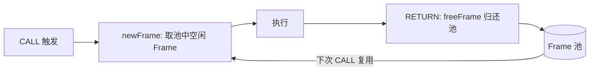
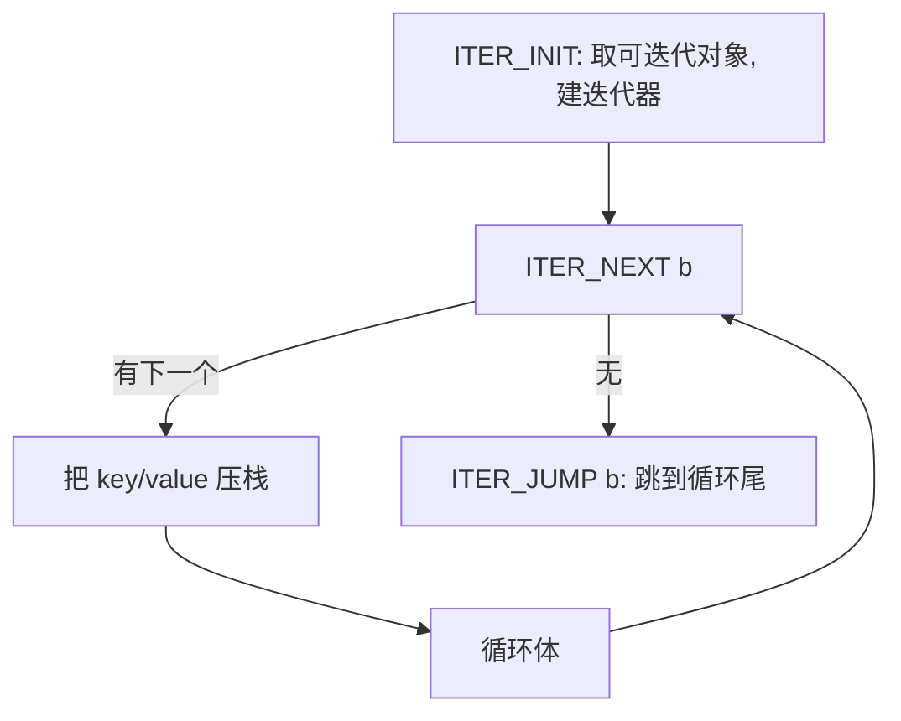

# D5 · 栈式虚拟机 Vm

> 前置知识：D3、D4。本篇讲"字节码怎么真正跑起来"，是引擎的心脏。

## 1. 主分发循环

`Vm.run`（`vm/Vm.kt:40`）是一个紧凑的 `while(true) when(op)`：

```kotlin
40:70:engine/src/main/kotlin/io/kjs/vm/Vm.kt
fun run(bc: Bytecode): Any? {
    val frame = newFrame(bc, null, 0, realm.globalEnv, null)
    var pc = 0
    while (true) {
        val op = Opcode.fromOrdinal(bc.codeA[pc])
        val a = bc.aOpsA[pc]
        val b = bc.bOpsA[pc]
        pc++
        when (op) {
            Opcode.LOAD_NULL  -> push(NULL)
            Opcode.LOAD_CONST -> push(bc.constants[a])
            Opcode.LOAD_STR   -> push(bc.strings[b])
            Opcode.LOAD_LOCAL -> push(frame.locals[a])
            Opcode.ADD -> push(add(pop(), pop()))   // 经类型强制
            Opcode.CALL -> { ... }
            ...
            Opcode.RETURN -> return pop()
            else -> error("unhandled $op")
        }
    }
}
```

`Opcode.fromOrdinal` 是数组下标，`when(op)` 被 Kotlin 编译成 JVM `tableswitch`——一条
**无分支预测惩罚**的跳转表，这是 VM 快的根本原因。

## 2. 操作数栈与帧

`Frame`（`Vm.kt:80`）持有：

```kotlin
80:110:engine/src/main/kotlin/io/kjs/vm/Vm.kt
class Frame(
    val bc: Bytecode,
    val locals: Array<Any?>,          // 局部变量槽（含参数）
    val stack: OperandStack,          // 操作数栈
    val env: Env,                     // 当前作用域（块级 let/const）
    val upvals: Array<Upvalue?>?,     // 闭包捕获
    var prev: Frame?,                 // 调用链
    var pc: Int,
    var thisVal: Any?,                // 方法调用时的 this
)
```

`OperandStack` 是 `Array<Any?>` + `sp` 指针，push/pop 即 `stack[sp++]` / `stack[--sp]`。

### 帧池化（性能关键）

`newFrame` / `freeFrame` 复用 `Frame` 对象与底层 `Array`，避免每次调用都分配：



热递归（如 `fib(30)`）下，帧池把 GC 压力降到接近零——这是相比"新建对象解释 AST"快十倍以上的主因之一。

## 3. 调用约定（CALL / CALL_METHOD / NEW）

```mermaid
sequenceDiagram
    participant C as 调用者帧
    participant V as Vm
    participant F as 被调帧
    C->>V: 压 callee + args 入栈
    V->>V: CALL a=argc: 弹出 argc 个参数
    alt callee 是 JsClosure
        V->>F: newFrame(bc, args, upvals)
        F->>F: 执行 → RETURN
        V->>C: 把返回值压回调用者栈
    alt callee 是 JsNativeFn
        V->>V: 直接 kotlin 调用，返回值压栈
    end
```

- `CALL a b`：`a`=参数个数。VM 弹出 `a` 个参数 + callee，分派到：
  - `JsClosure` → 建新 `Frame` 跑其 `Bytecode`（可被 JIT 接管，见 D8）；
  - `JsNativeFn` → 直接调用 Kotlin lambda（`Intrinsics`，D10）；
  - `JsBoundFn` / `JsProxy` → 转发。
- `CALL_METHOD a b c`：`a`=argc，`b`=IC 槽，`c`=属性名池下标。先 `LOAD_PROP` 取方法，
  再把 `this`（栈上对象）作为隐式第 0 参数传入，正确实现方法调用语义。
- `NEW a b`：构造调用——先基于 callee.prototype 建新对象作 `this`，再 `CALL`，
  若构造函数**返回对象**则用返回值，否则用新建的 `this`（JS `new` 语义）。

### invokeFast 快速路径

对 `a()` 这种"已知是简单函数、参数固定"的调用，`Vm` 提供 `invokeFast`（`Vm.kt:200`）跳过
通用分派，直接定位 `JsClosure`/`JsNativeFn` 并进入——省去一次 `when(op)` 与参数数组解包。

## 4. 属性读写与缓存

`LOAD_PROP a` / `STORE_PROP a`：从栈顶取对象与属性名，`a` 是 **IC 槽下标**。VM 调
`PropIc.load`（`vm/PropIc.kt`）：

```kotlin
220:250:engine/src/main/kotlin/io/kjs/vm/Vm.kt
Opcode.LOAD_PROP -> {
    val key = bc.strings[/* 名称池 */]
    val obj = peek()
    val ic = bc.caches[a]                      // a = IC 槽
    val v = ic.load(obj, key, realm)            // 单态缓存或回退原型链
    pop(); push(v)
}
```

IC 命中（对象"形状"相同）→ 直接返回缓存偏移；未命中 → `getProperty`（遍历原型链，见 D6）
并更新 IC（单态 / 多态 / megamorphic 回退，见 D7）。

## 5. 异常处理器栈（try / catch / finally）

KJS 用 `tryStack: MutableList<TryHandler>` 实现异常：

```kotlin
260:290:engine/src/main/kotlin/io/kjs/vm/Vm.kt
// TRY_PUSH h: 压入 handler，记录 catch 入口、finally 入口、当前 sp
// THROW: 弹 tryStack，找到 handler；若 catch → JMP 到 catch；若 finally → 先跑 finally
// RETURN: 若所在作用域有 finally，先执行 finally 再返回（JS 语义）
class TryHandler(
    var pcCatch: Int,
    var pcFinally: Int,
    var sp: Int,             // 进入 try 时的栈高，异常时回滚
    var envDepth: Int,
)
```

`finally` 最棘手：它**无论正常/异常都要执行**。VM 在 `RETURN` 和 `THROW` 时检查当前帧
是否处于某 `finally` 覆盖区，若是则先跳转去执行 finally 块；finally 内部用一个"完成类型"
（normal/return/throw）决定结束后流向（继续 RETURN 还是重新 THROW）。

## 6. 迭代协议（for-in / for-of）



- `for-in`：迭代对象的**可枚举 own + 继承键**（`forInKeys`，跳过 Symbol，跳过不可枚举）。
- `for-of`：走 `Symbol.iterator` 协议，逐次调 `.next()`，取 `.value`。

## 7. 块级作用域（PUSH_SCOPE / POP_SCOPE）

`let/const` 的块级绑定存在 `Frame.env`（`Env` 链）里，进块 `PUSH_SCOPE` 建子 `Env`，出块
`POP_SCOPE` 丢弃。这与局部变量槽（`LOAD_LOCAL a`）互补：频繁访问的 `var`/参数走**槽（快）**，
`let/const` 走 **Env 链（慢但语义精确）**。

## 8. 设计取舍

- **单函数大 `when` 而非 opcode 对象虚方法**：`tableswitch` 比接口分派快，且全指令集中在一处好维护。
- **帧池化 + 栈复用**：把"调用"做成廉价操作，支撑热递归。
- **异常用显式 handler 栈而非 JVM try/catch**：异常在 JS 层可控、可被 `finally` 拦截，且与字节码
  `pc` 对齐，便于 JIT 复用同一语义。
- **`invokeFast` 特例**：普通 `a()` 占绝大多数调用，值得为其开快速路径。

## 9. 常见坑

- **栈不平衡**：某 opcode `push`/`pop` 数不对 → 后续读取错位，表现成诡异值或崩溃。加 opcode 必须
  同时保证栈效应对称（验证可参考 D9 的 `disasm` 栈高检查）。
- **IC 槽越界**：`LOAD_PROP a` 的 `a` 必须等于编译期 `caches` 数组下标；若编译器漏分配，
  运行时 `bc.caches[a]` 越界。
- **finally 里的 RETURN**：`function f(){ try { return 1 } finally { return 2 } }` 必须返回 `2`——
  VM 在第一个 RETURN 时检测到 finally 覆盖，先去执行 finally 的 RETURN，覆盖原值。
- **`this` 绑定丢失**：`CALL_METHOD` 必须正确把对象作为 `thisVal`；若用普通 `CALL` 调方法，
  `this` 会变成 `undefined` → 严格模式下报错。
