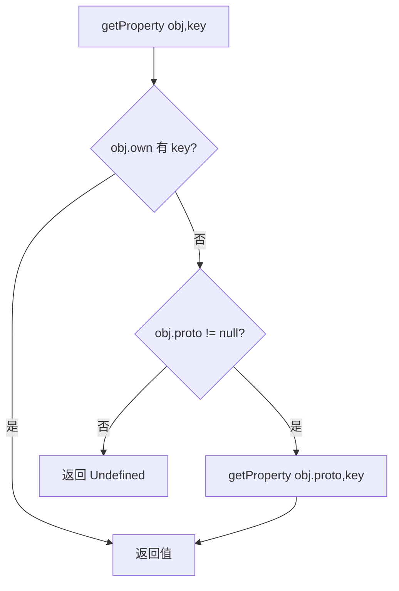
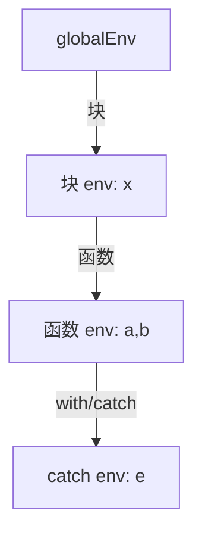

# D6 · 运行时值模型

> 前置知识：D3、D5。本篇讲"栈上那一堆 `Any?` 到底是什么"，以及 JS 语义如何在 JVM 类型上落地。

## 1. 装箱表示：用 `Any?` 装一切

KJS 用 JVM 的 `Any?` 统一表示 JS 值，按类型直接映射：

| JS 类型 | KJS 表示（JVM） | 说明 |
|---------|----------------|------|
| Undefined | `Undefined` 单例对象 | 哨兵，非 `null`（见下） |
| Null | `null` | JVM 原生 `null` |
| Boolean | `Boolean` | JVM 原生 |
| Number | `Double` | 所有数字都是双精度（含整数） |
| BigInt | `BigInteger` | `kotlinx`/`java.math` |
| String | `String` | JVM 原生 |
| Symbol | `JsSymbol` | 含 `description`，去重 |
| Object | `JsObject` 及其子类 | 见下 |
| Function | `JsClosure` / `JsNativeFn` / `JsBoundFn` | 见下 |
| Array | `JsArray`（`JsObject` 子类） | 带 `length` |
| Proxy | `JsProxy` | 转发陷阱 |

关键设计：**Undefined 用独立的 `Undefined` 单例**，而不是用 `null`。这样才能区分
`undefined` 与 `null`——JS 里 `undefined === null` 是 `false`，但 `undefined == null` 是 `true`
（这是 `looseEq` 的特殊分支）。KJS 在 `JsValue.kt` 定义：

```kotlin
10:30:engine/src/main/kotlin/io/kjs/runtime/JsValue.kt
object Undefined                          // 单例哨兵
val NULL = Undefined                       // 别名（栈上常用）
// 类型判定工具
fun isUndefined(v: Any?) = v === Undefined
fun isNull(v: Any?) = v == null
fun isCallable(v: Any?) = v is JsFunction
fun typeOf(v: Any?): String = when {     // JS typeof
    isUndefined(v) -> "undefined"
    v == null -> "object"               // null 的 typeof 是 "object"（JS 历史坑）
    v is Boolean -> "boolean"
    v is Double -> "number"
    v is BigInteger -> "bigint"
    v is String -> "string"
    v is JsSymbol -> "symbol"
    v is JsFunction -> "function"
    else -> "object"
}
```

## 2. JsObject 与原型链

`JsObject`（`runtime/JsObject.kt:20`）持有：

```kotlin
20:60:engine/src/main/kotlin/io/kjs/runtime/JsObject.kt
open class JsObject(
    var proto: JsObject?,                 // 原型（链尾是 null）
    val clazz: String = "Object",
) {
    val own = LinkedHashMap<String, Property>()   // own 属性
    var extensible = true
    // hidden shape / IC 友好：属性槽可缓存
}
data class Property(var value: Any?, var get: (()->Any?)?, var set: ((Any?)->Unit)?,
                    var writable: Boolean, var enumerable: Boolean, var configurable: Boolean)
```

属性查找 `getProperty(obj, key)`（`JsObject.kt:80`）走原型链：



`OwnProperty` 直接读 `own`；继承属性沿 `proto` 向上爬。写属性 `setProperty`：若 own 已有且
`writable=false` → 严格模式报错；否则在 own 上建/改。**不会**沿原型链改父对象属性——这正是
`obj.x = 1` 不会污染原型 `x` 的原因。

### 隐藏类 / IC 友好

`Property` 存在 `LinkedHashMap`，但 `PropIc`（D7）会缓存"对象的形状（proto + own 键集合）到
属性偏移"的映射，命中时跳过 `HashMap` 查找。JIT（D8）进一步把"形状稳定"的对象属性直接当
`double/Any?` 字段访问。

## 3. JsArray / JsTypedArray / JsProxy

- **`JsArray`**（`JsObject` 子类）：`length` 作为特殊属性维护，索引 `0..n-1` 存 `own`。
  `push/pop/map/forEach` 等由 `Intrinsics`（D10）实现。
- **`JsTypedArray`**：`Int8Array` 等，底层 `ByteArray`/`IntArray`，与 JS 语义对齐（`set`/`subarray`）。
- **`JsProxy`**：持有 `target` + `handler`，所有 `get/set/has/apply` 转发到 handler 陷阱，
  `CALL` 时识别 `JsProxy` 走 `apply` 陷阱。

## 4. 函数对象（JsFunction.kt）

`JsFunction`（`runtime/JsFunction.kt:1`）是函数基类，三个实现：

```kotlin
1:40:engine/src/main/kotlin/io/kjs/runtime/JsFunction.kt
sealed class JsFunction : JsObject() {
    abstract fun arity(): Int
    abstract fun call(vm: Vm, args: List<Any?>, thisVal: Any?): Any?
}
class JsClosure(                       // 用户写的 JS 函数
    val bc: Bytecode, val upvals: Array<Upvalue?>,
    val name: String?, val env: Env,
) : JsFunction()
class JsNativeFn(                      // 宿主/Kotlin 实现的内置函数
    val name: String, val fn: (Vm, List<Any?>, Any?) -> Any?,
) : JsFunction()
class JsBoundFn(val target: JsFunction, val boundThis: Any?, val boundArgs: List<Any?>)
    : JsFunction()
```

- **`JsClosure`**：持编译后的 `Bytecode`、闭包 `upvals`、定义时作用域 `env`。`call` 委托给
  `Vm` 建新 `Frame`（见 D5 §调用约定）。
- **`JsNativeFn`**：用 Kotlin lambda 实现 `console.log`、数组方法等（`Intrinsics`）。无字节码、
  无 upvalue，直接进入 Kotlin，是性能热点（如 `Array.map`）。
- **`JsBoundFn`**：`fn.bind(thisArg, ...args)` 的产物，调用时把 `this` 与预置参数拼到实际参数前。

## 5. 作用域 Env

`Env`（`runtime/JsObject.kt` 或独立文件）是实现 `let/const`/块级作用域的链：



`resolveOwner(name)`：从当前 `Env` 沿链向上找持有 `name` 的 `Env`，返回它——这是 `GlobalIc`
（D7）缓存的"名字 → 拥有者 Env"的慢路径。块级 `let` 在 `Env` 链上，函数级 `var` 在 `Frame.locals`
槽；二者互补。

## 6. Realm：世界的根

`Realm`（`runtime/Realm.kt:15`）是一个 JS 执行"世界"的全部全局状态：

```kotlin
15:50:engine/src/main/kotlin/io/kjs/runtime/Realm.kt
class Realm {
    val globalObj = JsObject(proto = null)        // globalThis
    val globalEnv = Env(parent = null)            // 全局作用域
    val objectProto = JsObject(proto = null)      // Object.prototype
    val functionProto = JsObject(proto = objectProto)
    val arrayProto = JsObject(proto = objectProto)
    // 各类原型：Array/Function/String/Number/Boolean/Symbol/Error...
    init {
        globalObj.setProto(objectProto)           // globalThis.__proto__ = Object.prototype
        installIntrinsics(this)                   // 挂 console/Object/Array 等
    }
}
```

所有内置原型、全局对象、全局作用域都在这里装配。`Engine` 每个实例持一个 `Realm`；
`globalEnv` 是 `LOAD_GLOBAL` 查找的起点（D7）。

## 7. 类型强制（ToXxx）

JS 的隐式转换全在 `JsValue.kt` 的 `To*` 函数里：

- `toNumber(v)`：字符串 `"123"`→123，`""`→0，`"abc"`→NaN；`true`→1；`null`→0；
  `undefined`→NaN；对象→先 `toPrimitive` 再转。
- `toBoolean(v)`：`0 / -0 / NaN / "" / null / undefined` 为 `false`，其余 `true`；
  对象恒 `true`。
- `toPrimitive(v, hint)`：对象先查 `valueOf`，再 `toString`（hint=number 时顺序相反），
  用于 `a + b` 当任一操作数是对象时。
- `looseEq(a, b)`（==）：**类型不同先强制**：`null==undefined` 为真；数字 vs 字符串先转数字；
  对象 vs 原始先 `toPrimitive`；数字 vs BigInt 特殊规则。这是 JS `==` 的全部诡异之源。
- `strictEq(a, b)`（===）：**先比类型**，类型不同直接 `false`，类型相同再比值
  （含 `NaN!==NaN`，同引用才算等）。

```kotlin
90:130:engine/src/main/kotlin/io/kjs/runtime/JsValue.kt
fun looseAdd(a: Any?, b: Any?): Any? {
    if (a is String || b is String) return toStr(a) + toStr(b)   // 字符串拼接优先
    if (a is BigInteger || b is BigInteger) return bigAdd(a, b)
    return toNumber(a) + toNumber(b)                            // 否则数值加
}
```

`+` 的语义：**任一操作数是字符串就拼接**，否则数值加——这与直觉相反的地方（如 `1 + {}`）都
由 `toPrimitive` 兜底。

## 8. 设计取舍

- **Undefined 用单例而非 null**：保住 `undefined` 与 `null` 的区分（语义正确性优先）。
- **Number 统一用 Double**：简单一致；整数运算有精度上限但符合 JS 规范（JS 本来就是双精度）。
- **own 用 LinkedHashMap + IC 缓存**：通用查找正确，热点走 IC/隐藏类加速。
- **函数分三类**：用户函数（需 VM）、宿主函数（Kotlin 直跑）、bound（粘合），职责清晰。

## 9. 常见坑

- **`typeof null === "object"`**：历史包袱，KJS 照规范实现，`isNull` 单独用 `== null` 判。
- **`NaN !== NaN`**：`strictEq` 必须特判，否则 `indexOf` 等逻辑错。
- **`{}+{}` 在不同位置语义不同**：语句首的 `{}` 会被当成空块，导致 `+{}` 变成 `+""` → `0`。
  KJS 的 ASI 处理决定这里的解析。
- **BigInt 与 Number 不能混运算**：`1 + 2n` 抛 `TypeError`，在 `looseAdd`/`ToNumber` 处检查。
- **原型链查找未缓存**：同一属性每次都爬链会 O(depth)；JIT/IC 解决（D7/D8）。
