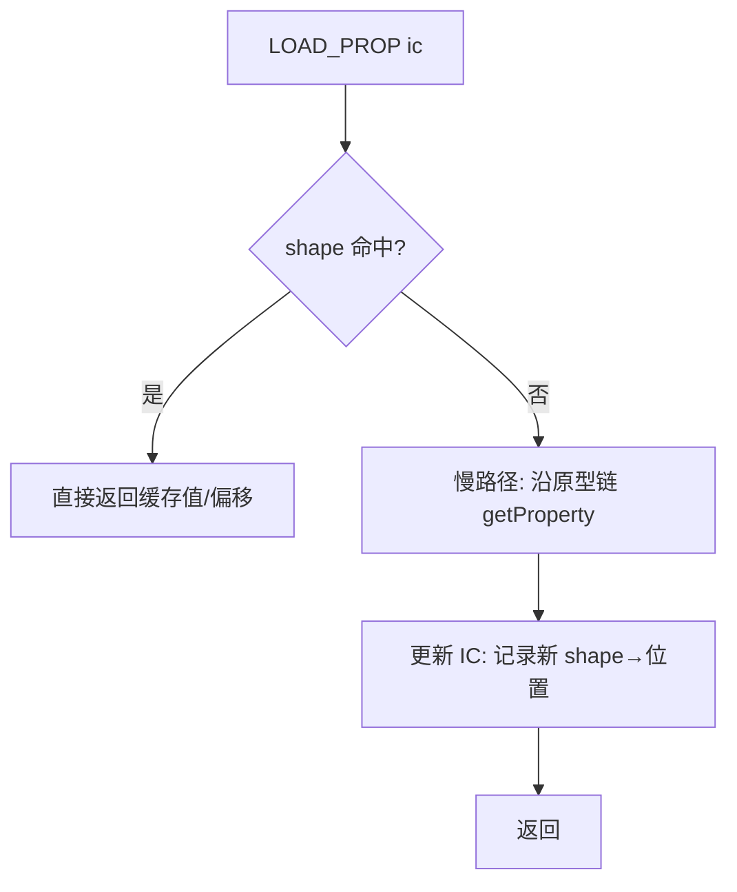

# D7 · 内联缓存（PropIc / GlobalIc）

> 前置知识：D5、D6。本篇讲"快的关键之一"：用缓存把昂贵的查找变成 O(1) 命中。

## 1. 为什么需要 IC

看这两行：

```js
for (let i = 0; i < 1e6; i++) sum += obj.x;   // obj.x 每次都查？
```

若每次 `obj.x` 都沿原型链 `getProperty`（D6 §2），就是 100 万次 `HashMap` 查找 + 可能的链爬，
极慢。但**绝大多数情况下对象的"形状"不变**（同一类实例、同一组 own 键），
`x` 的存储位置是固定的。IC 就是"记住上次的位置，下次先核对形状，形状没变就直接用"。

## 2. 单态 IC 原理

单态（monomorphic）IC：只缓存**一种**对象形状。命中条件 = "当前对象的隐藏类/proto 与缓存的相同"：



"形状（shape）"在 KJS 里用对象的 `proto` + own 键集合（或更精确地，用一个 shape id）刻画。
`PropIc`（`vm/PropIc.kt:1`）：

```kotlin
1:35:engine/src/main/kotlin/io/kjs/vm/PropIc.kt
class PropIc {
    var cachedShape: Any? = null    // 上次对象的形状标识（proto/shape id）
    var cachedSlot: Int = -1        // own 里的偏移/槽
    var cachedValue: Any? = null    // 对无 getter 的数据属性，可直接缓存值引用
    var polymorphic: Boolean = false

    fun load(obj: Any?, key: String, realm: Realm): Any? {
        val shape = shapeOf(obj)            // 取形状
        if (shape == cachedShape && !polymorphic) {
            return if (cachedSlot >= 0) (obj as JsObject).ownValueAt(cachedSlot)
                   else cachedValue
        }
        // 慢路径
        val v = getProperty(obj, key, realm)
        // 单态更新
        if (!polymorphic) {
            cachedShape = shape
            cachedValue = v
        }
        return v
    }
}
```

> 对**数据属性**（无 getter），连 `ownValueAt` 都省了——直接缓存 `cachedValue` 的引用（对象本身
> 不变即可复用）。getter/可写属性则缓存槽偏移。

## 3. 多态与 megamorphic 回退

当同一 IC 槽遇到**不同形状**的对象（典型的 `if (cond) a.x else b.x`，a、b 形状不同），
继续缓存单一形状会一直 miss。KJS 的处理：

- **多态（polymorphic）**：IC 升级为一个小的**形状→位置映射表**（2~4 项），线性查表命中即用。
- **megamorphic**：形状超过阈值（通常 >4），放弃特化，`polymorphic=true` 标志让 `load` 永远走
  慢路径 `getProperty`，不再尝试缓存——避免表无限膨胀。此时性能退化为无 IC，但正确。

```kotlin
37:60:engine/src/main/kotlin/io/kjs/vm/PropIc.kt
fun loadSlow(obj: Any?, key: String, realm: Realm): Any? {
    val v = getProperty(obj, key, realm)
    if (!polymorphic) {
        if (cachedShape == null) { cachedShape = shapeOf(obj); cachedValue = v }
        else if (cachedShape != shapeOf(obj)) {
            polymorphic = true           // 升为 megamorphic，后续只走慢路径
        }
    }
    return v
}
```

## 4. STORE_PROP 的 IC

写属性同样用形状缓存：`STORE_PROP a` 的 IC 命中时，直接在 own 的同一槽 `setProperty`，
跳过 `writable` 重判（除非形状变了需重新查）。对 `obj.x = 1` 在热循环里被反复执行，收益显著。

## 5. LOAD_GLOBAL 的 IC（GlobalIc）

全局变量查找要沿 `Env` 链从 `globalEnv` 往上找"谁拥有这个名字"（D6 §5）。
`GlobalIc`（`vm/GlobalIc.kt:1`）缓存"名字 → 拥有者 Env"：

```kotlin
1:40:engine/src/main/kotlin/io/kjs/vm/GlobalIc.kt
class GlobalIc {
    var cachedName: String? = null
    var cachedOwner: Env? = null      // 命中后直接在这个 Env 上读写
    var cachedSlot: Int = -1          // 若该 Env 用槽表示

    fun resolve(name: String, start: Env): Env {
        if (name == cachedName && start.ownsSlot(cachedSlot)) {
            return cachedOwner        // 命中：跳过链爬
        }
        val owner = start.resolveOwner(name)   // 慢路径：沿链找拥有者
        cachedName = name
        cachedOwner = owner
        cachedSlot = owner.slotOf(name)
        return owner
    }
}
```

**`resolveOwner` 的慢路径**：从 `start`（`globalEnv`）沿 `parent` 链向上，对每个 `Env` 查它是否
持有 `name`。对 `g.x`（全局函数里反复访问外层 `var`）每次都链爬，IC 把它变成一次比较。

> 这是上次改动的重点（`GlobalIc.kt` 是本次工作区新增文件，配合 `IntrinsicsExt` 调优全局查找）。

## 6. IC 与编译期的契约

回忆 D3：字节码里 `LOAD_PROP a` 的 `a` 是 **IC 槽下标**，编译期通过 `bc.addPropCache()` 预分配；
`LOAD_GLOBAL b` 的 `b` 是名字池下标，`GlobalIc` 实例挂在 `Bytecode` 或 `Frame` 上、按名字索引。
VM 执行时直接取 `bc.caches[a].load(...)`。两者解耦：编译器只管"留个槽"，VM 管"填缓存"。

## 7. IC 与 JIT 的协同

D8 的模板 JIT 会**直接内联** IC 的命中分支：生成一个 `if (obj.shape == cachedShape) return slot`
的 JVM 原生比较，连 `PropIc.load` 的方法调用都省了。IC 槽在 JIT 编译时已固定，于是类型稳定的
属性访问退化成"一次引用比较 + 一次字段读"。

## 8. 设计取舍

- **单态优先，多态兜底，megamorphic 退场**：不追求缓存所有形状，超阈值就放弃，省内存保稳定。
- **用形状而非类型**：同一 `class` 的不同实例形状相同 → 一次缓存惠及所有实例，命中率高。
- **GlobalIc 缓存拥有者而非值**：全局变量值会变，但"谁拥有它"基本不变；缓存位置即可。

## 9. 常见坑

- **形状被改动但 IC 未失效**：若某操作意外改变了对象的 own 键集（如首次写新属性），
  形状 id 变化，IC 自然 miss 走慢路径——**正确**，只是暂时变慢，下次重新缓存。
- **跨 Realm 的形状不兼容**：两个 `Realm` 的原型对象即使结构相同也不是同一 shape；
  IC 按对象引用/shape id 判等，天然隔离。
- **getter 不能缓存值**：有 `get` 陷阱的属性每次都得调 getter，只能缓存"槽"不能缓存"值"，
  `PropIc` 用 `cachedSlot>=0` 区分这两种缓存策略。
- **IC 槽与字节码绑定**：IC 是**每函数每槽**的，不能跨函数共享；`makeClosure` 复制字节码时
  也要注意 IC 状态是否需要重置（mega 状态保留可加速，单态状态应保留因形状可能复用）。
