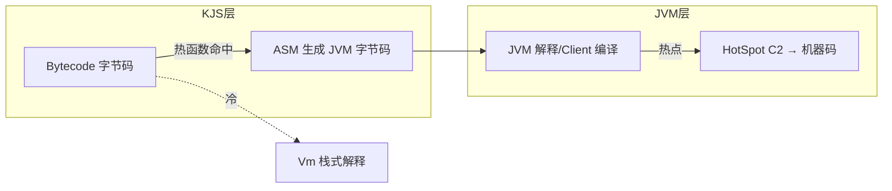
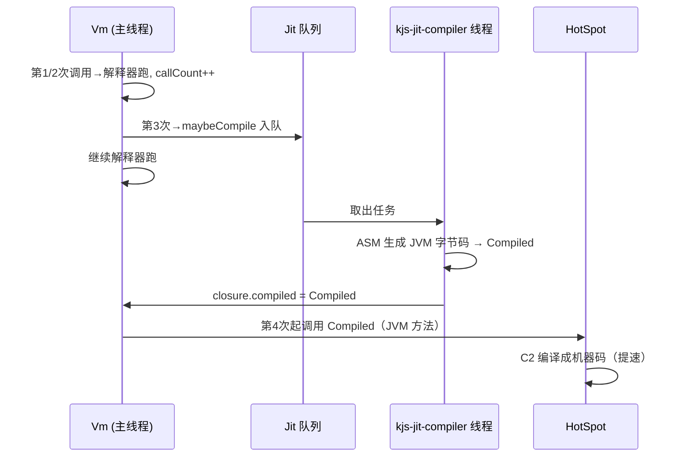

# D8 · 模板 JIT 编译器

> 前置知识：D3、D5、D7。本篇讲"快的关键之二"：把热字节码在运行时变成 JVM 字节码，再白嫖 HotSpot C2。

## 1. 两级 JIT 直觉



- **第一级（我们做）**：KJS 把热函数的字节码翻译成 JVM 字节码（`.class` 形态，常驻内存，不落盘）。
- **第二级（JVM 免费做）**：生成的 JVM 字节码被 HotSpot 当成普通 Java 方法，C2 再编译成机器码。

于是 KJS 只需实现"字节码→JVM 字节码"这一步，**机器码优化（内联、逃逸分析、寄存器分配）全部免费**。

## 2. 触发：异步编译管线

`Jit`（`vm/Jit.kt:20`）监听函数调用计数。热函数（默认 `callCount >= 3`）被提交到
专用编译线程 `kjs-jit-compiler`：

```kotlin
20:55:engine/src/main/kotlin/io/kjs/vm/Jit.kt
object Jit {
    private val queue = LinkedBlockingQueue<CompileTask>()
    private val thread = Thread({ compileLoop() }, "kjs-jit-compiler")
    fun maybeCompile(closure: JsClosure) {
        if (closure.callCount < HOT_THRESHOLD) return   // 默认 3
        if (closure.compiled != null || closure.compiling) return
        closure.compiling = true
        queue.offer(CompileTask(closure))
    }
    private fun compileLoop() {
        for (task in queue) {
            val c = tryCompile(task.closure) ?: continue
            task.closure.compiled = c          // 编译完原子替换
        }
    }
}
```

关键点：**异步 + 不阻塞 VM**。编译在后台线程进行，VM 继续用解释器跑；编译完成把
`closure.compiled` 填上。`CALL` 分派时优先用 `compiled`（`Compiled` 子类），否则回退解释器。



## 3. 保守策略：canCompile

不是所有字节码都能/都值得 JIT。`canCompile(bc)` 做白名单检查：

```kotlin
60:90:engine/src/main/kotlin/io/kjs/vm/Jit.kt
fun canCompile(bc: Bytecode): Boolean {
    if (bc.functions.isNotEmpty()) return false  // 含嵌套闭包先不编（简化）
    if (bc.usesWith || bc.usesEval) return false // with/eval 破坏静态分析
    if (bc.hasTryFinally) return false            // finally 控制流复杂，先不编
    for (i in 0 until bc.countA) {
        val op = Opcode.fromOrdinal(bc.codeA[i])
        if (op in UNSUPPORTED) return false        // 不支持的 opcode
    }
    return true
}
```

> 保守主义是对的：JIT 错了就是崩溃或正确性问题，宁可回退解释器。随着实现成熟可逐步放开。

## 4. 类型特化：inferDoubleLocals

最大收益来自**类型特化**。JS 值都是 `Any?`，但热循环里局部变量往往是纯数字。
`inferDoubleLocals` 用抽象解释（abstract interpretation）推断哪些局部槽**永远只装 double**：

```kotlin
100:140:engine/src/main/kotlin/io/kjs/vm/Jit.kt
// 抽象解释：模拟每条指令对栈/局部变量类型的影响
// 状态: 每个局部槽 ∈ {ANY, DOUBLE, BOOL, UNDEF}
fun inferDoubleLocals(bc: Bytecode): BooleanArray {
    val localT = BooleanArray(bc.localsSize) { false }  // true = 确定是 double
    val stackT = ArrayDeque<Type>()
    for (i in 0 until bc.countA) {
        val op = Opcode.fromOrdinal(bc.codeA[i])
        when (op) {
            Opcode.LOAD_CONST -> if (bc.constants[bc.aOpsA[i]] is Double) stackT += DOUBLE
            Opcode.DADD -> { pop2Double(stackT); stackT += DOUBLE }  // 已知 double 相加
            Opcode.ADD -> {
                // 若两操作数都是 DOUBLE，特化为数值加，否则 ANY（拼接/对象）
                val r = stackT.removeLast(); val l = stackT.removeLast()
                stackT += if (l==DOUBLE && r==DOUBLE) DOUBLE else ANY
            }
            Opcode.STORE_LOCAL -> { if (stackT.last()==DOUBLE) localT[bc.aOpsA[i]]=true }
        }
    }
    return localT
}
```

推断结果驱动代码生成：被标记为 double 的局部槽在生成的 JVM 方法里用原生 `double` 局部变量，
**彻底避免装箱**（`Double` ↔ `double` 拆箱开销）。`sumN(1M)` 因此从 ~403ms 降到 ~10ms。

## 5. 栈类型追踪

生成的 JVM 方法用一个 `Array<Any?>` 操作数栈（与解释器同构），但每条指令生成时都带上
栈类型信息（ANY/DOUBLE/BOOL），决定用：

- `DADD` / `DMUL` / `DCMPL`：原生双精度加减与比较（快，无装箱）；
- 通用 `ADD`：走 `looseAdd`（需类型强制，慢但正确）。

```kotlin
142:170:engine/src/main/kotlin/io/kjs/vm/Jit.kt
// 生成 VM ADD 时：
if (leftType == DOUBLE && rightType == DOUBLE) {
    mv.visitInsn(DADD)                       // 原生双精度
} else {
    mv.visitMethodInsn(INVOKESTATIC, "JsValue", "looseAdd", "(Ljava/lang/Object;Ljava/lang/Object;)Ljava/lang/Object;")
}
```

## 6. ASM 生成 JVM 字节码

`Compiled`（`vm/Compiled.kt:1`）是 `JsFunction` 的子类，由 ASM 动态生成 `invoke` 体：

```kotlin
1:45:engine/src/main/kotlin/io/kjs/vm/Compiled.kt
abstract class Compiled : JsFunction() {
    // ASM 生成的子类重写 call()，把字节码翻译成一连串 JVM 指令
    // 与原 Vm 主循环语义等价，只是：
    //   - 操作数栈是原生 JVM 栈（不再是 Array 索引）
    //   - double 槽用原生 double
    //   - 属性访问内联 PropIc 命中分支
}
```

生成流程：遍历 `codeA/aOpsA/bOpsA` → 对每条 opcode `emit` 对应 JVM 指令。关键映射：

| Bytecode | 生成的 JVM 指令 |
|----------|----------------|
| `LOAD_LOCAL a` | `aload` / `dload`（若该槽是 double） |
| `STORE_LOCAL a` | `astore` / `dstore` |
| `LOAD_CONST a` | `ldc` 常量 |
| `DADD` | `dadd` |
| `LOAD_PROP a` | `aload obj; if(shape==cached) getfield else call getProperty` |
| `CALL a b` | `invoke` JsClosure.call / JsNativeFn.fn |
| `RETURN` | `areturn` / `dreturn` |

`JitBridge`（`vm/JitBridge.kt`）把 `Bytecode` + 推断结果喂给 ASM 的 `ClassWriter`，
`defineClass` 加载，实例化 `Compiled` 子类，挂回 `closure.compiled`。

## 7. 与 VM 语义对齐（正确性）

JIT 生成的代码**必须与 Vm 解释器逐指令等价**，否则就是 JIT bug。`Tracer`（`Engine.kt`）+ D9 的
VM/Walker 对拍用来兜住这条线。任何 opcode 的 JIT 实现都以 Vm 对应 `when` 分支为准。

## 8. 调试开关

- `KJS_JIT=0`：禁用 JIT，纯解释器（便于对照性能/正确性）。
- `KJS_JIT_TRACE=1`：打印每次编译的函数名、是否特化、生成的字节码大小。
- `KJS_JIT_DUMP=<dir>`：把生成的 `.class` 落盘，可用 `javap -c` 反汇编检查。

## 9. 设计取舍

- **模板 JIT 而非 tracing JIT**：整函数编译比 trace 简单、可控，且不依赖运行时 trace 收集。
- **异步编译 + 原子替换**：不阻塞主执行流；未编完前解释器顶上，平滑过渡。
- **保守 canCompile**：宁可不编也不出错；随着成熟逐步放开闭包/finally。
- **白嫖 C2**：省去自写寄存器分配/内联，专注"字节码→JVM 字节码"这一层。

## 10. 常见坑

- **类型推断过宽**：某槽曾被赋非 double（如第一次循环 `i` 从 `undefined` 来），推断退化为 ANY，
  特化失效 → 性能回退但**正确**。这是保守推断的安全副作用。
- **IC 缓存失效未同步**：JIT 内联了 IC 命中分支，但对象的形状变化了，生成的代码必须包含
  "形状不符 → 跳回慢路径 `getProperty`" 的判断，否则读到错值。
- **与 finally/异常的交互**：含 `try/finally` 的函数暂不编译（`canCompile` 拦掉），因为 JVM 异常
  表生成复杂，易错。
- **闭包捕获**：含嵌套闭包的函数暂不编译（upvalue 绑定在生成期难对齐），留待后续。
- **`defineClass` 的 ClassLoader**：生成的类必须用与引擎同级的 `ClassLoader` 定义，否则
  `Compiled` 类型转换/权限失败。
