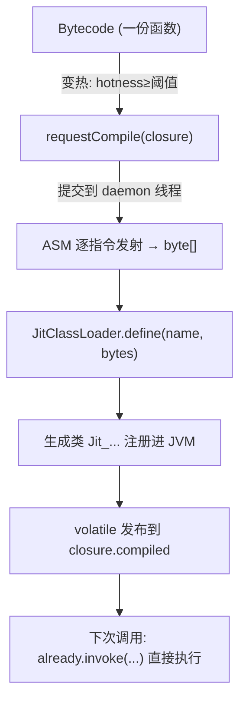
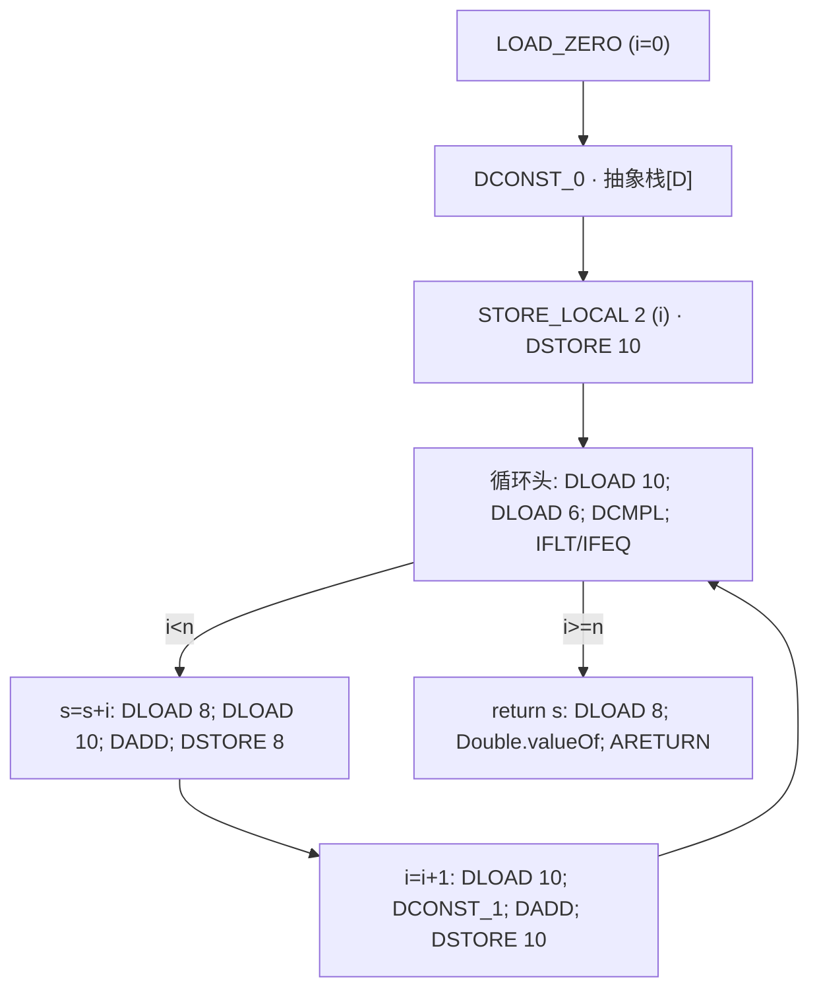

# D8 · 模板 JIT 编译器

JIT（Just-In-Time，即时编译）是让 JS 跑得更快的技术：当某段函数"跑热了"，引擎把它从"一条条解释的字节码"现场翻译成"JVM 能直接跑的机器码近亲（JVM 字节码）"，之后就飞快。你不用懂 JVM 也能读这一章——§2.4 用 `sum(n)` 一个例子，从原始 JS → 字节码 → JIT 生成的 JVM 指令，一行行对照着讲，还会教你怎么读 JVM 指令（首字母是类型、后半是动作），建议直接从 §2.4.0 开始读。加快 JS 有几种常见路线：最朴素的是纯解释器（KJS 默认，慢但简单，见 D5）；tracing JIT 只编译"跑得最热的循环路径"，快但复杂（如 LuaJIT）；也有人先生成 `.java` 文件再交给 `javac` 编译，慢且依赖文件。KJS 选了 **模板 JIT**：一条字节码对应一小段固定的 JVM 指令，机械、安全、好验证。往下，§5 讲"为什么快"（六层消除），§7 讲"怎么猜出变量是数字以便特化"，§13 讲整体取舍。

> 前置阅读：D3（字节码）、D4（编译器）、D5（虚拟机）、D6（值模型）、D7（内联缓存）、D9（双后端对拍）。

KJS 有**两个执行后端**：解释器（D5）和本篇的 JIT。两者吃的是同一份 `Bytecode`，跑的是同一套 `JsValues`/`JitBridge` 语义，差别只在"指令怎么被驱动"。本篇回答这些核心问题：

- JIT 到底在做什么、编译成了什么东西？
- 是不是"每个函数都生成一个 Java 类"？类什么时候运行、会不会落盘成 `.class` 文件？
- 生成的代码为什么比解释器快？快在哪几层？
- 生成的 Java 类怎么实现原 JS 逻辑、**凭什么保证语义一致**？
- 还有哪些 JIT 内部结构值得知道（抽象解释、特化、回退、类加载、调优）？

---

## 1. 一句话原理：把 KJS 字节码"翻译"成 JVM 字节码

一句话概括：KJS 的 JIT 把"自己的字节码"翻译成"JVM 的字节码"，而且不生成 `.java` 文件，直接在内存里拼出来。那些复杂的操作（属性访问、相等判断、函数调用）都交给和解释器同一份的 `JitBridge` 去处理，JIT 只亲自优化"数字加减"这一类最规整、也最容易提速的计算。

KJS 的 JIT 是**模板 JIT（template / method JIT）**，不是 tracing JIT，也不是生成 `.java` 源文件再走 `javac`：

- **时机**：运行时（runtime），当某个函数"变热"时。
- **输入**：一份 `Bytecode`（一段已经编译好的 KJS 指令序列，见 D3/D4）。
- **输出**：一份 **JVM `.class` 字节码**，用 ASM 直接拼出来，不经过 `.java` 源文件。
- **手段**：用 `ClassWriter` 把每条 KJS 指令**逐条翻译成一段确定的 JVM 指令**（"模板"），得到一个 `Compiled` 抽象类的子类。

三条核心映射是理解全部内容的关键：

| KJS 概念 | 在 JVM 后端里变成什么 |
|---|---|
| KJS **操作数栈**（`push`/`pop`） | JVM 的**原生操作数栈**（每 `push` 是一条 `dup`/常量入栈，每 `pop` 是栈顶消费） |
| KJS **局部变量槽**（`LOAD_LOCAL`/`STORE_LOCAL`） | JVM 方法的 **local slot**（普通值占 1 槽，double 占 2 槽） |
| KJS **指令 `when(op)` 分发** | **展开成顺序的 JVM 指令**，不再有分发循环 |

关键认知：**KJS 没有"重新实现一套 JS 语义"，而是把语义"委托"给了 `JsValues` / `JitBridge`**。`Compiled.invoke` 里凡是涉及对象、字符串、属性读取、全局变量、相等比较、调用等"复杂"操作，都直接调用和解释器/Walker **完全相同**的 `JitBridge.*` 静态方法（D6/D7）。JIT 真正"自己优化"的，只占总指令里的一小撮——**数值/布尔的算术与比较**（见 §5 的"类型特化"）。

> 为什么不生成 `.java` 再 `javac`？因为那样要经过"写临时文件 → 启动 javac 进程 → 类路径扫描 → 加载"，慢且依赖文件系统。ASM 直接产出 `byte[]` 交给 `ClassLoader.defineClass`，一步到位，且天然在内存里（§4）。

---

## 2. 编译产物长什么样：一个 `Compiled` 子类

### 2.1 一个函数 = 一个生成的类

`compile(closure)`（Jit.kt）为每个**变热的 `Bytecode` 生成且只生成一个类**，它是抽象类 `Compiled`（Compiled.kt）的子类：

```kotlin
abstract class Compiled {
    abstract fun invoke(vm: Vm, realm: Realm, closure: VmClosure,
                        thisVal: Any?, argsArr: Array<Any?>): Any?
}
```

类名形如 `io/kjs/jit/Jit_<safeName>_<id>_a<attempt>`（`<safeName>` 是函数名清洗后的结果，`<id>`/`<attempt>` 是全局计数器）。**每个函数一份、互相独立**。多个闭包若共享同一份 `Bytecode`，仍各自请求编译（见 §11 的线程安全说明），但形态完全一致。

### 2.2 生成类的内存结构

```
class Jit_sum_7_a0 extends Compiled {
    static Object[] CONSTS;     // 由 closure.bc.constants 拷贝而来（LOAD_CONST 直接读这里）
    static Object[] STRINGS;    // 由 closure.bc.strings 拷贝而来（LOAD_STR 直接读这里）

    invoke(vm, realm, closure, thisVal, argsArr): Object {
        // —— prologue：把实参塞进局部槽（见 §2.3）——
        // —— body：翻译后的指令序列，真实 JVM 栈即 KJS 栈 ——
        // —— epilogue：RET 弹出返回值并 ARETURN ——
    }
}
```

要点：

- **`CONSTS` / `STRINGS` 是 `static` 字段**：`LOAD_CONST a` 被翻译成 `GETSTATIC CONSTS; xxxxx; AALOAD`，从类里的常量池直接取，**完全绕过** `bridge.constOf` 桥接调用。这是又一处相对解释器的提速（解释器每次 `LOAD_CONST` 都走 `bridge.constOf` 查池再 `push`）。
- **没有 `Frame` 对象、没有 `Array<Any?>` 操作数栈**：KJS 的 `push` 在生成代码里就是"把值留在 JVM 栈顶"，`pop` 就是"接下来的指令直接消费栈顶"。解释器里那一坨 `frame.stack[sp++]` 索引运算彻底消失。
- **`invoke` 签名与解释器 `execClosureArr` 同形**：都是 `(vm, realm, closure, thisVal, argsArr) → Object`。这就是为什么 JIT 能"无缝替换"解释器（D5 §3）——调用方根本分不清自己调的是解释器还是编译后的类。

### 2.3 prologue：实参 → 局部槽

`emitBody` 在方法开头生成一段**序言**，把 `argsArr` 拷进局部槽。规则与解释器（`Vm.runFrame` 里 `frame.locals[i] = argsArr[i]`）完全一致：

1. `for (i in 0 until paramCount)`：先 `ALOAD argsArr; ARRAYLENGTH` 做一次长度检查（**实参不足就压 `UNDEFINED`**），够则 `AALOAD` 取 `argsArr[i]`；随后若该参数**被抽象解释为 DOUBLE**，用 `bridge.toD` 转成原生 double 再 `DSTORE`，否则直接 `ASTORE`。
2. 其余局部槽（`var`/`let` 声明）初始化为 `0.0`（double 槽）或 `null`（object 槽）。
3. `GET_THIS`（若有）直接 `ALOAD 4` —— `thisVal` 就是 `invoke` 的第 4 个参数，占 JVM 槽 4，不需要任何查表。

> **两套"槽号"别混淆**：
> - **KJS 槽号**（解释器 `frame.locals[]` 的下标）：参数在前 `0..paramCount-1`，随后是 `var`/`let` 局部。`function sum(n){var s; var i; …}` → **`n`=0、`s`=1、`i`=2**。`n` 一定是 0，因为解释器就是 `frame.locals[i]=argsArr[i]` 把参数铺在 0 号起。
> - **JVM 槽号**（生成方法的 local slot）：低位槽被 `invoke` 的参数占掉了，KJS 局部**从槽 6 开始**排，且 `double` 每个占 **2** 个槽。所以 `sum` 的 `n/s/i` 落在 JVM 槽 **6 / 8 / 10**（见 §2.4.1 的对照表）。

### 2.4 一个具体例子：`sum`（逐行拆解，零基础可读）

这一节是全文最重要的"眼见为实"。我们把一段最普通的 JS 循环，一路跟到它变成 JVM 指令为止。

#### 2.4.0 先扫盲：JVM 字节码怎么读

JVM 和 KJS 一样是**栈机（stack machine）**：指令里不写寄存器名字，值全靠一个**操作数栈**传递，另外有一排**编号的局部变量槽（local slot）**当变量用。

助记符的拼法有规律，拆成两半就能读懂：

| 部件 | 含义 | 例子 |
|---|---|---|
| **首字母 = 数据类型** | `D`=double（64 位浮点）、`I`=int、`A`=引用（对象 / `Object`）、`L`=long、`F`=float | `DLOAD` 读一个 double，`ALOAD` 读一个对象 |
| **后半 = 动作** | `CONST_x` 压常量、`LOAD n` 把槽 n 读到栈顶、`STORE n` 把栈顶写回槽 n、`ADD`/`SUB` 弹两个算完压回 | `DSTORE 8` = 把栈顶的 double 存进槽 8 |

所以 `DLOAD 10` 念作"把 10 号槽里的 double 压到栈顶"，`ASTORE 6` 念作"把栈顶那个对象存进 6 号槽"。就这么简单。

下面例子里出现的全部指令，一次列全（`…` 表示栈里更下面的内容，最右边是栈顶）：

| 指令 | 干什么 | 栈变化 |
|---|---|---|
| `ALOAD n` | 把局部槽 n 里的**对象**压栈 | `… → …, obj` |
| `AALOAD` | 弹出「数组, 下标」，压回该元素 | `…, arr, idx → …, v` |
| `ARRAYLENGTH` | 弹出数组，压回它的长度 | `…, arr → …, len` |
| `DLOAD n` | 把槽 n 的 double 压栈 | `… → …, d` |
| `DSTORE n` | 弹出栈顶 double，写进槽 n | `…, d → …` |
| `DCONST_0` / `DCONST_1` | 压常量 `0.0` / `1.0` | `… → …, d` |
| `LDC 42.0` | 压任意常量 | `… → …, d` |
| `DADD` | 弹两个 double，相加，压回结果 | `…, a, b → …, a+b` |
| `DCMPL` | 弹两个 double 比较，压一个 int：`a<b`→`-1`、`a==b`→`0`、`a>b`→`1`（含 `NaN` 时压 `-1`） | `…, a, b → …, i` |
| `IFLT L` | 弹一个 int，若 `< 0` 就跳到标签 `L` | `…, i → …` |
| `IFEQ L` | 弹一个 int，若 `== 0` 就跳到标签 `L` | `…, i → …` |
| `ICONST_0` / `ICONST_1` | 压 int `0` / `1`（JVM 里 `boolean` 底层就是 int） | `… → …, i` |
| `SIPUSH k` | 压一个 int 常量 `k`（数组下标之类用它） | `… → …, k` |
| `GOTO L` | 无条件跳到 `L` | 不变 |
| `DUP2` | 复制栈顶的 double（double 占 2 个"栈字"，所以叫 `DUP`**2**） | `…, d → …, d, d` |
| `POP2` | 丢掉栈顶的 double | `…, d → …` |
| `INVOKESTATIC C.m` | 调用静态方法：按签名弹参数、压返回值 | 视签名而定 |
| `ARETURN` | 把栈顶的**对象**当返回值返回，方法结束 | — |

> **一个必须先说清的点**：`invoke` 的返回类型是 `Object`。所以哪怕函数内部算出来的是原生 `double`，**跨出函数边界之前也必须 `Double.valueOf` 装箱**，再 `ARETURN`。原生 `double` 只在函数**体内部**流动 —— 这既是 JVM 的类型规则，也是 §6 语义一致性的一环（外界拿到的永远是和解释器一模一样的 `Double` 对象）。

#### 2.4.1 局部槽的编号为什么从 6 开始

生成的 `invoke(vm, realm, closure, thisVal, argsArr)` 是个**实例方法**，JVM 会先按顺序把 `this` 和 5 个参数占掉低位槽，KJS 自己的局部变量只能从后面排：

| JVM 槽 | 装的东西 |
|---|---|
| 0 | `this`（生成类自己的实例） |
| 1 | `vm` |
| 2 | `realm` |
| 3 | `closure` |
| 4 | `thisVal` |
| 5 | `argsArr` |
| **6 起** | KJS 的局部变量（`Jit.emitBody` 里就是 `var s = 6`） |

再叠加"**`double` 占 2 个槽**"的 JVM 规则，`sum` 的完整映射是：

| JS 变量 | KJS 槽（解释器视角） | 抽象解释推断类型 | JVM 槽 |
|---|---|---|---|
| `n`（参数） | 0 | DOUBLE | **6**（吃掉 6、7） |
| `s` | 1 | DOUBLE | **8**（吃掉 8、9） |
| `i` | 2 | DOUBLE | **10**（吃掉 10、11） |

> 快速推算公式：**`JVM槽 = 6 + KJS槽号 × 2`**。`6` 是 `this` + 5 个参数占掉的起始位置；`×2` 因为 `double` 在 JVM 里是 64 位、占 2 个槽。代入 `sum`：`n`(0)=6、`s`(1)=8、`i`(2)=10，与上面完全吻合。这也解释了为什么 `s`(槽 8) 夹在 `n`(槽 6) 和 `i`(槽 10) 中间、而不是紧挨着——每跳一个 double 局部，槽号 +2。

#### 2.4.2 第一层：原始 JS

```js
function sum(n) {
  var s = 0;
  var i = 0;
  for (i = 0; i < n; i = i + 1) {
    s = s + i;
  }
  return s;
}
```

#### 2.4.3 第二层：KJS 字节码（解释器吃的那份，D3/D4 产物）

```text
 pc  指令              注释
  0  LOAD_ZERO         ; 压 0.0
  1  STORE_LOCAL 1     ; s = 0：把栈顶 0.0 存进槽 1，但"赋值表达式的值"仍留在栈顶（见脚注②）
  2  POP               ; 这条 var 语句用不到赋值结果 → 弹掉残留的 0.0，栈恢复平衡
  3  LOAD_ZERO
  4  STORE_LOCAL 2     ; i = 0：同上，赋值值留栈顶
  5  POP               ; 弹掉残留 0.0
  6  LOAD_LOCAL 2      ; ┐
  7  LOAD_LOCAL 0      ; │ 循环条件 i < n
  8  LT                ; ┘
  9  JF 21             ; 条件为假 → 跳出循环
 10  LOAD_LOCAL 1      ; ┐
 11  LOAD_LOCAL 2      ; │ s = s + i
 12  ADD               ; │
 13  STORE_LOCAL 1     ; ┘ 赋值值仍留栈顶
 14  POP               ; 弹掉残留值
 15  LOAD_LOCAL 2      ; ┐
 16  LOAD_ONE          ; │ i = i + 1
 17  ADD               ; │
 18  STORE_LOCAL 2     ; ┘ 赋值值仍留栈顶
 19  POP               ; 弹掉残留值
 20  JMP 6             ; 回到循环头
 21  LOAD_LOCAL 1
 22  RET               ; return s
```

> 两个容易踩的细节：① `0` 和 `1` 有专用短指令 `LOAD_ZERO`/`LOAD_ONE`（`Compiler.emitNumber`），不走常量池；② **每个 `STORE_LOCAL` 后面为什么都有一条 `POP`？** 因为 KJS 把"赋值"当成一条**有返回值的表达式**：`s = 0` 这个表达式本身的值就是 `0`。所以 `STORE_LOCAL` 的语义是"把值存进槽、**同时把那个值留在栈顶**"，以便支持链式赋值 `a = b = 0`（`b = 0` 返回 0，紧接着 `a = 0` 复用它）。但当 `var s = 0;` 或 `s = s + i` 作为**一条独立的语句**出现时，赋值结果没人要，必须 `POP` 掉——否则栈上会越堆越多残留值，污染后面的指令。反例：`return s = 0;` 或 `foo(s = 0)` 里，`s = 0` 的值要当返回值 / 参数用，那里就**不会**有 `POP`。这套"留一份 + 清残留"机制一路传染到 JVM 侧：`DUP2`（留一份）配 `POP2`（清残留），见 §2.4.4。把上面 `var s = 0` 的栈逐条走一遍最直观（左边栈底、右边栈顶）：

| 步 | 指令 | 执行后的操作数栈 | 局部槽变化 |
|---|---|---|---|
| 0 | `LOAD_ZERO` | `[0.0]` | — |
| 1 | `STORE_LOCAL 1` | `[0.0]`（0.0 已存进槽 1，且仍留在栈顶） | 槽 1 = `0.0` |
| 2 | `POP` | `[]`（清掉残留，栈恢复空） | — |

**如果省略 `POP` 会怎样？** 下一步 `LOAD_ZERO`（给 `i` 初始化）压进来之前，栈里已经躺着一个没人要的 `0.0`。后面凡是"读栈顶"的指令（比如循环条件 `i < n` 要先把 `i`、`n` 压栈运算）就会先碰到这份垃圾值，整个栈彻底错位、结果全错。所以 `POP` 不是可有可无的清理，而是**维持栈平衡、划清语句边界的硬要求**——每个独立赋值语句结束时，都必须把"赋值表达式的返回值"弹掉。为聚焦主线，上面省略了 `for` 更新段的跳转编排细节。

#### 2.4.4 第三层：JIT 发射出的 JVM 字节码

`Jit.emitBody` 拿着上面那 23 条 KJS 指令，从头到尾扫一遍，每条**换成一小段固定模板**，就得到下面这些（一行一条指令，标签 `L6`/`L21` 对应 KJS 的 pc）：

```text
; ========== prologue：把实参搬进局部槽 ==========
  ALOAD        5                              ; 压 argsArr
  SIPUSH       0                              ; 压下标 0
  AALOAD                                      ; 取出 argsArr[0]（长度检查分支略）
  INVOKESTATIC JitBridge.toD (Object)D        ; 拆箱成原生 double
  DSTORE       6                              ; n = 实参
  DCONST_0
  DSTORE       8                              ; s = 0.0（非参数局部一律先清零）
  DCONST_0
  DSTORE       10                             ; i = 0.0

; —— 槽号速查（推算公式见 §2.4.1：JVM槽 = 6 + KJS槽号×2，因为 double 占 2 个 JVM 槽）——
;    n : KJS 槽 0 → JVM 槽 6    （DLOAD/DSTORE 6）
;    s : KJS 槽 1 → JVM 槽 8    （DLOAD/DSTORE 8）
;    i : KJS 槽 2 → JVM 槽 10   （DLOAD/DSTORE 10）
;    槽 0-5 被 this + 5 个参数(vm/realm/closure/thisVal/argsArr) 占掉，KJS 局部从 6 起排。
;    所以下面循环条件 `i < n` 先 DLOAD 10（i）再 DLOAD 6（n）；`s = s + i` 是 DLOAD 8 再 DLOAD 10。

; ========== 循环头（KJS pc=6）==========
L6:
  DLOAD        10                             ; 压 i           <- LOAD_LOCAL 2
  DLOAD        6                              ; 压 n           <- LOAD_LOCAL 0
  DCMPL                                       ; ┐
  IFLT         L_true                         ; │
  ICONST_0                                    ; │ i < n ? 把布尔结果做出来   <- LT
  GOTO         L_done                         ; │
L_true:                                       ; │
  ICONST_1                                    ; │
L_done:                                       ; ┘
  IFEQ         L21                            ; 结果为 false → 跳出循环      <- JF 21

; ========== 循环体：s = s + i ==========
  DLOAD        8                              ; s              <- LOAD_LOCAL 1
  DLOAD        10                             ; i              <- LOAD_LOCAL 2
  DADD                                        ; s + i          <- ADD
  DUP2                                        ; ┐ STORE_LOCAL 的"存完还留一份"
  DSTORE       8                              ; ┘ s = s + i    <- STORE_LOCAL 1
  POP2                                        ; 清掉留下的那份  <- POP

; ========== 步进：i = i + 1 ==========
  DLOAD        10
  DCONST_1                                    ; 1.0            <- LOAD_ONE
  DADD
  DUP2
  DSTORE       10
  POP2
  GOTO         L6                             ;                <- JMP 6

; ========== 出口：return s ==========
L21:
  DLOAD        8                              ; 原生 double    <- LOAD_LOCAL 1
  INVOKESTATIC Double.valueOf (D)Ljava/lang/Double;  ; 必须装箱（见 §2.4.0 的提醒）
  ARETURN                                     ;                <- RET
```

右侧 `<- XXX` 标出了每段 JVM 指令**是由哪条 KJS 指令翻译来的**——这就是"模板 JIT"四个字的全部含义：**一条进、一小段出，一一对应，没有重排、没有跨指令优化**。

#### 2.4.5 把栈的变化演一遍：`s = s + i`

假设进入这一轮时 `s = 1.0`（槽 8）、`i = 2.0`（槽 10）。看操作数栈怎么起落（左边是栈底，右边是栈顶）：

| 步 | 指令 | 执行后的 JVM 操作数栈 | 局部槽变化 |
|---|---|---|---|
| 1 | `DLOAD 8` | `[1.0]` | — |
| 2 | `DLOAD 10` | `[1.0, 2.0]` | — |
| 3 | `DADD` | `[3.0]` | — |
| 4 | `DUP2` | `[3.0, 3.0]` | — |
| 5 | `DSTORE 8` | `[3.0]` | 槽 8 = `3.0` |
| 6 | `POP2` | `[]`（空） | — |

**关键：整个过程里 `1.0`/`2.0`/`3.0` 从头到尾都是原生 64 位浮点，从没变成 `Double` 对象，一次堆分配都没有。** 而解释器跑同样一轮，`stack[sp++] = s + i` 这一步就得 `Double.valueOf(3.0)` 造一个对象出来（§5 第 3 点）。

> `DUP2` + `POP2` 看着像白干活 —— 确实是，它只是为了忠实还原 KJS `STORE_LOCAL` 的"留一份"语义。这类冗余会被 HotSpot C2 在后续优化里直接消掉（§3.3 的第二层 JIT），所以不影响最终机器码。**宁可多发一条冗余指令，也不在发射期做"聪明"的重排** —— 这是保证语义一致的重要取舍（§6）。

#### 2.4.6 这段代码凭什么快

整段循环里**没有任何对象分配、没有任何数组索引、没有任何指令分发**，全是原生 `D*` / `GOTO` / `IF*`。逐项对照：

| 每轮循环要做的事 | 解释器 | JIT 生成代码 |
|---|---|---|
| 取下一条指令 | `op = code[pc++]` × 约 15 次 | 无（指令已展开成顺序代码） |
| 决定执行哪段逻辑 | `when(op)` 大分支（`tableswitch`）× 约 15 次 | 无 |
| 操作数栈读写 | `frame.stack[sp++]` / `stack[--sp]`，数组下标 + 越界检查 | JVM 原生操作数栈（可进寄存器） |
| 局部变量读写 | `frame.locals[a]`，对象数组访问 | `DLOAD`/`DSTORE`，直接是槽 |
| 数值加法 | `toNumber` → `Double.valueOf` 装箱 | 一条 `DADD` |
| 堆分配 | 每轮若干个 `Double` 对象 | **0** |

> 这个端到端例子同时也是 §7"抽象解释如何投票出 double"的成品展示：正因为 `n`/`s`/`i` 三个局部都被投票为 DOUBLE，才有资格全程走 `DLOAD`/`DSTORE`。只要其中任何一个曾被赋过字符串或对象，它就会被降级成 `Object` 槽，上面那串 `D*` 立刻退化成 `ALOAD` + `JitBridge.add(...)`。

看完这个例子，自然会冒出三个最根本的问题。下面三节逐一讲清——它们是理解整个 JIT 的钥匙。

#### 2.4.7 解释器的栈 vs JIT 的栈：这是两个完全不同的栈

最容易混淆的一点：**JIT 编译出来的代码，用的不是解释器那个"栈"**。

- **解释器**执行 KJS 字节码时，操作数栈和局部变量表是**两个堆上的 `Object[]` 数组**：
  - `frame.stack`：操作数栈，每个元素都是 `Double` 对象或别的对象（数字不会直接存成原生 `double`）；
  - `frame.locals`：局部变量表，`var`/`let`、参数都躺这里。
  
  每次加法都得：弹两个 `Double` → `toNumber` → `Double.valueOf` 造新对象 → 压回。全是**数组下标访问 + 越界检查 + 堆分配**。

- **JIT** 生成的 JVM 方法，跑在 **JVM 自己的操作数栈 + 局部变量槽**上：
  - 操作数栈逻辑上在 JVM 栈帧里，**物理上 HotSpot 会尽量塞进 CPU 寄存器**；
  - 局部变量用的是 JVM 的 **slot**（§2.4.1 那张表里从 6 号起的槽），double 类型就是原生 64 位浮点。

**关键点**：JIT 编译完的代码，运行期**根本不再碰 `frame.stack` / `frame.locals` 这两个数组**，原来的 KJS 字节码数组也只充当"编译原料"，调用时没被读。对照前面的 `s = s + i`：

| | 解释器 | JIT 生成代码 |
|---|---|---|
| "栈"在哪 | `frame.stack[ ]`（`Object[]` 堆数组） | **JVM 操作数栈**（寄存器里） |
| `s`/`i` 存哪 | `frame.locals[ ]`（`Object[]` 堆数组） | **JVM 槽 8 / 10** |
| 一次加法 | 弹 `Double`、弹 `Double`、**`Double.valueOf` 造对象**压回 | `DADD`：弹两个原生 double、相加、压回 |
| 有无堆分配 | 每轮若干 `Double` 对象 | **0** |

> 一句话：**不是同一个栈，也不是"JIT 自己的独立栈"——JIT 把 KJS 那个"堆数组当栈"的抽象，整张替换成了 JVM 原生栈/槽。** 拆掉 `Object[]` 这层，原生 `double` 就能在寄存器里一路流动，循环里的堆分配归零。这也正是 §5 第 3 点"去装箱 + 去数组访问"的来源。

#### 2.4.8 外部参数怎么传进来：用 `Object[] argsArr` 桥接，而不是直接映射成 JVM 形参

前面 2.4.4 的 prologue 里 `ALOAD 5; AALOAD; DSTORE 6` 把 `argsArr[0]` 搬进了槽 6（也就是 `n`）。这背后是一套标准的"动态语言 → 静态 JVM"桥接手法：

**1. 外层 `invoke` 本身是按 JVM 约定调用的。** 生成的 `Compiled.invoke` 是个普通 JVM 实例方法，签名固定为 5 个形参（加上 `this` 共占槽 0–5）：

```java
Object invoke(Vm vm, Realm realm, Closure closure, Object thisVal, Object[] argsArr)
```

调用方（运行时 / 解释器）发起调用时，就按 JVM 标准约定把这 5 个实参压进 JVM 栈帧的槽 0–5，纯粹的标准调用。

**2. 但 JS 自己的参数不对应 JVM 形参，而是打包进 `argsArr`。** `function sum(n)` 里的 `n` **不是** `invoke` 的某个 JVM 形参。因为 JS 函数参数数量、类型都是动态的，而 JVM 方法签名是编译期钉死的静态结构，两者对不上。所以工程上把**所有 JS 实参打包成 `Object[] argsArr`，作为一个 `Object` 整体传进来**：

```
JS 侧： sum(100)
  └─> 运行时构造 argsArr = [100]（Object[] 数组）
       └─> 按 JVM 约定调 compiled.invoke(vm, realm, closure, thisVal, argsArr)
            └─> 进入方法体，prologue 拆包：
                 ALOAD 5        ; 取 argsArr（槽 5）
                 SIPUSH 0       ; 下标 0
                 AALOAD         ; argsArr[0]
                 INVOKESTATIC JitBridge.toD   ; 拆箱成原生 double
                 DSTORE 6       ; n 进槽 6（KJS 槽 0 → JVM 槽 6）
```

`argsArr[0]` 就是 `n`，`argsArr[1]` 就是第二个参数……有多少个 JS 参数，就 `AALOAD` 几次、各进各的 JVM 槽（double 占 2 槽，见槽号表）。

**3. 为什么不直接把参数摊成 JVM 形参？** 因为 JVM 方法签名编译期就固定了——`sum` 有 1 个参数、`add` 有 3 个参数就得生成不同签名，JIT 就没法用"一套固定 `invoke` 模板"服务所有函数了。用 `Object[] argsArr` 当统一入口后：

- **签名永远一样**，一个 `invoke` 模板适配任意 JS 函数；
- **参数个数任意**，几个都行，全塞数组；
- **类型动态**：数组里是 `Object`，每个参数到底是不是 double 由 §7 抽象解释投票决定——是就 `JitBridge.toD` 拆箱走 `DSTORE`，不是就直接 `ASTORE` 留作对象。

**4. 和解释器的一致性。** `argsArr` 这个名字两边是**同一个东西**：解释器 `frame.locals[i] = argsArr[i]`（数组访问，每值是 `Double` 对象）；JIT 从 `argsArr[i]` 拆出来进 JVM 槽。数据来源完全相同，只是"落地位置"不同（解释器落地在 `Object[]` 数组，JIT 落地在 JVM 原生槽）。这同样是 §6 语义一致性的体现——**同一份 `argsArr`，两种执行路径都认**。

#### 2.4.9 JIT 到底是什么：模板翻译 + 两层 JIT

把前面三节串起来，给"JIT"下一个完整定义：

**它是模板（template）JIT：一条 KJS 字节码 → 一小段固定的 JVM 指令，一一对应，没有重排、没有跨指令优化。** 但要说清三点，免得理解偏：

1. **是"一小段"不是"一条"**：每条 KJS 指令展开成它的专属模板。`ADD` 在 double 场景翻译成 `DADD`（1 条）；`STORE_LOCAL`（double 槽）翻译成 `DUP2; DSTORE; POP2`（3 条）；`RET` 翻译成 `Double.valueOf; ARETURN`（2 条）。翻译的粒度为**指令级**，不是字节级。

2. **同一条指令，翻译结果取决于类型**：§7 的抽象解释先给每个局部投票出"double 还是 Object"，同一个 `ADD`：两边都 double → 发 `DADD`（快）；否则 → 先 `boxTopTwo` 装箱、再调 `JitBridge.add(...)`（慢，退化成"解释器式"调用）。所以"翻译"不是死板查表，而是**按类型选模板**。

3. **不是每条都在循环里反复翻**：`prologue`（搬实参那段）只生成一次；循环体指令才跟着循环结构反复执行。JIT 生成的是**整个方法的代码**，循环在 JVM 层面就是 `L6:` + `GOTO L6` 的真实跳转，不是"每轮重新翻译"。

**两层 JIT 的关系**（详见 §3.3）：KJS 自己做的这层叫**第一层 JIT**，本质是"机械翻译"——把每条 KJS 指令套模板展开成 JVM 字节码；真正把 `DUP2; POP2` 这类冗余消掉、把变量塞进 CPU 寄存器、做内联优化的，是 HotSpot 拿到这份 JVM 字节码后跑的 **C2 第二层 JIT**。

> 一句话总结：JIT 把每条 KJS 指令按它的推断类型"套模板"展开成 JVM 原生指令，整段拼成普通 Java 方法；跑起来就不经过解释器的 `when(op)` 大分支和堆上操作数栈了——这正是它比解释器快的根本原因。

### 2.5 生成类的生命周期



---

### 2.6 JIT 函数如何调用别的 JS 函数（跨函数调用）

`sum` 这个例子里函数体是"自包含的"，但真实代码里 JIT 函数经常会调用别的函数：`s = add(s, i)`。这里有个关键设计问题：**编译 `sum` 的时候，引擎并不知道 `add` 有没有被 JIT 编译**（可能 `add` 还没变热，甚至根本没被调用过）。所以 JIT 生成的代码**不能硬编码跳转到 `add` 的 JVM 方法**，而是必须"桥接回运行时"，由运行时在**调用那一刻**决定走哪条路径。

#### 2.6.1 JVM 侧：把调用打包成一次普通的 Java 调用（`Op.CALL`，`Jit.kt:750`）

`CALL` 指令在 JIT 里同样走模板，但有两条硬约束：`argc` 必须 `≤ 4`（`MAX_JIT_CALL_ARGC`，`Jit.kt:130`），否则整个函数被拒绝 JIT（因为多参数的装箱组合会爆炸）。发射步骤如下（以 `add(s, i)`、`argc=2` 为例）：

1. **把调用边界上的值装箱**：栈顶的 `s`、`i` 之前是原生 `double`，但在进入另一个 JS 函数前必须变回 `Object`（`Double.valueOf`）——这和 §2.4.0 返回值装箱是同一道"跨函数边界必须走 Object 世界"的门槛。
2. **打包实参**：`JitBridge.argsOf2(arg0, arg1)` 把两个实参打包成 `Object[]`，`callee`（被调函数对象）留在栈上。
3. **整理栈并调桥接方法**：`SWAP` 换位、`ALOAD 1`（压 `vm`，槽 1）后，调用 `JitBridge.invokeCall2(args[], callee, vm)`——这就是一次普通的 Java 静态方法调用，**控制权交回 KJS 运行时**。

```text
; —— s = add(s, i) 在 sum 的 JIT 代码里如何发射（argc=2）——
  DLOAD 8                ; s（原生 double，槽 8）
  INVOKESTATIC Double.valueOf        ; ① 装箱！调用边界必须变回 Object
  DLOAD 10               ; i（原生 double，槽 10）
  INVOKESTATIC Double.valueOf        ; ① 装箱
  ALOAD <add 的 closure> ; 压 callee（add 的函数对象，从常量/槽取）
  INVOKESTATIC JitBridge.argsOf2 (Object,Object)Object[]   ; ② 打包 args[]
  SWAP                   ; callee 与 args[] 交换
  ALOAD 1                ; 压 vm（槽 1）
  INVOKESTATIC JitBridge.invokeCall2 ([Object,Object,Vm)Object   ; ③ 进入运行时
  ; 返回值 Object 回到 sum 栈上（若 add 返回 double，此处再 toD 拆箱回原生 DSTORE 8）
```

#### 2.6.2 运行时侧：统一分发（`Vm.execClosureArr`，`Vm.kt:132`）

`invokeCall2` 最终落到 `execClosureArr(callee, thisVal, argsArr)`，它做的事情非常干脆：

```kotlin
val already = c.compiled
if (already != null) {
    return already.invoke(this, realm, c, thisVal, argsArr)   // 走 B 的 JIT 代码
}
// 否则解释器路径，hotness++，达阈值就 requestCompile(c)
```

也就是说：**被调函数 `add` 若已编译 → 直接调它的 `invoke`（第二层 JIT 甚至能把这次调用内联掉）；若还没编译 → 解释执行 `add`，同时给它加热度，变热后自动升级成 JIT。** `sum` 这边完全不用重编译。

#### 2.6.3 这意味着什么

- **递归 / 互相调用都安全**：`sum` 调 `add`、`add` 调 `sum`、函数调自身，都走同一条运行时分发，不存在"跳错代码"的可能。
- **被调函数自动升级**：`add` 一开始是解释执行，被 `sum` 反复调用变热后就会被 JIT 编译；下次 `sum` 再调 `add`，运行时自动走快路径，而 `sum` 的机器码一行没动过。
- **代价在哪里**：调用边界要**装箱**（`double→Double`）+ **打包 `Object[]`** + **一次 Java 方法调用** + **运行时分发判断**。这比 JIT 函数体内部（全原生、零堆分配）慢不少，但比"调用方也是解释器"快得多——因为 `sum` 本身已经是 JIT 的，只有跨函数那一跳走 Object 世界。

#### 2.6.4 完整 demo

```js
function add(a, b) { return a + b; }   // 被调用的函数（callee）
function sum(n) {
  var s = 0;
  for (var i = 0; i < n; i++) {
    s = add(s, i);                      // ← JIT 函数体内调用另一个 JS 函数
  }
  return s;
}
```

执行 `sum(1000)` 时的真实路径：

```
sum 被调用 → sum 已 JIT → 直接 sum.invoke(...)        （原生 double 跑循环）
   └─ 循环里遇到 add(s, i)
        └─ sum 的 JIT 代码：装箱 s,i → argsOf2 → invokeCall2(...)
             └─ 运行时 execClosureArr(add, ...)
                  ├─ 第 1 次：add 未编译 → 解释执行 add（hotness=1）
                  ├─ … 反复调用，hotness 累积 …
                  ├─ 达阈值：requestCompile(add) → add 变 JIT
                  └─ 之后：add 已编译 → 直接 add.invoke(...)（走 JIT 快路径）
```

> 一句话：**JIT 函数调用别的 JS 函数 = 在调用边界把原生值装箱、打包成 `Object[]`、通过 `invokeCall2` 桥接回运行时；运行时检查被调函数是否已编译，已编译就直接调它的 `invoke`，否则解释执行并顺手加热度。** 由于始终走运行时分发，`A` 调 `B`、`B` 调 `A`、递归都安全，且 `B` 一旦变热会自动升级、无需重编译 `A`。

#### 2.6.5 那 Frame 呢？调用时还要组装 Frame 吗

**取决于被调函数走哪条路径，与调用方是不是 JIT 无关。** 回到 `Vm.execClosureArr`（`Vm.kt:132`）的两个分支：

- **被调函数已 JIT（`c.compiled != null`）** → 直接 `already.invoke(this, realm, c, thisVal, argsArr)`（`Vm.kt:144`）。这条路径**完全不组装 `Frame`**：被调方自己也是 JVM 栈/槽在跑，闭包捕获变量（`upvalues`）通过 `closure` 参数访问，而不是解释器的 `frame.locals` 数组。调用方 `sum` 这一侧本来就没有 `Frame`（它早已在 JVM 原生栈上执行）。

- **被调函数未编译（解释器路径）** → 才需要组装 `Frame`（`Vm.kt:174-191`）：
  ```kotlin
  val stack   = borrowStack()                       // 从对象池借操作数栈
  val locals  = borrowLocals(localsSize)            // 从对象池借局部数组
  val frame   = Frame(bc, stack, locals,
                      closureEnv = c.closureEnv, upvalues = c.upvalues,
                      thisVal = thisVal, args = argsArr)
  for (i in 0 until pc) frame.locals[i] = argsArr[i]   // 参数铺进槽 0..paramCount-1
  return runFrame(frame)
  ```
  注意这里 `Frame` 的栈/局部数组是**从对象池 `borrow` 的**（`stackPool`/`localsPool`，`Vm.kt` 有 `releaseStack`/`releaseLocals` 用完归还），目的是压低 GC 压力。

**所以拆解来看"谁有没有 Frame"：**

| 角色 | 走 JIT 快路径时 | 走解释器路径时 |
|---|---|---|
| 调用方 `sum`（已 JIT） | 无 `Frame`，用 JVM 栈/槽 | —（它不会走解释器） |
| 被调方 `add`（已 JIT） | **无 `Frame`**，用 JVM 栈/槽，靠 `closure` 参数取 upvalues | — |
| 被调方 `add`（未编译） | — | **有 `Frame`**：borrow 栈+局部、绑参数、跑 `runFrame` |

关键洞察：**JIT 调用的存在，只是把"调用的发起点"放在了 JVM 栈上**——调用前把实参装箱成 `Object[] argsArr` 透传给运行时即可，**调用方不需要、也不会去组装被调方的 `Frame`**。`add` 的 `Frame` 只在它自己被解释执行的那一刻、由运行时按需组装（且用完归还对象池）。换句话说，JIT 和解释器在"跨函数调用"这件事上共享同一个运行时入口，Frame 的组装规则和纯解释器调解释器**一模一样**，绝不因为调用方是 JIT 而多一份、少一份。

#### 2.6.6 调用链全景：从 JIT 指令到 Frame 组装

上面说"未编译才组装 Frame"，但这一步是怎么被触发的？把 `sum` 的 JIT 代码到 `Vm.kt:174` 之间的每一跳列全（`add` 是普通函数调用、走 `CALL` 而非 `CALL_METHOD`，`thisVal` 是全局对象）：

```text
sum 的 JIT 代码（JVM 方法 invoke 的内部）
  │  INVOKESTATIC JitBridge.invokeCall2(args[], callee, vm)   ← §2.6.1 发射的指令
  ▼
JitBridge.invokeCall2(args, callee, vm)          [JitBridge.kt:142]
  │  只是栈顺序变体，内部直接 = invokeCall(vm, callee, args)
  ▼
JitBridge.invokeCall(vm, callee, args)           [JitBridge.kt:132]
  │  vm.invokeFast(fn, vm.realm.globalObject, args)   // 普通调用 thisVal = 全局对象
  ▼
Vm.invokeFast(fn, thisVal, argsArr)              [Vm.kt:198]
  │  val vc = fn.vmClosure as? VmClosure          // 区分 KJS 用户函数 vs 原生函数
  │  vc != null → execClosureArr(vc, thisVal, argsArr)
  ▼
Vm.execClosureArr(c, thisVal, argsArr)           [Vm.kt:132]
  ├─ c.compiled != null → c.compiled.invoke(...)        // JIT 快路径：不组装 Frame
  └─ c.compiled == null → 解释器路径                     ← 走到这里（add 还没编译）
        │  hotness++、达阈值就 requestCompile(c)
        ▼
       borrowStack() / borrowLocals() / Frame(...) / runFrame(frame)   [Vm.kt:174-191]
                                                            ↑ 组装 Frame 的位置
```

逐跳说明：

1. **`JitBridge.invokeCall2`（`JitBridge.kt:142`）**：纯转发。`sum` 的 JIT 代码把 JVM 栈排成 `[args[], callee, vm]`（这是 `Op.CALL` 发射时定好的顺序），而真正干活的是 `invokeCall(vm, callee, args)`，所以 `invokeCall2` 只是把栈顺序摆正后委托过去。
2. **`JitBridge.invokeCall`（`JitBridge.kt:132`）**：把 `callee` 强转成 `JsFunction`，并补上 `thisVal = vm.realm.globalObject`——普通函数调用的 `this` 就是全局对象（这是 JS 语义；若是 `CALL_METHOD` 则 `thisVal` 是那个对象，走另一条桥接）。
3. **`Vm.invokeFast`（`Vm.kt:198`）**：关键分叉。它先看 `fn.vmClosure as? VmClosure`——`add` 是 KJS 用户函数，带 `vmClosure`，于是走 `execClosureArr`；若 `callee` 是原生函数 / bound 函数，则走 `fn.call(...)` 通用路径。
4. **`Vm.execClosureArr`（`Vm.kt:132`）**：第二步分叉。看 `c.compiled`：
   - **非空** → 直接 `c.compiled.invoke(...)`，这就是 §2.6.5 说的"已 JIT 不组装 Frame"；
   - **为空**（`add` 还没编译）→ 进入解释器路径，`borrowStack()` / `borrowLocals()` 借出栈和局部数组，`Frame(bc, stack, locals, closureEnv, upvalues, thisVal, args)` 组装好，参数铺进 `frame.locals[0..paramCount-1]`，最后 `runFrame(frame)` 解释执行。**`Vm.kt:174` 的 Frame 就是在这一跳被构造的。**

> 一句话：**`sum` 的 JIT 代码只发出一条 `invokeCall2`；之后控制权完全交还 KJS 运行时，经过 `invokeCall2 → invokeCall → invokeFast → execClosureArr` 四跳，最终在 `execClosureArr` 发现 `add.compiled == null` 时，才走到解释器路径、按需组装 `Frame`。** JIT 代码本身从不直接碰 `Frame`——它只负责"把调用打包发出去"。

---

## 3. 何时运行：变热才编译，下一次调用即走 JIT

### 3.1 触发阈值

`execClosureArr`（D5 §3）里：

```kotlin
val already = closure.compiled
if (already != null) {               // 已经编译好 → 直接走 JIT，绕过 when(op) 分发
    closure.jitCalls++
    return already.invoke(this, realm, c, thisVal, argsArr)
}
closure.jitHits++
if (closure.jitHits >= KJS_JIT_THRESHOLD)   // 默认 3
    requestCompile(closure)
return runFrame(frame)                // 本次仍解释执行
```

即：**前 2 次（默认）解释执行并累计热度，第 3 次触发异步编译请求，编译完成之后的每一次调用都走 `invoke`**。阈值由 `KJS_JIT_THRESHOLD` 环境变量控制（§12）。

### 3.2 异步编译，无停顿

`requestCompile` 把任务交给一个**单线程守护线程池 `compilerPool`**（Kotlin `Executors.newSingleThreadExecutor().asCoroutineDispatcher()`）。编译在后台做，当前调用**立刻回到解释器跑完**，不阻塞。编译完成后通过 `closure.compiled = ...`（Kotlin `volatile` 字段）发布。由于 `volatile` 语义，下一次调用 `execClosureArr` 读到的 `already` 即为新类——**不会有竞态，也不需要锁**。

### 3.3 "运行"就是一次普通的 JVM 方法调用

一旦 `closure.compiled` 非空，调用该函数等于调用一个普通的 JVM 方法 `Compiled.invoke(...)`。这意味着两层 JIT：

1. **KJS JIT**（本篇）：KJS 字节码 → JVM 字节码。
2. **HotSpot C2**（JVM 自带的优化编译器）：当 `invoke` 自己也成为 JVM 热点时，HotSpot 会把它进一步编译成**机器码**，做内联、寄存器分配（double 进 XMM 浮点寄存器）、逃逸分析等（§5）。

所以"JIT 什么时候运行"的答案是：**编译完成的瞬间起，所有对该函数的后续调用都会运行生成的 `invoke`；运行多久、何时被 C2 再编译，由 JVM 自己决定**。

---

## 4. 会落盘成 `.class` 文件吗：不会

明确结论：**KJS 的 JIT 产物只存在于内存，绝不写磁盘。**

```kotlin
private object JitClassLoader : ClassLoader(Jit::class.java.classLoader) {
    fun define(name: String, bytes: ByteArray): Class<*> =
        defineClass(name, bytes, 0, bytes.size)   // 直接吃内存里的 byte[]，从不开文件
}
```

- 没有 `.java`、没有 `.class` 文件、没有 `javac` 调用。`className` 只是 `defineClass` 需要的内部标识。
- 进程退出即丢失，**没有持久化缓存**：下次启动同一段脚本会重新走"变热 → 异步编译"流程。
- HotSpot 自己可能把 `invoke` 再编译成机器码并缓存，但那是 **JVM 的事**，与 KJS 无关，且通常也不落盘（除非开了 `-XX:+PrintCompilation` 之类诊断）。

> 设计取舍：不落盘是为了简单和零外部依赖。代价是"冷启动"每次都要重新 JIT；对该项目的脚本规模（bench 级别）完全可忽略。

---

## 5. 为什么生成的代码更快：六个层面的"消除"

生成的代码之所以更快，靠的不是"更聪明的算法"，而是"一层层拿掉解释器的累赘"：去掉"读下一条指令 + 大分支分发"的开销，去掉"用堆上的数组当栈"的间接访问，最关键的，是让数字全程用原生 `double`、不再装箱——于是循环里可以实现零内存分配。下面的对照表把"每一轮循环，解释器在干嘛、JIT 在干嘛"列得清清楚楚。

速度来自 JIT **逐层拿掉了解释器的开销**，而不是魔法是"更快的算法"：

1. **去掉指令分发循环**。解释器每条指令：`while(true){ op=code[pc++]; when(op){ ... } }`——一次大 `when`（底层 `tableswitch`）+ 一次 `pc` 推进，每指令都有。JIT 把整个函数**展开成顺序 JVM 指令**，没有循环、没有分支表、没有 `pc` 变量。函数越大、循环越热，收益越大。

2. **操作数栈实体化**。解释器用 `Array<Any?>` + `sp` 索引（`frame.stack[sp++]`），每次 `push`/`pop` 两次数组访问。`Array<Any?>` 是**对象数组**，元素还要装箱。JIT 把栈变成 JVM 原生操作数栈，单条 `dup`/`swap`/消费即完成，且能被 HotSpot 分配进寄存器。

3. **类型特化去装箱（最关键）**。核心热点循环里 `s=s+i` 全程 `DLOAD`/`DADD`/`DSTORE`，double 是 **JVM 原生 64 位浮点**，零堆分配、零 `Double.valueOf`/`doubleValue`。解释器若未特化，每轮都要 `toNumber` → 装箱成 `Double` 对象（§7）。这一项在数值循环里是数量级的差距。

4. **桥接方法内联**。凡是对象/字符串/属性/全局/比较等"复杂"操作都调用 `JitBridge.*`——这些是 **`static`、方法体小、调用单态** 的辅助方法。HotSpot C2 会把它们**内联回** `invoke` 体内，调用开销消失，且内联后更容易做常量传播。

5. **内联缓存（IC）共享且可内联**。`LOAD_PROP` 走和解释器**同一个 `PropIc`**（D7），`LOAD_GLOBAL` 走同一个 `GlobalIc`。单态站点（同一形状的属性访问）命中后稳定，C2 易将其内联为直接字段/原型读取。

6. **常量/字符串走 static 字段 + 真实 JVM 分支**。`LOAD_CONST`→`GETSTATIC CONSTS; AALOAD` 直接取池；`JMP`/`JT`/`JF` 变成 `GOTO`/`IFEQ`/`IFNE`，是 CPU 分支预测器友好的**真实跳转**，而非解释器的"查表 + 跳 `pc`"。

> 量化对比（同一 `sum(1e6)` 循环，参考 `bench-jit.js`/`bench-jit-node.js`）：
> - 解释器：每轮 ≈ 多次 `Array<Any?>` 访问 + `toNumber` 装箱（每轮至少 1 个 `Double` 分配）。
> - JIT：每轮 ≈ 纯 `DADD` + `DCMPG` + `IFGE`/`GOTO`，**不碰堆**。
>
> 注意：未特化路径（字符串拼接 `+`、对象属性运算、`==` 含对象等）仍走 `JitBridge`，速度≈解释器，但仍省掉了第 1、2 层的分发循环与数组栈开销。

---

## 6. 逻辑一致性如何保证：翻译 + 委托，而非重新实现

"生成的 Java 类"并**不是**把 JS 重写成 Java，而是把 JS 语义**保真地映射**到 JVM 指令上。一致性由以下机制层层保证：

### 6.1 每条指令 1:1 直译，语义等价

每个 KJS opcode 有**唯一确定**的 JVM 指令序列（见 D3 指令集与 §7 映射表）。翻译是机械的、不引入新语义。例如 `ADD`：

- 两边都是 double → `DADD`（结果 == `JsValues.toNumber(a)+toNumber(b)`，且因两者本就是 double，`toNumber` 是恒等）。
- 否则 → `JitBridge.add(a, b)`，即解释器 `Op.ADD` 分支调用的同一函数（D5 §7）。

无论走哪条路，**数值结果都来自 `JsValues` 的同一实现**，所以特化路径和装箱路径结果一致。

### 6.2 复杂语义全部委托给 `JsValues` / `JitBridge`

`toNumber`、`toBool`、`looseEq`（松散相等）、`typeof`、`add`（字符串拼接）、`loadProp`、`getGlobal`、`invokeCall` 等，**JIT 与解释器/Walker 调用的是同一份代码**（D6/D9）。JIT 只负责"把操作数摆到正确位置再调它"，不重写规则。

### 6.3 类型特化只改"表示"，不改"结果"

抽象解释投票出 `DOUBLE` 后，double 在 JVM 里是原生 64 位浮点；装箱路径里它是 `Double` 对象。但：

- 原生 double = `toD(value)`，`toD` == `JsValues.toNumber`。
- 数学运算对 double 是逐位一致的 IEEE 754 加法。
- 因此 `DADD` 分支与 `bridge.add` 的 double 分支**数值完全相同**，只是"在栈上是什么形态"不同。

### 6.4 不支持的指令 → 函数整体拒绝，零正确性损失

`canCompile`（Jit.kt）在编译前先把关：只要 `Bytecode` 含**任一** JIT 不支持的 opcode（如 `THROW`/`TRY`/`CATCH`/`ENTRY_HANDLER`/`END_FINALLY`/`MAKE_CLOSURE`/`LOAD_PROP_BYVAL` 风格动态键、含 upvalue、含大常量池等），或函数有 `upvalueInfo`（闭包捕获），**整函数放弃 JIT，永远留在解释器**。这意味着：JIT 只接它 100% 能正确翻译的函数，绝不"半吊子"执行导致语义偏差。

### 6.5 回退机制：特化覆盖不到就全装箱，保证能跑且正确

发射期若抽象栈追踪发现某处 double "埋得太深"无法安全装箱（如 `CALL` 时 double 压在栈第 3 层以下），抛 `JitAbort` → `compile` 捕获后改用**全装箱方案**重编译（`tryCompileBoxed`）：所有值以 `Object` 形态走 `JitBridge`，与解释器逐字等价，只是慢些。若连全装箱都因 JVM 字节码校验失败（`VerifyError`），同样回退到全装箱。两种回退都**保证可运行且语义正确**，只是不再享受特化提速。

### 6.6 异常跨栈帧：JIT 函数不含 try/catch，异常冒泡到解释器帧

JIT 支持的指令集合里**没有**异常处理 opcode（`TRY`/`CATCH`/`ENTRY_HANDLER`/`END_FINALLY`），所以 JIT 编译出的函数体内不可能有 `try/catch`。当 JIT 函数（或其调用的 `JitBridge` 方法）抛出 `JsThrown`（D5 §14）时：

- 该异常是 `RuntimeException` 子类，**直接沿 JVM 调用栈 unwind**，穿过所有中间的 JIT 帧（每个 `invoke` 是一层 JVM 栈帧，深度与 JS 调用深度一一对应）。
- 它一直冒泡到**最近的"解释器帧"**——即某个仍在 `runLoop` 里、带有 `try { when(op) } catch (JsThrown)` 的帧。
- 由该解释器帧按自己的 `handlers` 栈执行 `catch`/`finally`（D5 §14）。

因为 JS 的调用深度本就用 Kotlin 递归栈表示（D5），JIT 帧和解释器帧在 JVM 栈上**无缝衔接**，异常处理的语义（栈展开、finally 执行、返回值/异常续传）与纯解释器执行**完全一致**。这是"双后端对拍"（D9）能兜住一切一致性的根本原因：JIT 只是 VM 后端的"另一种形态"，共享同一套值模型。

---

## 7. 类型特化详解：抽象解释 + 发射期抽象栈

（本章是速度快慢的核心，展开讲透。）

### 7.1 为什么需要"预测类型"

JIT 必须在**不真正运行**函数的情况下，猜出每个栈位置在每条指令后是什么类型，才能决定发 `DADD`（原生 double）还是 `bridge.add`（装箱）。这个"猜"分两步：

1. **抽象解释（compile 期）**：在 `inferDoubleLocals` 里跑一遍"影子执行"，对每个局部变量槽投票"是否为 double"。
2. **发射期抽象栈（emitBody 期）**：维护一个 `ArrayDeque<T>`，实时追踪"当前 JVM 操作数栈顶是 DOUBLE / BOOL / ANY"，据此给每条算术指令选具体模板。

### 7.2 第一步：局部变量的抽象解释（投票机制）

`inferDoubleLocals` 沿控制流正向扫描，对每个 `var`/`let` 局部维护一个 `DoubleVote`：

- `UNKNOWN` → `LIKELY` → `YES`：只要命中"被赋常量数字 / 被 numeric 算术结果赋值 / 被另一 YES 局部赋值"等正向证据就往上投；一旦命中"被赋对象/字符串/调用结果/参数回退（参数无法静态确定类型）"等反向证据，立刻降到 `MAYBE`（不可信）。
- **单调性**：正向证据只升不降（到 `YES` 后不再因别的分支回退），保证**只要投出 `YES` 就一定是安全的**——最坏情况是"本可特化却没特化"，绝不"错误地特化"。
- **分支重置**：遇到 `JMP` 目标或 `JT`/`JF` 的任一出口，该局部在该分支点的抽象类型被重置为 `UNKNOWN`（保守），防止"只在某分支是 double"被错误推广到汇合点。
- 只有最终 `YES` 的局部，发射期才用原生 double 槽（`DSTORE`/`DLOAD`）。

> 产物：`doubleLocals` 集合（如 `{n, s, i}`），供发射期把对应 `LOAD_LOCAL`/`STORE_LOCAL` 直接翻译成 `DLOAD n`/`DSTORE n`，免去 `toD` 转换。

### 7.3 第二步：发射期抽象栈（`ArrayDeque<T>`）

`emitBody` 维护 `aStack: ArrayDeque<T>`，逐指令更新栈顶类型：

- `LOAD_ZERO` / `LOAD_ONE` / `LOAD_INT` → 压 `DOUBLE`（`DCONST_0` / `DCONST_1` / `LDC`）
- 已知 `YES` 的 `LOAD_LOCAL` → 压 `DOUBLE`（`DLOAD slot`）
- `STORE_LOCAL`（double 槽）→ `DUP2` + `DSTORE`（存完留一份，栈顶仍是 `DOUBLE`）
- `ADD`：若栈顶两个都是 `DOUBLE` → `DADD`；否则 → `boxTopTwo` 后调 `bridge.add`
- `LT`：若两个 `DOUBLE` → `DCMPL` + `IFLT` 物化出 `BOOL`；否则 `bridge.lt`（`GT`/`GE` 用 `DCMPG`，差别只在 NaN 的处理方向）

`T` 只有三种：`DOUBLE`（原生双精度）、`BOOL`（原生 `Z`）、`ANY`（装箱 `Object`）。栈深度随 `push`/`pop`（`addLast`/`removeLast`）增减，与 KJS 操作数栈 1:1 对应。

### 7.4 端到端：数值循环全程不碰堆

`sum` 例子中 `inferDoubleLocals` 投出 `n/s/i` 均为 `DOUBLE`，于是：



整段循环里只有 `D*` 与 `GOTO`/`IF*`——**全程不碰堆、不装箱、不查池**，就是 §5 第 3 点"去装箱"的来源。唯一一次装箱发生在 `RET`：结果要跨出 `invoke` 边界，必须变回 `Object`（§2.4.0）。

---

## 8. 属性 / 全局 / 调用 桥（与 D7 的关系）

JIT 不支持"动态键属性读取"和闭包，但支持最常见的 `obj.prop` 与全局变量，机制与解释器共享：

- **`LOAD_PROP a`**：
  ```kotlin
  val ic = closure.bc.caches[bc.pc] as PropIc   // 与解释器同一把 IC
  m.visitVarInsn(ALOAD, 3); m.visitFieldInsn(GETSTATIC, ..., "caches", ...)
  m.visitMethodInsn(INVOKESTATIC, BRIDGE, "readProp", "(LPropIc;Ljava/lang/Object;Ljava/lang/Object;)Ljava/lang/Object;", false)
  ```
  走 `JitBridge.readProp`，`.readProp` 再委托 `ShapeCache.getShape` + `shape.loadSlot`（D7）。**首次走 `slow`，命中后走 `fast` 直接取槽**——和解释器同一 IC，所以"形状稳定后快"的特性在 JIT 里同样成立。
- **`LOAD_GLOBAL a`**：`bridge.getGlobal` + 同一把 `GlobalIc`（`c.globalIc`）。JIT 用 `GETSTATIC <className>; GLOBAL_IC` 取 IC 句柄，保证与解释器引用同一个 IC 实例。
- **`CALL a`**：把栈顶 `argc+1` 个操作数（`callee` + 参数）整理成 `Object[]`（若其中有 double，需 `boxTop` 成 `Double`），然后 `bridge.invokeCall2(args, callee, vm)` → `vm.invokeFast` → 递归回 `execClosureArr`。若被调函数也已 JIT，则直接进它的 `invoke`，形成**嵌套的 JVM 调用栈**（见 §6.6 异常传播）。

> 约束：CALL 时若 double 出现在栈第 3 层及以下（"埋太深"），`emitCALL` 抛 `JitAbort` → 全装箱重编译（§6.5）。

---

## 9. 编译两阶段：特化优先 + 失败回退

`compile`（Jit.kt）流程：

```kotlin
fun compile(closure): Compiled? {
    val bc = closure.bc
    if (canCompile(bc)) {                       // 前置把关：无不支持 opcode / 无 upvalue / 池不大
        try { return tryCompile(closure, bc, spec = true) }   // 优先特化方案
        catch (ab: JitAbort) { /* fall through */ }
    }
    return tryCompileBoxed(closure, bc)         // 全装箱方案（与解释器逐字等价）
}
```

- `tryCompile(spec=true)`：用抽象解释结果 + 发射期抽象栈，尽可能发原生模板；遇到覆盖不到的特化场景抛 `JitAbort`。
- `tryCompileBoxed`：所有值以 `Object` 走 `JitBridge`，无原生 double 优化，但**任何函数都能编译且语义与解释器一致**。
- `VerifyError`：字节码校验失败（极少见，通常是栈类型推导边角 case）在 `define` 时抛出，同样回退到 `tryCompileBoxed`。

这一设计保证：**能特化的尽量特化（快），特化不了的至少还能跑（正确）**，绝不会因为"想快"而牺牲正确性。

---

## 10. JitBridge：JIT 与值模型之间的薄适配层

`JitBridge` 是一组 `static` 方法，是生成代码与 `JsValues`（D6）之间的唯一桥梁：

- 数值/字符串/布尔运算：`add`/`sub`/`mul`/`div`/`mod`/`neg`/`lt`/`le`/`gt`/`ge`/`looseEq`/`strictEq`/`toNumber`/`toBool` —— 内部全部委托 `JsValues.*`。
- 属性/全局：`readProp`/`writeProp`/`getGlobal`/`setGlobal` —— 复用 `ShapeCache`/`GlobalIc`（D7）。
- 调用/构造：`invokeCall2`/`invokeNew` —— 委托 `Vm.invokeFast`/`newOperator`。
- 池访问：`constOf`/`strOf` —— 仅在未特化路径或常量池过大时用到。

因为 JIT 与解释器都只通过这一层触碰值语义，**双后端不可能出现"同一段 JS 两种结果"**（否则对拍 D9 立刻红）。

---

## 11. 生成类的类加载与线程安全

- **类加载器**：`JitClassLoader` 是 `child-first` 的单例 `object`，父加载器是 `Jit` 自己的类加载器。生成的类**永不卸载**（单例持有），进程内类数量有界（受"变热函数数"限制），无内存泄漏风险。
- **发布安全**：编译产物通过 `closure.compiled = c`（Kotlin `volatile`）发布。`requestCompile` 在后台线程编译，`execClosureArr` 在前台读——`volatile` 保证"写完成对读可见"，且生成的类在被赋值前必然已 `defineClass` 成功，故不会出现"半初始化类被调用"。
- **并发编译**：`compilerPool` 是单线程，同一时刻只有一个函数在编译；不同闭包并发变热时排队编译，互不干扰。
- **类名唯一性**：全局 `classCounter` + `attempt` 计数保证即便同一函数被多次请求，类名也不冲突。

---

## 12. 调优与环境变量

| 变量 | 默认 | 作用 |
|---|---|---|
| `KJS_JIT` | `true`（非 `false` 即开） | 总开关。设 `false` 禁用 JIT，全部走解释器。 |
| `KJS_JIT_THRESHOLD` | `3` | 热度阈值。`execClosureArr` 累计调用达到该值触发编译请求。调低（如 `1`）可更快 JIT，调高减少编译开销。 |
| `KJS_JIT_SPEC` | `true` | 是否允许特化方案（原生 double）。设 `false` 强制全装箱（用于调试/对拍一致性）。 |
| `KJS_JIT_ASYNC` | `true` | 是否异步编译。设 `false` 则编译阻塞在当前调用（便于调试，但会拖慢首次热调用）。 |
| `KJS_JIT_VERBOSE` | `false` | 打印每次编译的函数名、是否特化、是否回退。 |
| `KJS_JIT_LOG` | （空） | 若设置，将 JIT 统计写入该文件。 |

> 调试技巧：开 `KJS_JIT_VERBOSE` 看哪些函数被 JIT、是否回退；若怀疑 JIT 与解释器不一致，设 `KJS_JIT=false` 跑同一脚本，结果应与 JIT 路径完全相同（D9 对拍保证）。

---

## 13. 设计取舍（为什么这么设计）

这一节回答"为什么这么设计"：选模板 JIT 而不是 tracing JIT，图的是简单、可静态分析；只特化数值、其余一律委托，是把最难保证正确的部分交给已经验证过的代码；遇到不支持的特性就整函数放弃，宁可少优化也不引入"半正确"的结果；编译在内存里完成、不落盘，换来零外部依赖，代价是冷启动时要重新编译。横向看，V8 走的是"解释器 Ignition + 多层 JIT TurboFan"，分层更激进；QuickJS 则根本没有 JIT，靠解释器加精巧的字节码取胜。

- **模板 JIT 而非 tracing JIT**：实现简单、单遍翻译、可静态分析类型；代价是对"动态形状"的函数优化不如 tracing。对该引擎的脚本规模足够。
- **只特化数值/布尔，其余委托桥**：把"最难保证正确"的语义（相等、属性、this、调用）交给已验证的 `JsValues`/`JitBridge`，JIT 只优化最易证明安全、收益最大的一块。
- **不支持就整体放弃**：宁可少优化，也不引入"半正确"路径。`canCompile` 的保守把关是正确性的第一道防线。
- **内存编译、不落盘**：零外部依赖、零 IO；代价是无持久化缓存、冷启动重编译（可忽略）。
- **与解释器共享调用入口**：`execClosureArr` 一处分流，调用方无感，便于"双后端对拍"（D9）和灰度开关（`KJS_JIT`）。

---

## 14. 常见坑（实现与调试）

- **`loop` 是 Mermaid 保留字**：写文档的 sequenceDiagram 时不能用 `loop` 作参与者别名（会触发 `Expecting 'ACTOR', got 'loop'`）。本文图均用 `flowchart` 规避。
- **double 占 2 个 JVM 局部槽**：`inferDoubleLocals` 投出 `YES` 的局部用 `DSTORE n`/`DLOAD n`；若某局部被投为 `YES` 但运行时偶尔是对象，会**类型错误**——靠 §7.2 的单调性+分支重置保证不误投。
- **`CALL` 的 cat2 限制**：double 是 `category-2`，`SWAP` 只能交换栈顶两个 `category-1`。若 double 出现在参数区第 3 层以下，`emitCALL` 主动 `JitAbort` 回退全装箱，避免生成非法字节码。
- **抽象栈必须与真实 JVM 栈同步**：`aStack` 的 `push`/`pop` 必须和发射的 `DUP`/`SWAP`/消费严格对应，否则 `VerifyError`；所有 `boxTop`/`SWAP` 序列都同步更新 `aStack`，否则后续指令会误判类型。
- **`VerifyError` 必须回退**：JVM 在 `defineClass` 时做字节码校验，栈类型不匹配会抛 `VerifyError`；`compile` 捕获后走全装箱重编译，确保总能跑。
- **线程安全**：编译在 `compilerPool` 单线程，`closure.compiled` 用 `volatile` 发布，避免"读到半初始化类"。

---

## 15. 与全局的关系

- 输入来自 **D4（编译器）** 的 `Bytecode`；执行语义来自 **D5（虚拟机）** 的 `execClosureArr`/`invokeFast` 与 **D6（值模型）** 的 `JsValues`。
- 性能来源与 **D3（字节码）** 的指令设计强相关：指令越规整、局部性越好，特化命中率越高。
- 正确性由 **D7（内联缓存）** 的共享 IC 与 **D9（双后端对拍）** 的同结果断言共同兜底。
- 想看"解释器 vs JIT vs Node"的真实差距，直接跑 `bench-jit.js` / `bench-jit-node.js` / `bench.js`。
