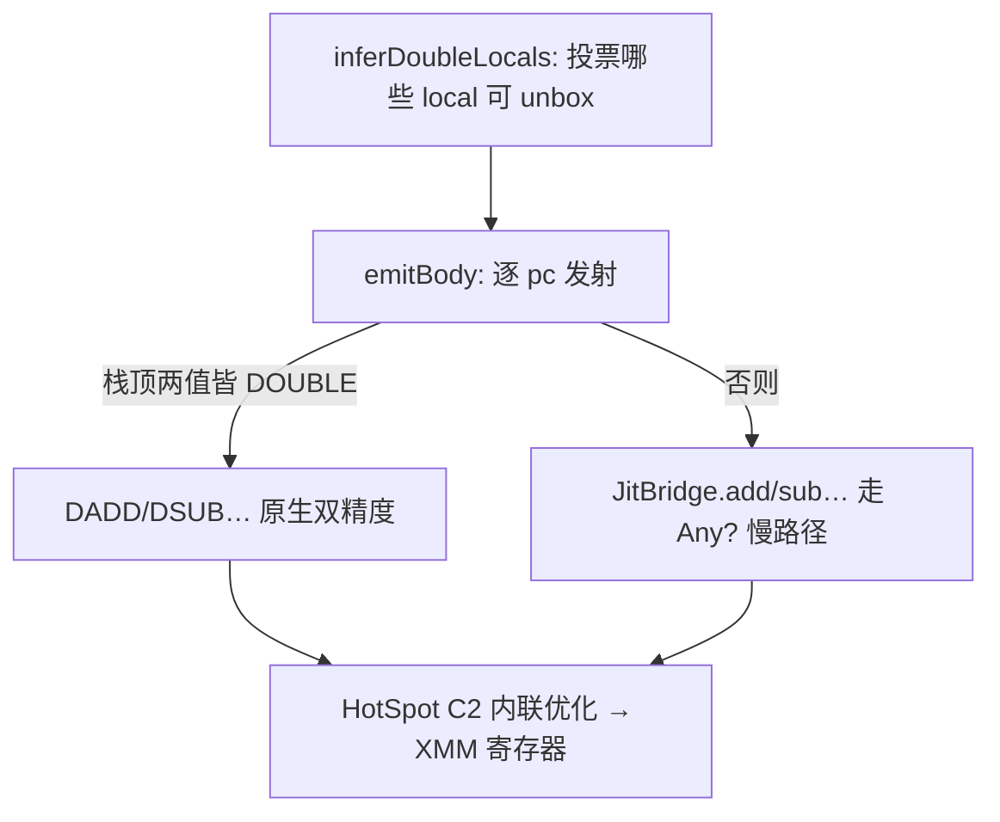

# D8 · 模板 JIT 编译器

> 前置知识：D3（字节码）、D5（VM）、D7（内联缓存）。
>
> 本篇拆解 `vm/Jit.kt`、`vm/Compiled.kt`、`vm/JitBridge.kt`：KJS 如何把字节码**在运行时翻译成
> JVM 字节码**（模板 JIT），并通过**类型特化**消除热点数值循环的装箱开销。读完能理解"解释器为何
> 能快一个数量级"。

## 1. 总体策略：每函数一个生成的类

`Jit`（`Jit.kt:42`）是单例。它用 ASM 把每个 `Bytecode` 翻译成一个 `Compiled` 子类（`Jit.kt:18`）：

- **KJS 操作数栈 → JVM 操作数栈**：`push/pop` 直接映射成 JVM 栈指令，无额外数组。
- **KJS 局部变量槽 → JVM 局部变量槽**：`locals[i]` 映射到 `localSlot[i]`，`double` 局部占 2 个 JVM 槽。
- 只编译**受支持的操作码子集**（算术、比较、局部读写、常量、跳转、`RET`、`CALL argc≤4` 等，
  `Jit.kt:110`）；遇到不支持的（如 `MAKE_CLOSURE`、属性赋值、迭代协议）函数**整体被拒绝**，
  继续走解释器——正确性零损失。

`Compiled`（`Compiled.kt:14`）只有一个抽象方法 `invoke(vm, realm, closure, thisVal, args)`，VM 在
函数变热后直接调它（D5 §3 的 `already.invoke(...)`），绕过 `when(op)` 分发循环。

## 2. 异步编译：变热才编译

`threshold = 3`（`Jit.kt:43`，可用 `KJS_JIT_THRESHOLD` 调）。VM 每次解释调用 `hotness++`（`D5 §3`），
`shouldCompile`（`Jit.kt:57`）在 `hotness == threshold` 时触发：

```kotlin
79:101:engine/src/main/kotlin/io/kjs/vm/Jit.kt
fun requestCompile(closure: VmClosure) {
    if (closure.compilePending || closure.compiled != null || closure.jitRejected) return
    if (!canCompile(closure.bc)) { closure.jitRejected = true; return }
    closure.compilePending = true
    val task = Runnable {
        val compiled = compile(closure.bc)
        closure.compiled = compiled         // 发布( volatile 写)
    }
    if (asyncDisabled) task.run() else compilerPool.execute(task)   // 默认单线程守护线程
}
```

要点：
- **先 `canCompile` 把关**（`Jit.kt:132`）：扫描每条 opcode，无不支持的、`CALL` 的 `argc≤4`（`MAX_JIT_CALL_ARGC`，`Jit.kt:130`）才允许；否则 `jitRejected=true`，永不重试。
- **异步后台编译**：默认提交到单线程守护线程池（`Jit.kt:65`），编译完成把 `Compiled` 发布到
  `closure.compiled`（volatile 写）。**编译期间函数仍由解释器执行**，编译好了下一次调用自动走 JIT。
- `KJS_JIT_ASYNC=off` 可强制同步编译（调试用）。
- 可用 `KJS_JIT=off`、`KJS_JIT_VERBOSE`、`KJS_JIT_LOG` 等环境变量观察/关闭 JIT（D5/D0）。

## 3. 类型特化：消除装箱（核心原理）

解释器里每个数字都是 `Any?` 装箱（`Double`），加法要 `unbox + dadd + box`。JIT 的关键是：**把那些
"只用数字"的局部与栈顶，提升到原生 `double` JVM 槽 + 原生 `DADD`**，从而热点循环零装箱。

### 3.1 抽象解释：`inferDoubleLocals`（`Jit.kt:161`）

编译前先做一遍**单遍抽象解释**，给每个 KJS 局部投"能否用 `double`"的票（`vote`）：

- 每个 `STORE_LOCAL` 压的值若是 `DOUBLE` 链上的（来自 `LOAD_ZERO/ADD/...`），该槽投"可 double"；
  一旦某次 store 压了非数字，票降到 0（不可）。
- **参数初始视为 DOUBLE 候选**（`Jit.kt:168`），若后续流经非数字运算则降级。
- **固定点迭代**：`while (changed && rounds < 8)`（`Jit.kt:189`），`vote` 单调 1→0 不回弹，快速收敛。
- **分支目标处重置抽象栈**（`Jit.kt:173`/`Jit.kt:200`）：`JMP/JT/JF` 的跳转目标 `isTarget` 处把抽象
  栈清空，避免跨分支类型错配。

最终 `res[i] = (vote[i] == 1)` 决定局部 `i` 是否用原生 `double` 槽。

### 3.2 发射期栈类型追踪

`emitBody`（`Jit.kt:359`）维护一个与 JVM 操作数栈平行的**抽象栈** `aStack`（元素 `T.ANY/DOUBLE/BOOL`，
`Jit.kt:357`），并用一组强制转换助手保持二者同步：

- `boxTop`：把栈顶 `DOUBLE/BOOL` 装箱成 `Object`（`Double.valueOf`/`Boolean.valueOf`）。
- `toDouble`：`ANY → bridge.toD`（兜底 `JsValues.toNumber`）、`BOOL → I2D`；`DOUBLE` 不动。
- `toBoolPrim`：转原生 `int` 0/1。
- `boxTopTwo` / `boxAllStack`：在二元运算、分支前把需要的栈顶统一装箱。



### 3.3 原生算术 / 比较

- **`ADD`**（`Jit.kt:651`）：若抽象栈顶两值都是 `DOUBLE`，直接 `DADD` 并保留 `DOUBLE` 标签；否则
  `boxTopTwo` + `JitBridge.add`（处理字符串拼接与兜底）。`SUB/MUL/DIV/MOD` 经 `emitArith`（`Jit.kt:830`）
  同构。
- **`LT/LE/GT/GE`** 经 `emitCompare`（`Jit.kt:880`）：双精度走 `DCMPL + IF_icmp`，否则 `JitBridge.lt`；
  比较结果标 `BOOL`。
- **`STORE_LOCAL`**（`Jit.kt:569`）：若该槽是 `double`，先 `toDouble` 再 `DSTORE`（并 `DUP2` 保留一份
  供抽象栈）。

于是 `sumN`/`poly`/`square` 这类热点数值循环，每次迭代都是纯原生 `double` 运算，**完全不碰堆**，
HotSpot C2 进一步把它们优化进 XMM 寄存器（`Jit.kt:38` 注释）。

## 4. 属性访问与原型链：复用同一份 IC

`LOAD_PROP` 不是把属性查找逻辑内联进生成代码，而是调用 `JitBridge.loadProp`（`Jit.kt:603`、`JitBridge.kt:98`）。
关键点：**`loadProp` 走 `closure.bc.caches[pc]` 的同一个 `PropIc`**（D7 §2）——VM 与 JIT 共享一份
内联缓存。该桥接方法是 `static`、小且单态，HotSpot 能把它内联回生成代码，使单态属性站点几乎零
开销。`LOAD_GLOBAL` 同样走 `JitBridge.loadGlobal`（`JitBridge.kt:78`），复用 `Environment` 链与
`GlobalIc`。

`CALL`（`Jit.kt:750`）因参数要装成 `Object[]`，生成代码用 `JitBridge.argsOfN`（`argsOf0..argsOf4`，
`JitBridge.kt:146`）+ `invokeCall2`（`JitBridge.kt:142`）转交 VM 的 `invokeFast`——所以 JIT 调用
其它函数时仍走统一的调用约定（D5 §4），被调函数自己可能也已 JIT 化。

## 5. 编译：特化优先，失败回退

`compile`（`Jit.kt:291`）两阶段尝试：

```kotlin
295:353:engine/src/main/kotlin/io/kjs/vm/Jit.kt
while (true) {
    val specialize = attempt == 0 && !specDisabled
    val doubleLocals = if (specialize) inferDoubleLocals(bc) else BooleanArray(bc.localCount)
    // ... ASM 生成 ClassWriter ...
    try { /* emitBody; 若类型特化遇到未覆盖情形抛 JitAbort */ }
    catch (abort: JitAbort) { attempt++; if (attempt > 1) throw ...; continue }   // 重试非特化
    val cls = try { JitClassLoader.define(...) }
              catch (vfy: VerifyError) { attempt++; if (attempt>1) throw vfy; continue }  // 校验失败重试非特化
    cls.getDeclaredField("CONSTS").set(null, bc.constants.toTypedArray())
    cls.getDeclaredField("STRINGS").set(null, bc.strings.toTypedArray())
    return cls.getDeclaredConstructor().newInstance() as Compiled
}
```

- **先尝试类型特化**（attempt 0）：`inferDoubleLocals` 决定 unbox。若发射中遇到无法特化的情形
  （如 `double` 埋在栈太深，`Jit.kt:769` 抛 `JitAbort`），**回退到全装箱（attempt 1）**。
- **JVM 校验失败**（VerifyError，如栈类型推断冲突）：同样回退非特化。
- `JitClassLoader`（`Jit.kt:939`）是 child-first 类加载器，`defineClass` 注册生成类。
- 常量池/字符串池写入生成类的 `static` 字段 `CONSTS/STRINGS`（`Jit.kt:311`），`LOAD_CONST/STR` 直接
  `GETSTATIC + AALOAD` 取，避免每次经桥接方法。

## 6. JitBridge：生成代码的静态桥

`JitBridge`（`JitBridge.kt:13`）是一组 `static` 小方法，被生成代码用 `INVOKESTATIC` 调用：

- 类型转换/运算：`toD/toBool/add/sub/mul/div/mod/lt/le/gt/ge/eq/seq/...`（全部委托给 `JsValues`，
  与 VM/Walker 同语义）。
- `loadProp/loadPropGeneric`：属性查找 + 复用 `PropIc`（见 §4）。
- `loadGlobal`：全局绑定查找，语义等同 `Op.LOAD_GLOBAL`（缺失且不容忍则 `ReferenceError`）。
- `invokeCall/invokeCall2/argsOfN`：函数调用桥（见 §4）。

这些方法小而单态，HotSpot C2 会内联进生成代码，使"桥接"开销消失。

## 7. 设计取舍

- **模板 JIT 而非方法 JIT**：KJS 无寄存器/SSA，直接"字节码 → JVM 字节码"，实现简单、可借力 JVM 后端。
- **类型特化是性能关键**：不特化也能跑，但热点数值循环会反复装箱；特化后零装箱、可落 XMM。
- **受支持子集 + 整体拒绝**：不支持的 opcode 让函数留在解释器，正确性永远优先于性能。
- **异步 + volatile 发布**：编译不阻塞执行；下一次调用即享受 JIT，无需全局锁。
- **VM/JIT 共享 IC 与 `JsValues`**：一份缓存、同一套语义，保证二者行为一致且 JIT 可被内联。
- **特化失败回退**：`JitAbort`/`VerifyError` 自动降级全装箱，鲁棒性优先。

## 8. 常见坑

- **`double` 在栈中坑位**：`double` 占 2 个 JVM 槽，`SWAP` 不能跨 cat2/cat1 直接交换，`boxTopTwo`/
  `boxAllStack` 在"double 埋在 ANY 之下"时直接抛 `JitAbort` 回退（D5/JIT 的保守正确性策略）。
- **抽象栈与 JVM 栈必须同步**：`emitBody` 的 `aStack` 与生成的 JVM 指令栈要逐条对应；一处不同步
  → JVM `VerifyError` → 回退非特化（甚至编译失败）。
- **分支目标重置**：`JMP/JT/JF` 目标处必须假设抽象栈全 `ANY`；遗漏重置会让特化路径误用错误类型。
- **`argc > 4` 的 CALL 不能 JIT**：超过 4 实参的函数被 `canCompile` 拒绝，整体走解释器。
- **IC 共享的线程安全**：`bc.caches[pc]` 被 VM/JIT 共享（单线程安全）；未来多线程执行需加锁。
- **常量池字段初始化时机**：`CONSTS/STRINGS` 必须在 `newInstance` 前写 `static` 字段，否则 `LOAD_CONST`
  读到 `null`。
