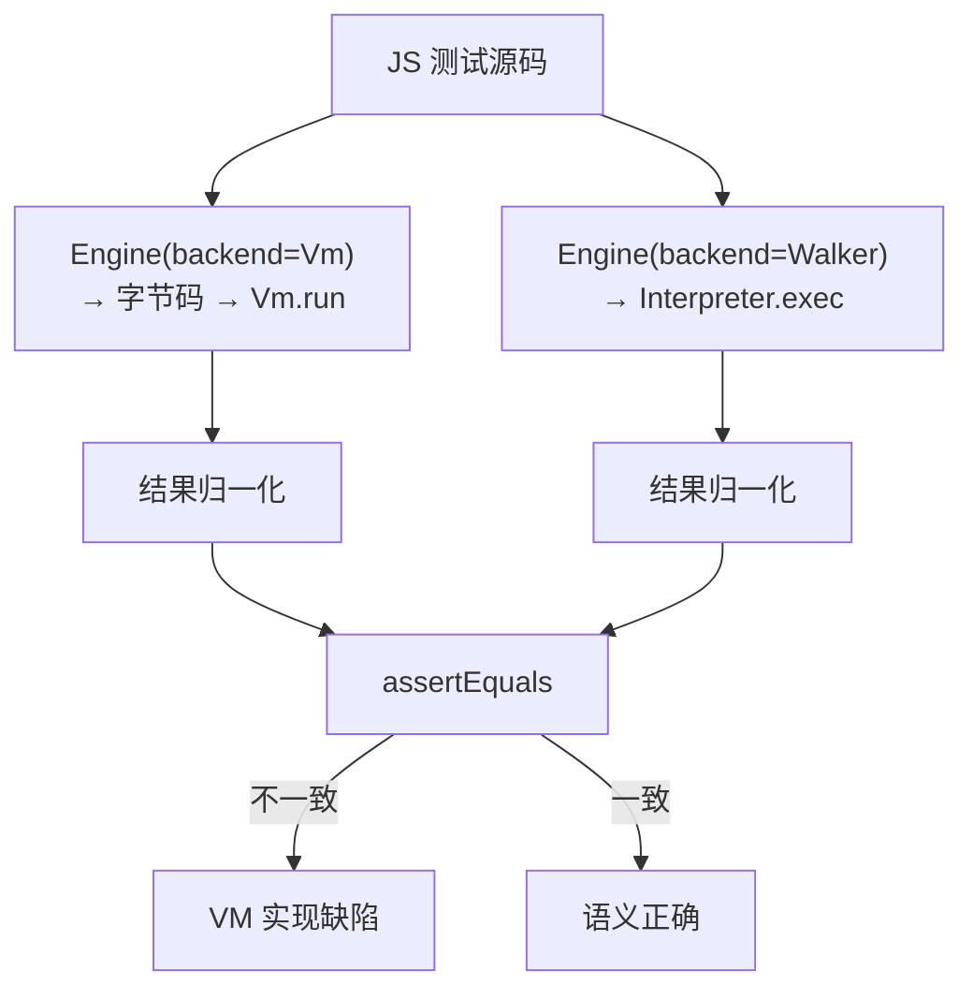

# D9 · 双后端与差分测试

这一章讲 KJS 的一个"作弊式保障"——它同时实现了两套执行引擎（字节码 VM + 树遍历 Walker），让它们互相核对结果，保证语义正确。这种手法叫差分测试（对拍）：同一段代码用两套实现各跑一遍，结果应该一致，不一致就说明至少一套有 bug。Walker 实现得最直白——"见到 if 就执行 if 分支"，几乎不碰字节码那些易错环节，所以把它当成"正确答案参考"。对拍有不同的做法：最常见的是单实现加单元测试（但实现错了测试也跟着错）；也有人对照一个独立的参考实现（比如用 Node 跑同一段代码，更权威但要外部依赖）。KJS 选了"自带第二套实现当 oracle"，零外部依赖、随时能跑——前提是两套后端共享同一套值模型（D6），否则各算各的对拍没意义。往下 §3 看对拍怎么归一化比较，§5 看控制流为何用"异常信号"实现。

> 前置知识：D2（AST）、D5（VM）、D6（值模型）、D8（JIT）。
>
> 本篇拆解 `runtime/Interpreter.kt`（树遍历后端）以及 `tests/` 下的对拍测试：KJS 为何同时保留
> 解释器 VM 与树遍历 Walker 两套执行引擎，如何用"同一个 AST + 同一个值模型"做差分验证，
> 保证 VM 的字节码语义正确。

## 1. 为什么需要两个后端

字节码 VM 跑得快，但实现复杂、容易出 bug；树遍历 Walker 跑得慢，但写法直白、几乎不会写错。让那个"慢而正确"的 Walker 当裁判，VM 每次改完都和它比一比，就能立刻暴露 VM 的语义偏差。Walker 不是备胎，而是"正确性预言机"。

KJS 有两条执行路径（D0 §3）：

- **VM（默认）**：AST → 字节码 → 栈式 VM 执行（D4/D5），可被 JIT 加速（D8）。
- **Walker（树遍历）**：直接递归遍历 AST 求值（`Interpreter.exec`）。

Walker 不是"备胎"，而是**正确性预言机（oracle）**：它的实现最直白——"见到 `If` 就求值 test 再
递归执行分支，见到 `Add` 就算左+右"，几乎没有字节码编译那些易错环节（作用域/插槽/跳转修补/Upvalue
盒子）。因此一个表达式在 VM 与 Walker 下应当得出**结构上相同**的结果；一旦不同，几乎一定是 VM 一侧
的 bug（或极少数 Walker 不支持的特性抛异常）。

> `Interpreter` 类注释（`Interpreter.kt:13`）明确写道：它"作为 M1 执行引擎，并作为字节码 VM 在 M2
> 中被验证时的 oracle"。

## 2. Walker 的运行时模型（Interpreter.kt）

`Interpreter`（`Interpreter.kt:16`）持 `Realm`，入口 `exec`（`Interpreter.kt:18`）：

```kotlin
18:23:engine/src/main/kotlin/io/kjs/runtime/Interpreter.kt
fun exec(program: Program): Any? {
    hoist(realm.globalEnv, program.body)
    var result: Any? = JsValues.UNDEFINED
    for (s in program.body) result = execStmt(s, realm.globalEnv) ?: result
    return result
}
```

### 2.1 控制流用"信号"实现

VM 用字节码 `JMP`/栈帧实现循环与跳出；Walker 用 **`RuntimeException` 子类作控制流信号**（无栈展开成本，
`fillInStackTrace` 被覆写为空）：

- `ReturnSignal(value)`（`Interpreter.kt:10`）：`Return` 抛出，在外层 `callUserFn` 被 `catch` 取出值。
- `BreakSignal(label)` / `ContinueSignal(label)`（`Interpreter.kt:8`）：`While/ForC/...` 的 `try/catch`
  捕获，带 label 校验（仅处理无标签的，有标签的向上抛）。
- `JsThrown(value)`（`Interpreter.kt:6`）：`throw` 携带 JS 值，沿 Kotlin 调用栈冒泡到 `try/catch`。

### 2.2 语句与表达式的递归求值

- `execStmt`（`Interpreter.kt:73`）`when` 分发所有语句。`Block` 用**新建子 `Environment(env)`**
  实现块级作用域（`Interpreter.kt:76`）；`VarDecl` 的 `let/const` 走 `env.declare`，`var` 在已存在时
  `env.set`（模拟提升，`Interpreter.kt:91`）。
- `evalExpr`（`Interpreter.kt:197`）`when` 分发所有表达式。`NumberLit/StringLit/...` 直接返回值；
  `Binary` 调 `evalBinary`（委托 `JsValues`，`Interpreter.kt:271`）；`Logical` 实现 `&&/||/??`
  短路（`Interpreter.kt:314`，只求右值当需要时）。
- `assignTarget`（`Interpreter.kt:347`）把值写到 `Ident`（→ `env.setOrDeclareGlobal`）或 `Member`
  （→ `obj.set`，并维护数组 `length`）。

### 2.3 函数调用与 `this`

`evalCall`（`Interpreter.kt:390`）：

```kotlin
390:399:engine/src/main/kotlin/io/kjs/runtime/Interpreter.kt
private fun evalCall(e: Call, env: Environment): Any? {
    val (thisVal, fn) = when (val c = e.callee) {
        is Member -> evalMember(c, env)         // 方法调用: 取出 obj 作 thisVal
        else -> null to evalExpr(c, env)
    }
    val args = e.args.map { evalExpr(it, env) }
    val f = fn as? JsFunction ?: throw JsThrown("TypeError: '...' is not a function")
    val self = if (f.getOwn("__arrow__") == true) env.get("this") else (thisVal ?: realm.globalObject)
    return f.call(self, args)
}
```

箭头函数 `this` 沿用外层 `env.get("this")`（`__arrow__` 标记，D6 §5）；普通调用 `this` 为 `thisVal`
（方法）或全局对象。`callUserFn`（`Interpreter.kt:417`）为用户函数入口：建 `localEnv(closure)`、
绑 `this`/`arguments`/参数、`hoist` 函数体、逐语句执行、捕获 `ReturnSignal`。

### 2.4 Walker 的能力边界

Walker 只支持**标识符参数**（`mkUserFunction` 把 `params` 拍平成名字，`Interpreter.kt:33`），且对
解构声明/赋值、`class`、`super`、`for-of` 复杂形态显式抛 `JsThrown`（`Interpreter.kt:89/124/236/238`）。
这些高级特性由 VM（D4 的解糖 + 完整指令集）负责。因此差分测试主要覆盖 Walker 支持的交集特性。

## 3. 差分测试：两个后端结果对拍

对拍的核心只有三步：同一份源码，分别用 VM 和 Walker 执行，然后把两边都"拍平"成可比较的字符串（对象按键排序、数组按顺序），再用 `assertEquals` 比对。任何不一致，都意味着至少一边有缺陷——多数时候是 VM。这其实是编译器/VM 工程里的经典做法，V8 同样用多后端互验来保证正确。

`tests/unit` 下的 `VmVsWalkerTest`（VM vs Walker）是核心正确性保障。思路：

1. 准备一组 JS 测试源码（含循环、闭包、递归、对象、异常、`==`/`===` 边界等）。
2. 同一份源码，分别用 `Engine(backend = Vm)` 与 `Engine(backend = Walker)` 执行。
3. 把两边的结果**归一化为"结构可比"的字符串**（对象按 key 排序、数组按序、递归处理嵌套），再
   `assertEquals`。任何不一致立即暴露 VM 实现缺陷。

`BasicsTest` 则是对单后端的单元断言（如 `1+1==2`、`typeof`、闭包计数等），快速验证基础语义。

> 把"两个实现一致"作为正确性标准，是编译器/VM 工程的经典做法（参考 V8 的多个后端互验）。
> KJS 因 VM 与 Walker **共享 `JsValue`/`JsValues` 强制原语**（D6 §2），"一致"才有意义——若各自
> 实现一套 `==`，对拍将永远通过却可能双双错误。



## 4. 如何切换后端

- 运行时：`Engine.setBackend(Backend.Walker)`（`Engine.kt:42`）。
- 启动：`KJS_BACKEND=walker`（或 `ast`）环境变量（`Engine.kt:70`）。
- CLI：`kjs -e '...'` 默认走 VM；调试时可临时切 Walker 看同一段代码行为是否一致。

## 5. 设计取舍

这一节总结全篇的设计选择：Walker 当 oracle、两套后端共享同一套值模型、控制流用轻量的异常信号表达、能力边界划得清清楚楚（不支持的特性直接报错，绝不静默给错结果）、结果做归一化比较。每一项取舍，都是为了"对拍真能抓到 bug"。

- **Walker 当 oracle**：用最简单的实现兜底正确性，VM 的任何语义偏差都能被对拍捕获。
- **共享值模型**：VM 与 Walker 都用 `JsValue`/`JsValues`，保证"一致"是真实的一致，而非各算各的。
- **控制流用异常信号**：`Break/Continue/Return` 用轻量 `RuntimeException`，避免显式传递控制标志，
  代码更直白（代价是栈展开，但 `fillInStackTrace` 被禁用）。
- **能力边界清晰**：Walker 不支持的高级特性显式抛错，避免"静默错误结果"污染对拍。
- **归一化比较**：测试结果按结构排序后再比，规避 `Map` 遍历顺序、对象/数组表示差异导致的假阴性。

## 6. 常见坑

- **归一化不充分**：对象 key 顺序、数组/对象混用会让"真相等"被判不等；对拍前必须统一结构表示。
- **两边各自实现强制**：若 VM 与 Walker 各写一份 `looseEq`，一致性测试永远通过却可能双双偏离 ES
  规范——强制必须收口在 `JsValues`（D6 §2）。
- **信号越界**：`BreakSignal` 的 label 校验（`Interpreter.kt:102`）必须严格，否则带标签 break 被
  内层循环吞掉，行为错位。
- **`__arrow__` 遗漏**：Walker 与 VM 都须识别箭头 `this` 沿用；任一遗漏都会导致 `this` 指向不一致、
  对拍失败。
- **Walker 不支持特性误用作对拍**：`class`/`super`/复杂解构在 Walker 抛错，对拍测试应只选 Walker
  支持的交集，或显式 `assertThrows`。
