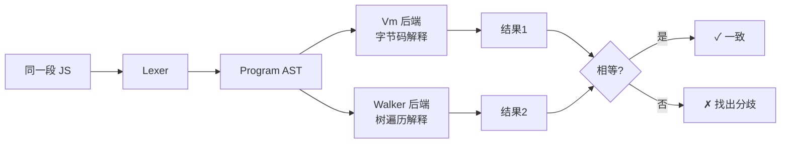
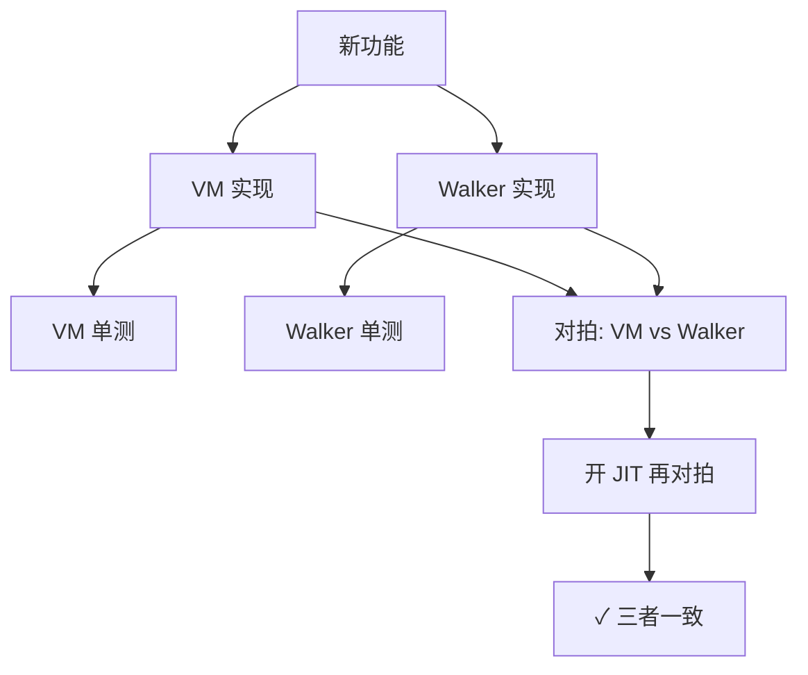

# D9 · 双后端与对拍

> 前置知识：D0、D5、D6。本篇讲"怎么保证 VM 没写错"——保留一个慢但独立的解释器作预言机。

## 1. 为什么需要两个后端

解释器（Walker）和栈式 VM 是**对同一门语言的两种实现**。如果它们对同段代码给出相同结果，
我们就对"语义正确"有很高信心。这是编译器/引擎界经典的 **differential testing（对拍）** 思路。



VM 是默认的、快的、带 JIT 的后端；Walker 是**正确性预言机**：它慢，但逻辑直接、易读，
实现路径与 VM 完全不同，因此能互相校验。

## 2. Walker 实现（Interpreter.kt）

`Interpreter`（`runtime/Interpreter.kt:1`）递归遍历 AST：每个 `evalExpr` / `execStmt` 方法
直接对应一个节点类型，**不生成字节码**：

```kotlin
1:40:engine/src/main/kotlin/io/kjs/runtime/Interpreter.kt
class Interpreter(val realm: Realm) {
    fun exec(program: Program): Any? {
        var last: Any? = Undefined
        for (s in program.body) last = execStmt(s, realm.globalEnv)
        return last
    }
    fun execStmt(s: Stmt, env: Env): Any? = when (s) {
        is ExprStmt -> evalExpr(s.expr, env)
        is VarDecl -> { for (d in s.decls) env.declare(d.name, d.init?.let{evalExpr(it,env)} ?: Undefined); Undefined }
        is IfStmt -> if (toBool(evalExpr(s.cond, env))) execStmt(s.then, env) else s.els?.let{execStmt(it,env)}
        is BlockStmt -> { val sub = Env(env); for (b in s.body) execStmt(b, sub) }
        is ReturnStmt -> throw ReturnValue(evalExpr(s.value, env))
        ...
    }
    fun evalExpr(e: Expr, env: Env): Any? = when (e) {
        is NumberLit -> e.value
        is StrLit -> e.value
        is BinaryExpr -> binaryOp(e.op, evalExpr(e.left, env), evalExpr(e.right, env))
        is CallExpr -> callValue(evalExpr(e.callee, env), e.args.map { evalExpr(it, env) }, env)
        ...
    }
}
```

特点：
- **控制流用 Kotlin 异常实现**（`ReturnValue`/`BreakSignal`/`ContinueSignal`/`ThrowValue`），
  而非 VM 的 `pc` 跳转——两种实现路径完全正交，对拍才有意义。
- **作用域用 `Env` 链**直接传递，不走 `Frame`/槽。
- **同一套 `JsValue`/`JsObject`/`looseEq` 运行时**（D6），保证值语义一致。

> 因为 Walker 复用 `runtime/*` 的运行时模型，对拍验证了"前端+中端+VM 执行"这条路径，
> 而 Walker 提供独立的"前端+直接解释"路径。两者的分叉点在"是否经过 Bytecode/Compiler"。

## 3. 后端切换（Engine）

`Engine.mode` 决定走哪条路径（见 D0 §4）：

```kotlin
38:55:engine/src/main/kotlin/io/kjs/Engine.kt
val mode = backend
fun eval(source: String): Any? {
    val program = Parser(source).parseProgram()   // 两后端共用同一 Parser
    return when (mode) {
        Backend.Walker -> walker.exec(program)
        Backend.Vm    -> {
            val bc = Compiler.compileProgram(program, source)
            vm.run(bc)
        }
    }
}
```

环境变量 `KJS_BACKEND=walker` 让 `Engine` 用 Walker——可用于 CI 对拍或本地调试某条用例。

## 4. 对拍测试（tests/）

`VmVsWalkerTest`（`tests/unit/src/test/kotlin/io/kjs/VmVsWalkerTest.kt`）是核心对拍：

```kotlin
1:40:tests/unit/src/test/kotlin/io/kjs/VmVsWalkerTest.kt
class VmVsWalkerTest {
    @Test fun corpus() {
        for (case in loadCorpus("src/test/resources/cases")) {
            val vm = Engine(backend = Engine.Backend.Vm).eval(case.src)
            val wk = Engine(backend = Engine.Backend.Walker).eval(case.src)
            assertEquals(repr(wk), repr(vm), "分歧: ${case.name}")
        }
    }
}
```

`repr` 把结果规范化为可比较的字符串（处理对象引用、NaN、`-0` 等 JS 特殊值），避免
"值相等但对象不同"的伪分歧。corpus 覆盖：算术、闭包、递归、原型链、`this` 绑定、异常、
解构、class、for-in/of、模板字符串、可选链等。

`BasicsTest.kt` 另含**单测**（不依赖对拍），直接断言具体行为（如 `typeof null`、
`NaN !== NaN`、严格/宽松相等表），锁定语言语义边界。

## 5. 零分歧目标

设计基线：**24 个对拍用例（corpus）零分歧**。新功能（如新 opcode、新语法）须同时让 VM 与
Walker 支持并通过全部 corpus，否则视为破坏正确性。JIT（D8）另需在 `KJS_JIT=1` 下再跑一遍
对拍，保证"解释器 / VM / JIT"三者语义一致。



## 6. 常见分歧来源（debug 线索）

- **`NaN` 与 `-0`**：`repr` 必须归一（`String(NaN)`、`Object.is(-0,0)`），否则对拍假阴性。
- **对象遍历顺序**：`for-in` 键序、对象的 `Object.keys` 顺序需一致（都用插入序）。
- **`this` 绑定**：Walker 的 `callValue` 与 VM 的 `CALL_METHOD` 必须同样处理非严格/严格 `this`。
- **异常完成类型**：`finally` 里的 `return` / `throw` 传播，两后端必须一致（VM 用 handler 栈，
  Walker 用 Kotlin 异常冒泡，需等价）。
- **`arguments` / 剩余参数**：`arity` 与 rest 的装配需两条路径一致。

## 7. 设计取舍

- **树遍历而非字节码**：预言机故意"简单直接"，牺牲性能换可读性与独立性。
- **复用运行时模型**：只有"执行路径"分叉，值语义共用，缩小需对拍的表面积。
- **corpus 而非随机生成**：可控、可命名、易定位；随成熟可加 fuzzing。

## 8. 常见坑

- **repr 归一不全**：`-0`、`NaN`、循环引用对象会让 `assertEquals` 误报；需专门的 `repr`。
- **两边各修一半**：发现分歧时，先判断哪边是错的（通常 Walker 更可信，因为它简单），
  再改 VM，不要两边都改到"看起来一样"却都错。
- **JIT 漏对拍**：只跑 VM/Walker 对拍而忘开 `KJS_JIT=1`，JIT 的 bug 会漏到线上。
