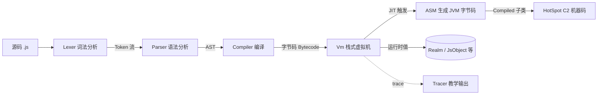

# KJS 实现文档（由浅入深）

KJS 是一个**用 Kotlin 写在 JVM 上的 JavaScript 引擎**：手写词法/语法分析生成 AST →
字节码编译器 → 基于栈的虚拟机（带属性内联缓存），并对热函数做运行时 JIT（ASM → JVM
字节码 → HotSpot C2 两级编译）。支持 ES5 + ES2015+ 的实用子集，并带 `--trace` 教学模式。

## 文档导航（按难度递增）

| 编号 | 文档 | 主题 | 关键源文件 |
|------|------|------|-----------|
| D0 | [总览](00-overview.md) | 引擎定位、五段管线、模块地图、如何运行 | `Engine.kt` |
| D1 | [词法分析 Lexer](01-lexer.md) | Token 设计、正则/除法歧义、字面量 | `lex/Lexer.kt` |
| D2 | [AST 与语法分析 Parser](02-parser-ast.md) | 节点模型、递归下降、运算符优先级 | `parse/Ast.kt`、`parse/Parser.kt` |
| D3 | [字节码与指令集](03-bytecode.md) | 三条并行 IntArray 车道、常量/函数池、IC 槽 | `ir/Bytecode.kt`、`ir/Opcode.kt` |
| D4 | [AST → 字节码编译器](04-compiler.md) | 作用域/槽分配、Upvalue、hoisting、跳转修补 | `ir/Compiler.kt` |
| D5 | [栈式虚拟机 Vm](05-vm.md) | 分发循环、帧池化、调用约定、异常处理器 | `vm/Vm.kt` |
| D6 | [运行时值模型](06-runtime-values.md) | 装箱表示、原型链、作用域、类型强制 | `runtime/JsValue.kt` 等 |
| D7 | [内联缓存](07-inline-cache.md) | 单态 IC、PropIc/GlobalIc、megamorphic 回退 | `vm/PropIc.kt`、`vm/GlobalIc.kt` |
| D8 | [模板 JIT 编译器](08-jit.md) | 异步编译、类型特化、栈类型追踪、两级 JIT | `vm/Jit.kt`、`vm/Compiled.kt` |
| D9 | [双后端与对拍](09-dual-backend.md) | 树遍历 oracle、后端切换、零分歧对拍 | `runtime/Interpreter.kt`、`tests/` |
| D10 | [内置库与宿主嵌入](10-intrinsics-cli.md) | Intrinsics、KjsNamespace、CLI/REPL | `runtime/Intrinsics*.kt`、`cli/` |

## 核心管线一览

> 行号引用基于仓库当前状态，可能随演进偏移；以函数名/文件名定位最稳妥。
